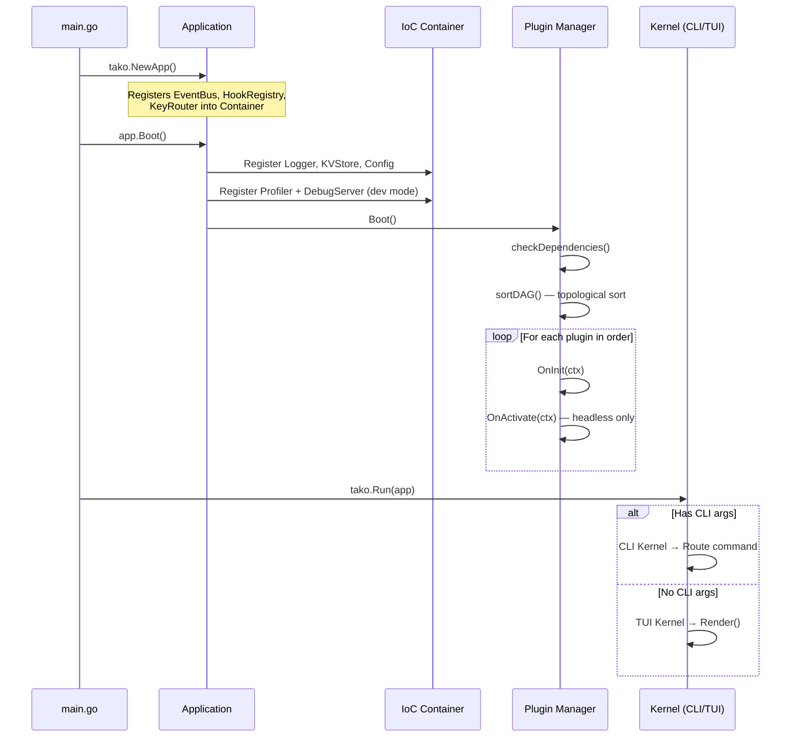

## What is Tako?

Tako is a **structured framework for building terminal applications in Go**. It doesn't build your UI for you — it gives you the infrastructure to build it yourself, in a way that scales cleanly beyond a single file.

Two ideas are at the core of Tako:

1. **UI Agnostic** — Tako's core has **zero UI library dependencies**. It abstracts rendering behind a `UIRenderer` interface. You choose the library: an official **Bubble Tea** adapter is available as an optional submodule (`github.com/gettako/tako/pkg/adapter/bubbletea`), but you can bring `tview`, `tcell`, `termbox`, or anything you want. Installing `github.com/gettako/tako` does not pull in any UI library.

2. **Optional Plugin System** — The plugin architecture is a **tool, not a requirement**. You can use Tako as a clean structured app without any plugins at all — just boot it, register your renderer, and run. The plugin system exists for when your app needs an *ecosystem*: a way for extensions to be added, removed, or redistributed independently without touching the core app code.

## Two Ways to Use Tako

### Without plugins — simple structured app

You don't have to use the plugin system. Register your renderer, boot, run. That's it.

```go [main.go]
func main() {
    app := tako.NewApp()

    // Register keybindings directly
    app.Keys().Bind("ctrl+c", func() {
        app.Shutdown()
    })

    // Register your UI renderer (bubbletea adapter is optional — install separately:
    //   go get github.com/gettako/tako/pkg/adapter/bubbletea)
    app.WithRenderer(bubbletea.NewAdapter(app.Context(), &myLayout{}))

    tako.Run(app)
}
```

No plugins, no `init()` imports, no `Manifest`. Just a clean app with Tako handling the lifecycle, key routing, event bus, and renderer management.

### With plugins — extensible ecosystem

When your app grows and you want *extensibility* — where third parties can ship independent extensions — that's when you reach for the plugin system.

```go [main.go]
import (
    _ "myapp/plugins/search"   // auto-registers via init()
    _ "myapp/plugins/history"
    _ "myapp/plugins/preview"
)
```

Each plugin declares its manifest, dependencies, and lifecycle hooks. The framework wires them together. Users of your app can add plugins without touching `main.go`.

## The Two Execution Paths

When your binary starts, Tako looks at `os.Args`:

```
Binary started
    │
    ├─ os.Args has a subcommand? ──► CLI Kernel ──► Command.Execute()
    │                                              (e.g. "myapp help", "myapp plugin:list")
    │
    └─ No subcommand ──────────────► TUI Kernel ──► UIRenderer.Render()
                                                   (blocks the main thread, runs your TUI)
```

CLI mode is for headless operations. TUI mode is the interactive experience. Both share the same bootstrapped application — the same container, plugins, and services.

## The Boot Sequence

Here's what happens when you call `tako.Run(app)`:



## Core Components

Think of these as the "subjects" of this course. Each gets its own dedicated chapter.

| Component | What it does |
|---|---|
| **IoC Container** | Registers and resolves services by interface. No globals. |
| **Event Bus** | Async pub/sub. Plugin A tells Plugin B something happened without knowing B exists. |
| **Hook Registry** | UI extension slots. Plugin A renders into a "slot" owned by the host app. |
| **Key Router** | Maps keystrokes to actions. Context-aware: different keys work in different zones. |
| **Plugin Manager** | Loads plugins in dependency order, drives the lifecycle. |
| **Config** | Flat dot-notation config from JSON + env var overrides. |
| **KV Store** | Persistent key-value storage, JSON-backed with atomic writes. |
| **UIRenderer** | The bridge between Tako and your chosen UI library. |
| **OverlayManager** | High-level: Show/close overlays in one call. Wraps Stack + Focus + Hooks. |
| **Component** | High-level: self-contained UI unit that declares its own view and keybindings. |
| **DialogService** | High-level: event-driven confirm/cancel dialogs without any rendering logic. |

## The Contracts Layer

Everything in `contracts/` is an **interface**, not an implementation. This is how Tako enforces the inversion of control:

```
contracts/
├── bus.go        — EventBus
├── component.go  — Component, KeyManager, ZoneKeyManager
├── config.go     — Config
├── container.go  — Container
├── dialog.go     — DialogService
├── logger.go     — Logger
├── overlay.go    — OverlayManager
├── renderer.go   — UIRenderer
└── storage.go    — KVStore
```

When a plugin calls `ctx.Logger()`, it gets back a `contracts.Logger`. It doesn't know (or care) whether logs go to a file, stdout, or somewhere else. The binding is set in `Application.Boot()`.

This is Dependency Inversion at the framework level. Your plugins depend on abstractions, not concretions.


