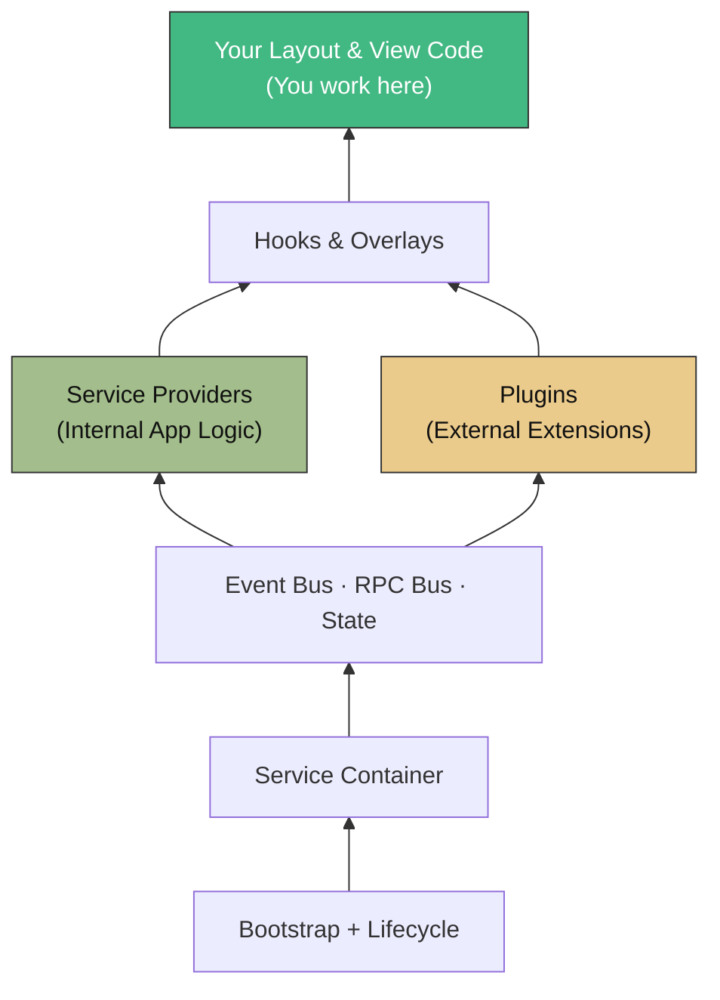
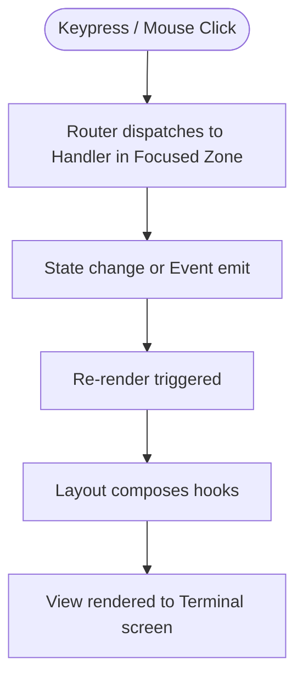

::warning
**Experimental / Pre-Release**
Tako is currently in early development (`v0.x.x`). It is not yet ready for production use. The architecture and API contracts may experience breaking changes without warning as we
refine the core design.
::

## Introduction

Tako is a **UI-agnostic framework for Go terminal applications**. You bring the renderer — Bubble Tea, tcell, or your own — and Tako handles everything underneath: dependency
injection, event-driven communication, keyboard and mouse routing, provider orchestration, reactive state, overlay management, and CLI tooling.

```go [main.go]
package main

import (
	"myapp/layouts"

	"gettako.dev/tako"
	"gettako.dev/tako/pkg/adapter/ui/bubbletea"
)

func main() {
	app := tako.NewApp()
	app.UI().Layout(&layouts.Base{})

	app.Mount(bubbletea.NewAdapter(app.Context(), nil))

	if err := tako.Run(app); err != nil {
		panic(err)
	}
}
```

Behind those few lines, Tako constructs an IoC container, registers core services, boots your plugins in dependency order, wires up a keyboard router, and prepares the event bus.
You don't need to think about any of that until you want to.

## Why Tako?

Building complex terminal applications often leads to a common set of architectural pain points. Tako was created to solve these by bringing proven patterns from modern web and backend frameworks (like Laravel, Nuxt, and Spring) to the terminal.

- **The Monolithic `main.go` Problem**: In traditional TUI development, as features grow, the central update loop and `main.go` file quickly bloat into thousands of lines of unmaintainable code. Tako's **Service Providers** and **Plugins** enforce a modular architecture, breaking your app into isolated, manageable domains.
- **Decoupling Logic from UI**: Business logic often gets tangled with pixel-rendering code. Tako enforces a strict separation: your application logic lives in providers and communicates via the **Event Bus** and **State Manager**, while your UI layer purely focuses on reacting to those changes. This makes your logic highly testable without needing a virtual terminal.
- **Enterprise-Grade Infrastructure**: Instead of duct-taping third-party libraries together, Tako provides a cohesive ecosystem out of the box. You get **Dependency Injection**, **Focus Routing**, **Job Scheduling**, **KV Storage**, and **CLI Commands** built right in, designed to work perfectly together.

## How It All Fits Together

| Layer                      | Role                                                      |
|----------------------------|-----------------------------------------------------------|
| **Application**            | Holds the IoC container and root context                  |
| **Service Container**      | Produces services on demand (Singleton, Lazy, Transient)  |
| **Contracts** (interfaces) | Define what each service exposes                          |
| **Service Providers**      | Internal modules built by you, silently extending the app |
| **Plugins**                | External extensions requiring a manifest for discovery    |
| **Event Bus**              | Decoupled pub/sub between plugins                         |
| **RPC Bus**                | Request-response on top of the same infrastructure        |
| **Layout + Hooks**         | Where things appear visually                              |
| **Focus Stack + Router**   | Decides which zone receives input                         |
| **State Manager**          | Reactive shared data any provider can read or observe     |

Service Providers and Plugins don't talk to each other directly. They post events and read shared state. The router ensures only the focused zone receives input.

### The Layer Cake



You work at the top. The framework works at the bottom. Most application code lives in Service Providers and layouts — you rarely touch the container or bootstrap directly. Plugins
act as flexible drop-in extensions for your app.

### Input → Output Flow



This cycle runs on every interaction.

## What Tako Gives You

| Feature                 | What it does                                                             |
|-------------------------|--------------------------------------------------------------------------|
| **Service Container**   | IoC with Singleton, Lazy, Transient bindings + closure injection         |
| **Service Providers**   | Internal modules without manifests, hidden from public CLI introspection |
| **Plugins**             | External extensions with manifests, visible via `go run . inspect`       |
| **Key & Mouse Routing** | Focus stack with zone-scoped input dispatch                              |
| **Event Bus + RPC**     | Pub/sub and request-response between plugins                             |
| **Reactive State**      | Observable atoms with TTL, LRU eviction, debounced observers             |
| **CLI Commands**        | Built-in commands + your own, with middleware pipeline                   |
| **Hooks & Overlays**    | Decoupled render slots + managed modal stack                             |
| **Scheduler**           | Background jobs with OnSuccess/OnError callbacks                         |
| **Developer Tools**     | Live inspector, time-travel replay, hot reload                           |

## Quick Reference

| When you want to...           | Use...                               |
|-------------------------------|--------------------------------------|
| Add a feature                 | Create a Service Provider            |
| Add a 3rd-party extension     | Install a Plugin (requires manifest) |
| Communicate between modules   | Event Bus or RPC Bus                 |
| Share data reactively         | State Manager                        |
| Handle keyboard input         | Key Router + Focus Stack             |
| Handle mouse input            | Mouse Router + Hitboxes              |
| Show a modal/overlay          | Overlay Manager                      |
| Contribute UI from a provider | Hooks                                |
| Run background work           | Scheduler                            |
| Persist preferences           | KV Storage                           |
| Add a CLI command             | Command interface                    |
| Configure the app             | YAML/JSON in `config/`               |

## Requirements

- **Go 1.23** or later
- A terminal emulator with ANSI support
- For Bubble Tea adapter: `charm.land/bubbletea/v2`

Head to [Quick Start](/getting-started/quick-start) to get a running app in under a minute, or [Installation](/getting-started/installation) for a detailed walkthrough.

