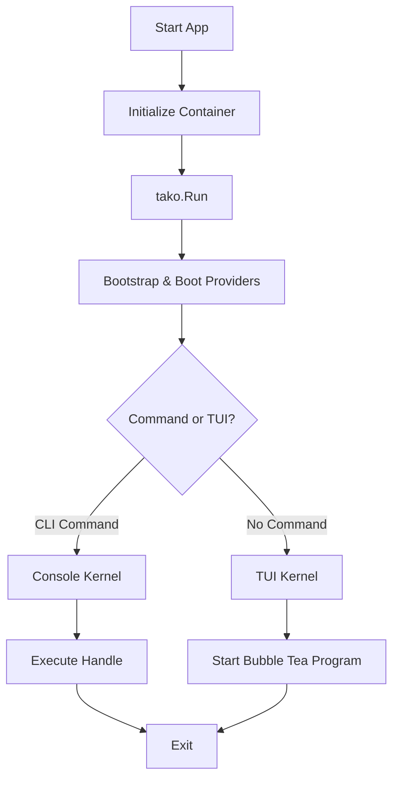

::warning
**Tako is currently in heavy development.** The framework is in its early stages, so expect breaking changes, incomplete features, and shifting APIs.
::

Tako is a framework for building Terminal User Interfaces (TUI) and Console applications in Go. It borrows heavily from the architecture of Laravel to provide a structured, dependency-injected way to write Go applications.

Under the hood, it is built entirely on top of [Bubble Tea](https://charm.land/bubbletea/v2), acting as an architectural layer that provides a fluent API and a component-based workflow.

## Why it exists

If you've built complex TUI applications, you might have noticed that state management and component coupling can get tricky as your project grows. Tako was created to help organize that complexity.

While "vanilla" Bubble Tea relies on a single `Update` function with large `switch msg := msg.(type)` blocks, Tako abstracts this into a DOM-like event propagation system. Instead of passing state down a long chain of structs, you can rely on a Service Container to resolve dependencies exactly where you need them.

In short, Tako allows you to:
* Manage global state and dependencies cleanly.
* Listen to keyboard and mouse events globally or per-component.
* Dispatch and listen to events across your application.
* Avoid circular dependency issues by programming to interfaces.

## Core Principles

Tako is guided by a few core ideas:

1. **Contract-First Architecture**: All core interactions are defined by interfaces within a dedicated `contracts` package. This keeps the codebase modular and prevents import cycles.
2. **Developer Experience**: We focus on creating APIs that read like natural language. Method chaining and clear naming conventions are a priority.
3. **Inversion of Control (IoC)**: There is no mutable global state. Everything is bound to and resolved from a centralized, thread-safe Service Container.
4. **Safety**: Built-in support for graceful shutdowns via `context.Context`, structured error handling, and thread-safe internal structures.

## How it works

At the center of a Tako application is the Service Container. Instead of manually instantiating structs and passing them down your component tree, you register them as Service Providers. When your application boots, Tako wires everything together.

Here is what you get out of the box:

* **IoC Container**: Type-safe dependency injection using Go Generics.
* **CLI Engine**: Console command routing with a signature parser (e.g., `make:model {name}`).
* **Logger**: A multi-channel logger for different outputs.
* **Input Manager**: Helper methods to bind keyboard and mouse events cleanly.
* **Event Bus**: A global event dispatcher to decouple components.
* **Hot-Reloading**: A built-in filesystem watcher so you don't have to restart your app manually after every change.

## Example

Initializing a Tako application is straightforward.

```go [main.go]
package main

import "gettako.dev/tako"

func main() {
	// Initialize the application and internal IoC container
	app := tako.NewApp()

	// Run the application lifecycle
	tako.Run(app)
}
```

::note
`tako.Run(app)` automatically handles bootstrapping the application, booting service providers, and routing to either the Console Kernel or the TUI Kernel based on the command-line arguments.
::

If you want to build a CLI tool, Tako provides a structured way to define console commands:

```go [commands.go]
package commands

import "gettako.dev/tako/contracts"

type MakeModelCommand struct {}

// Signature defines the command name, arguments, and options
func (c *MakeModelCommand) Signature() string {
	return "make:model {name} {--m|migration : Create a new migration file}"
}

func (c *MakeModelCommand) Handle(ctx contracts.CommandContext) error {
	name := ctx.Argument("name")
	
	if ctx.Option("migration") {
		ctx.Components().Info("Creating migration for " + name)
	}

	ctx.Components().Done("Model " + name + " created.")
	return nil
}
```

## Lifecycle Flow

Tako handles the application execution automatically based on the user's input and registered components.

