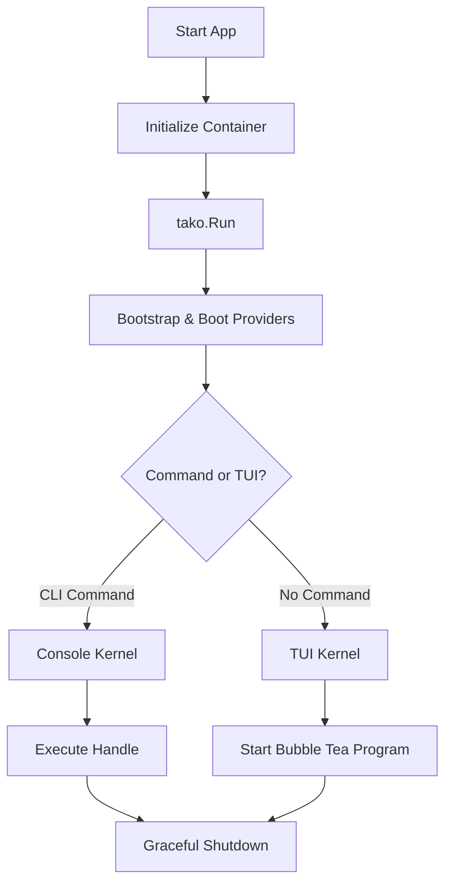

::warning
**Tako is currently in heavy development.** The framework is in its early stages, so expect breaking changes, incomplete features, and shifting APIs.
::

Tako is a framework for building beautiful Terminal User Interfaces (TUI) and Console applications in Go. If you love the expressive, developer-first experience of frameworks like Laravel but want to build terminal apps in Go, you'll feel right at home here!

Under the hood, Tako is built entirely on top of the amazing [Bubble Tea](https://charm.land/bubbletea/v2). It doesn't replace Bubble Tea; instead, it acts as an architectural layer that gives you a fluent API, a component-based workflow, and a robust structure for larger apps.

## Why did we build this?

If you've ever built a complex TUI application, you probably noticed that state management and component wiring can get messy fast. Passing dependencies down a long chain of structs and managing giant switch statements gets exhausting. Tako was created to organize that chaos and make terminal development fun again.

Here is a quick look at how Tako changes your workflow compared to vanilla Bubble Tea:

| Feature | Vanilla Bubble Tea | Tako Framework |
| --- | --- | --- |
| **State Management** | Passed manually down the component tree via structs. | Managed cleanly via a central Service Container. |
| **Event Handling** | Giant `switch msg := msg.(type)` blocks in a single `Update` function. | DOM-like event propagation (capturing & bubbling) and a global Event Bus. |
| **Dependency Injection** | Manual wiring and pointer passing. | Automatic resolution! Just ask the container for what you need. |
| **Code Organization** | Up to you! Can get messy in large apps. | Contract-first structure inspired by Laravel's architecture. |

In short, Tako lets you focus on building awesome terminal apps without fighting the boilerplate.

## Core Principles

Tako is guided by a few simple philosophies:

1. **Developer Experience (DX) First**: We want you to smile while writing code. APIs should read like natural English. We prioritize method chaining and clear, expressive naming conventions.
2. **Contract-First Architecture**: All core interactions are defined by interfaces in a dedicated `contracts` package. This keeps your codebase modular, swappable, and free from Go's dreaded import cycles.
3. **No Mutable Global State**: Global variables are a headache. In Tako, everything is neatly bound to and resolved from a thread-safe Service Container.
4. **Safety and Grace**: Built-in support for graceful shutdowns (LIFO & FIFO hooks), structured error handling, and completely thread-safe internal structures.

## What's in the box?

Instead of manually instantiating structs and passing them around, you register them as **Service Providers**. When your application boots up, Tako wires everything together for you automatically.

Here is what you get out of the box:
* **Service Container**: Type-safe dependency injection powered by Go Generics.
* **CLI Engine**: Console command routing with a super easy signature parser (e.g., `make:model {name}`).
* **Logger**: A robust, multi-channel logger for different outputs (files, stdout, etc).
* **Input Manager**: Elegant helper methods to bind keyboard shortcuts and mouse events globally or per-component.
* **Event Bus**: A global event dispatcher to easily decouple your components.
* **Hot-Reloading**: A built-in filesystem watcher so you don't have to restart your app manually after every single change.

## A Quick Taste

Initializing a Tako application is incredibly straightforward:

```go [main.go]
package main

import "gettako.dev/tako"

func main() {
	// Initialize the application and its internal container
	app := tako.NewApp()

	// Run the application lifecycle
	tako.Run(app)
}
```

::note
`tako.Run(app)` is smart! It automatically handles bootstrapping the application, booting your service providers, and routing to either the Console Engine (for CLI commands) or the TUI Engine based on how you launched the app.
::

Want to build a CLI tool? Tako provides a beautifully structured way to define console commands:

```go [commands.go]
package commands

import "gettako.dev/tako/contracts"

type MakeModelCommand struct {}

// Signature defines the command name, arguments, and options all in one readable string!
func (c *MakeModelCommand) Signature() string {
	return "make:model {name} {--m|migration : Create a new migration file}"
}

func (c *MakeModelCommand) Handle(ctx contracts.CommandContext) error {
	name := ctx.Argument("name")
	
	if ctx.Option("migration") {
		ctx.Components().Info("Creating migration for " + name)
	}

	ctx.Components().Done("Model " + name + " created successfully!")
	return nil
}
```

## How the Lifecycle Flows

Tako handles the application execution automatically based on the user's input and registered components. Here is a high-level look at what happens when you press enter:

