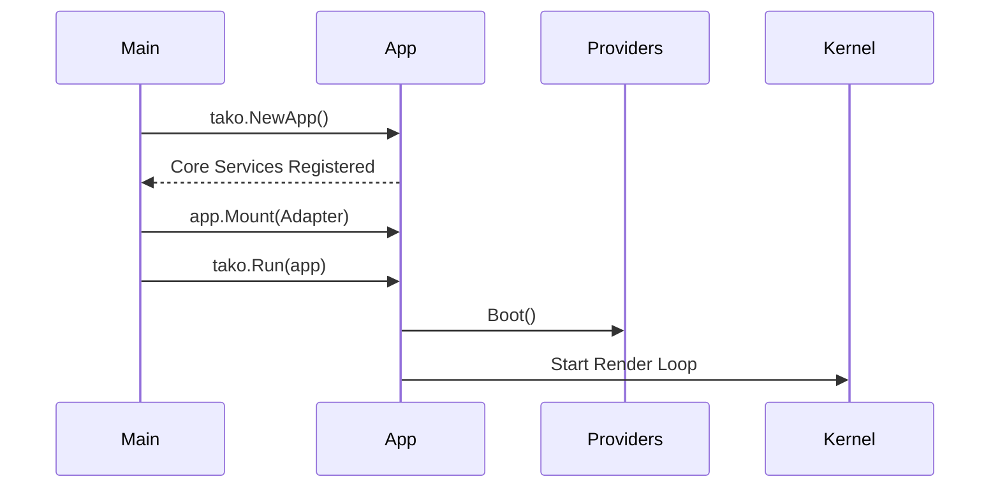

After installing Tako, let's build the foundation of our Server Dash application.

## The Bootstrap Sequence

Unlike traditional Go scripts that run sequentially, Tako applications are structured around a central Application instance. You initialize the application, mount your UI adapter, register your routes or services, and let the framework manage the execution loop.

Here is an overview of the bootstrap sequence:



Create a `main.go` file in your project root:

```go [main.go]
package main

import (
	"fmt"
	"os"

	"gettako.dev/tako"
	btadapter "gettako.dev/tako/pkg/adapter/ui/bubbletea"
)

func main() {
	// 1. Initialize the application
	// This registers core services like routing, events, and state.
	app := tako.NewApp()

	// 2. Mount a specific rendering adapter
	// We use the Bubble Tea adapter for rendering our terminal UI.
	app.Mount(btadapter.New(app))

	// (We will register our routes and components here later)

	// 3. Boot up the framework
	// This starts the UI event loop and blocks the main thread.
	if err := tako.Run(app); err != nil {
		fmt.Printf("Application Error: %v\n", err)
		os.Exit(1)
	}
}
```

## Running the Application

Execute your program:

```bash
go run main.go
```

You will likely see the application start and then immediately exit or display a blank screen. This is expected behavior since we have not built a UI component or set a default route.

### What happened?

1. `tako.NewApp()` created a new application instance. It registered the necessary core services, such as the Router, Event Bus, and State Manager.
2. `app.Mount(btadapter.New(app))` set the UI rendering adapter. Tako is adapter-agnostic, meaning you can swap the UI adapter if necessary.
3. `tako.Run(app)` booted all registered services and handed execution over to the kernel. Since there was no component to render, the application exited.

## Next Steps

The application structure is now set up. In the next chapter, we will cover how Tako handles configurations to prepare Server Dash for connecting to external services.
