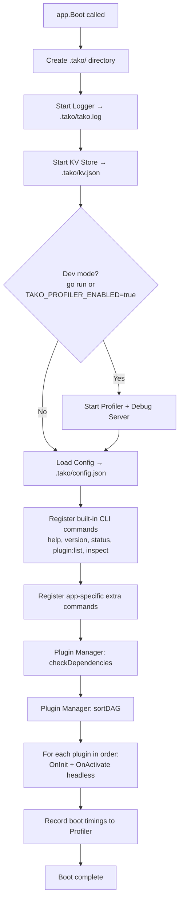
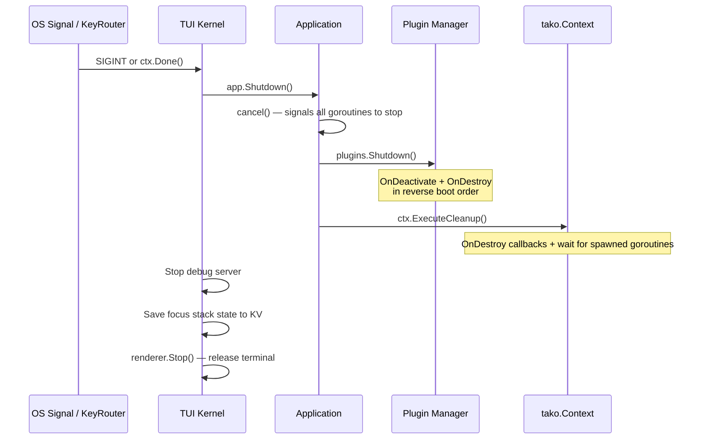

```go [main.go]
app := tako.NewApp()
tako.Run(app)
```

Simple to write, but there's a lot happening underneath. Understanding this will save you a lot of debugging time later.

## `tako.NewApp()`

This function creates the `Application` struct and wires up the core services that need to exist *before* plugins load. Specifically:

1. **Detects the app directory** — uses `runtime.Caller` to walk up the call stack and find `main.go`'s directory. This sets `TAKO_APP_DIR` automatically.
2. **Sets `TAKO_APP_NAME`** — derived from the binary name, or from the source path when running via `go run`.
3. **Creates the IoC Container** — the empty container that everything else gets registered into.
4. **Creates the Event Bus** — available immediately for any service to subscribe to.
5. **Creates the Hook Registry** — extension points are ready before plugins load.
6. **Creates the Key Router** — keybinding registration can happen in plugin `init()` functions.
7. **Registers the Plugin Manager** — and handles `plugin.Register` so that `init()` functions in plugin packages are captured.

Notice what's **not** in `NewApp()`: Logger, Config, KVStore. Those come in `Boot()`.

## `app.Boot()`

Boot is where the rest of the framework infrastructure comes online, and where your plugins are initialized. Here's the exact sequence:



You can call `app.Boot()` explicitly if you need to register things between `NewApp()` and boot. A common pattern:

```go [main.go]
app := tako.NewApp()

// Register your UI renderer BEFORE or AFTER Boot — both work.
// The renderer is only started when tako.Run() is called.
// NOTE: The bubbletea adapter is a separate submodule:
//   go get github.com/takoterm/tako/pkg/adapter/bubbletea
app.WithRenderer(bubbletea.NewAdapter(app.Context(), &myLayout{}))

tako.Run(app) // calls Boot() internally if you haven't already
```

> **Note:** `tako.Run()` calls `app.Boot()` for you if it hasn't been called yet. You only need to call it manually if you need to do something between boot and run — like resolve a service that needs the logger to be available.

## Shutdown

Shutdown is the reverse of Boot. When `ctrl+c` is pressed (or the context is cancelled programmatically), the TUI Kernel runs:



The two-phase approach — cancel context first, then teardown — ensures goroutines get the cancellation signal before their owning plugins are torn down.

## The Context Object

`tako.Context` is the object your plugins receive in lifecycle hooks. It's not just a `context.Context` — it's a service locator with shortcuts:

```go [lifecycle.go]
func (p *Plugin) OnInit(ctx *tako.Context) error {
    // Framework context (for goroutines, cancellation)
    ctx.Done()           // <-chan struct{}

    // Service shortcuts (cached after first access)
    ctx.Logger()         // contracts.Logger
    ctx.Config()         // contracts.Config
    ctx.Events()         // contracts.EventBus
    ctx.Hooks()          // hook.Registry
    ctx.Storage()        // contracts.KVStore

    // Direct container access (for resolving custom services)
    ctx.Container().Make(&myService)

    // Goroutine management
    ctx.Spawn(func(ctx context.Context) {
        // Tracked goroutine — waits for this before shutdown
    })

    // Cleanup registration
    ctx.OnDestroy(func() {
        // Called during Application.Shutdown()
    })

    return nil
}
```

Services are lazy-cached inside `Context`, so calling `ctx.Logger()` ten times only does the container lookup once.
