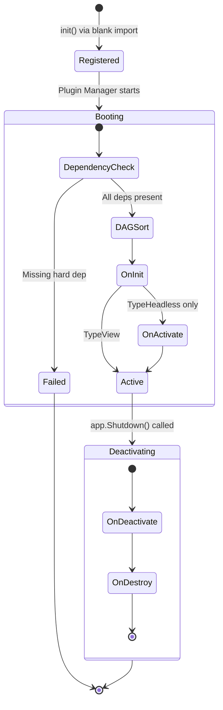

That said — once you understand the plugin pattern, you'll find it's a clean way to organize even medium-sized apps. So let's build one.

We'll write a "clock" plugin that:

- Registers a sidebar widget (via Hook)
- Subscribes to an event from another plugin
- Registers a keybinding
- Cleans up properly on shutdown

## The Three-File Pattern

Every Tako plugin is typically three files:

| File           | Purpose                                                    |
|----------------|------------------------------------------------------------|
| `plugin.go`    | Declares the `Manifest` — metadata and dependencies        |
| `init.go`      | Registers the plugin with the global registry via `init()` |
| `lifecycle.go` | Implements the `Lifecycle` interface — the actual logic    |

## Step 1 — The Manifest

```go [plugin.go]
// plugins/clock/plugin.go
package clock

import "github.com/takoterm/tako/internal/plugin"

var Manifest = plugin.Manifest{
	ID:          "clock",
	Name:        "Live Clock",
	Version:     "1.0.0",
	Description: "Displays a live clock in the sidebar.",
	Author:      "You",
	Type:        plugin.TypeHeadless, // runs in the background, no direct UI ownership
}
```

**Plugin types:**

- `TypeHeadless` — background service. Gets both `OnInit` and `OnActivate` called. Good for plugins that manage state, subscribe to events, or run goroutines.
- `TypeView` — UI-focused. Gets `OnInit` called. Registers hooks to contribute UI components.

> If you omit `Type`, it defaults to `TypeView`.

## Step 2 — Auto-Registration

```go [init.go]
// plugins/clock/init.go
package clock

import "github.com/takoterm/tako/internal/plugin"

func init() {
	plugin.Register(Manifest, func() plugin.Lifecycle {
		return &Plugin{}
	})
}
```

The `init()` function runs when Go imports the package. `plugin.Register` buffers this registration until the Plugin Manager is ready. In `main.go`, you blank-import the plugin:

```go [main.go]
import _ "myapp/plugins/clock"
```

That's all `main.go` needs to know about your plugin. No explicit wiring required.

## Step 3 — The Lifecycle

```go [lifecycle.go]
// plugins/clock/lifecycle.go
package clock

import (
	"context"
	"fmt"
	"time"

	"github.com/takoterm/tako/internal/plugin"
	"github.com/takoterm/tako/internal/tako"
)

type Plugin struct {
	plugin.NoopLifecycle // provides no-op defaults for hooks you don't implement
	currentTime          string
	cancelSub            func()
}

func (p *Plugin) OnInit(ctx *tako.Context) error {
	p.currentTime = time.Now().Format("15:04:05")

	// Register a sidebar widget — multiple plugins can contribute to the same slot
	ctx.Hooks().Add("app.sidebar", func() any {
		return fmt.Sprintf("🕐 %s", p.currentTime)
	})

	// Register a keybinding — no router boilerplate needed
	ctx.Keys().Bind("ctrl+t", func() {
		ctx.Logger().Info("Clock: ctrl+t pressed, current time", "time", p.currentTime)
	})

	return nil
}

func (p *Plugin) OnActivate(ctx *tako.Context) error {
	// Start a background goroutine that ticks every second.
	// ctx.Spawn is tracked — the framework waits for it during shutdown.
	ctx.Spawn(func(c context.Context) {
		ticker := time.NewTicker(time.Second)
		defer ticker.Stop()
		for {
			select {
			case t := <-ticker.C:
				p.currentTime = t.Format("15:04:05")
				// Notify the UI to re-render
				ctx.Emit("clock:tick", p.currentTime)
			case <-c.Done():
				return
			}
		}
	})

	return nil
}

func (p *Plugin) OnDeactivate(ctx *tako.Context) error {
	if p.cancelSub != nil {
		p.cancelSub()
	}
	return nil
}
```

Notice a few things:

- `plugin.NoopLifecycle` is embedded so you only need to implement the hooks you care about.
- `ctx.Spawn` is used for the goroutine — the framework tracks it and waits for it to exit during shutdown before destroying the plugin.
- The clock publishes `clock:tick` events. Any other plugin can subscribe to this without any direct import.

## Step 4 — Import in main.go

```go [main.go]
// main.go
import (
"github.com/takoterm/tako"
_ "myapp/plugins/clock" // ← blank import triggers init()
)

func main() {
app := tako.NewApp()
// ... register renderer ...
tako.Run(app)
}
```

## The Full Lifecycle Flow

Here's what happens to your plugin from boot to shutdown:



---

> to use each one.
