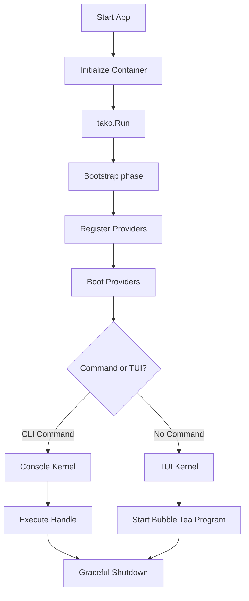

Understanding the lifecycle of a Tako application is the key to mastering the framework. Once you know exactly when and how things happen, you'll know exactly where to write your code. 

Whether the user is launching a beautiful TUI screen or running a quick CLI command, the underlying lifecycle is exactly the same.

## High-Level Flow

Here is a visual representation of what happens from the moment the application starts to the moment it exits:

Let's break this down step-by-step.

## 1. Initialization

Everything begins in your `main.go` file with `tako.NewApp()`. 

This creates the core **Application** instance and initializes the internal **Service Container**. At this stage, nothing is running yet; we are simply setting up the memory structures required to hold your dependencies.

## 2. Registration

After creating the app, you register your **Service Providers**. 

Service Providers are the central place to configure your application. During the registration phase, the `Register()` method on every provider is called. 

::warning
During the `Register` phase, you should **only** bind things into the Service Container. Do not attempt to resolve other services (like the database or logger) here, because they might not have been registered yet!
::

## 3. Booting

Once all providers have been registered, Tako moves to the Boot phase. It calls the `Boot()` method on all registered Service Providers. 

Since everything has been registered by now, it is completely safe to resolve any dependency from the container inside the `Boot` method. This is the perfect place to:
* Register global event listeners.
* Attach middleware.
* Initialize database connections.

### Boot Hooks

You can hook into the exact moment the application boots using lifecycle callbacks:

* **`app.Booting(func())`**: Executed right before the providers start booting.
* **`app.Booted(func())`**: Executed immediately after all providers have finished booting.

## 4. Execution (The Kernels)

After the application is fully booted, `tako.Run(app)` takes over. It looks at the command-line arguments to decide which engine (Kernel) to launch.

* **Console Kernel**: If the user ran a specific command (e.g., `go run main.go make:model User`), Tako routes the execution to the Console Kernel. The kernel resolves the command, executes its `Handle` method, and prepares to exit.
* **TUI Kernel**: If no command was provided, Tako hands control over to the TUI Kernel. This kernel initializes your router, binds global inputs, and starts the underlying Bubble Tea program, taking over the terminal screen.

## 5. Graceful Shutdown

When the application is asked to exit—whether the user pressed `Ctrl+C`, quit the TUI, or a CLI command finished its job—Tako executes a graceful shutdown sequence.

It triggers two important hooks:

* **`app.Terminating(func())`**: Executed first. These hooks run in **LIFO** (Last-In, First-Out) order. This is where you should close network connections, flush buffers, or save state. LIFO ensures that the most recently created resources are destroyed first.
* **`app.Terminated(func())`**: Executed last. These hooks run in **FIFO** (First-In, First-Out) order. This is used by the framework's core (like the Logger) to perform the absolute final cleanup before the Go process terminates.

By hooking into these lifecycle events, you can guarantee that your application never leaves orphaned sockets, corrupted files, or unsaved data behind.
