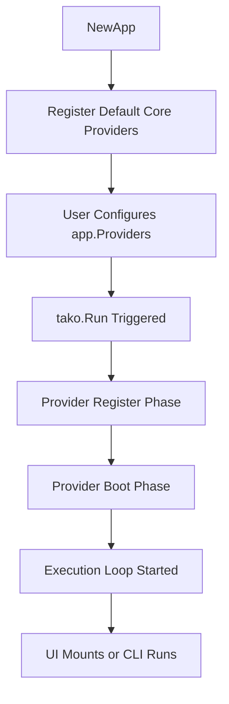

To effectively build applications with Tako, it is helpful to understand its lifecycle. Unlike scripts that run linearly, Tako follows a specific sequence of events to ensure components and services are initialized correctly.

## The Boot Sequence

When you initialize and run your application, the framework follows a structured boot sequence:



### 1. Initialization
`tako.NewApp()` creates the `Application` instance. At this moment, the dependency injection container is instantiated, and default configurations are loaded. 

### 2. Provider Registration (`Register` Phase)
When `tako.Run(app)` is called, the framework iterates over all registered Service Providers and executes their `Register(app)` method.
During this phase, providers bind their services to the **IoC Container**. Complex logic or service resolution should not happen here because other providers might not be registered yet.

### 3. Provider Booting (`Boot` Phase)
After every provider has completed its `Register` phase, the framework calls the `Boot(app)` method on each provider.
At this point, you can safely resolve dependencies using `app.Make()` since the container is populated.

### 4. Execution Loop
Finally, the application hands over control to the active UI Adapter (like Bubble Tea) or runs the designated CLI command. The main thread blocks here, waiting for user interactions, until the application exits.

## Headless & Manual Bootstrapping

If you are building a CLI daemon, a background worker, or a backend server, you may not need TUI-related services like `UI`, `Router`, or `Theme`.

### Using `NewHeadlessApp()`

Tako provides a built-in helper for this:

```go
import (
	"gettako.dev/tako"
	"os"
)

func main() {
    // UI, Router, and Theme providers are omitted,
    // reducing memory usage and speeding up boot times.
    app := tako.NewHeadlessApp()
    
    // Register custom workers or services
    app.Providers(
        &providers.BackgroundWorkerProvider{},
    )
    
    if err := tako.Run(app); err != nil {
        os.Exit(1)
    }
}
```

### Manual Bootstrapping

If you need control over which providers are loaded, you can bypass both `tako.NewApp()` and `tako.NewHeadlessApp()` to construct a bare application instance.

```go
import "gettako.dev/tako/pkg/foundation"

func main() {
    // Create an application without default providers
    app := foundation.NewApplication()
    
    // Register only the necessary providers
    app.Register(&providers.EventServiceProvider{})
    app.Register(&providers.LoggerServiceProvider{})
    
    tako.Run(app)
}
```

This approach is useful when embedding Tako into applications where memory usage must be managed closely.

## Environment Detection

During execution, it is common to need to know what environment the application is running in (e.g., `local`, `production`, or `testing`). Tako provides helper methods on the `Application` interface for this:

```go
if app.IsEnvironment("local", "testing") {
    // Run debug specific logic
    app.Logger().Debug("Debug Mode Enabled")
}

// Or get the exact environment name
currentEnv := app.Environment() // defaults to "production"
```

Tako reads this from your configuration (`app.env`), which supports `.env` overrides.

## Graceful Shutdown

When the user exits the TUI or triggers an interrupt signal (`SIGINT`/`SIGTERM`), Tako initiates a graceful shutdown sequence.

1. The underlying `context.Context` is cancelled.
2. The UI Manager unmounts the current views and restores the terminal to its original state.
3. Registered `OnDestroy` callbacks are executed in LIFO (Last-In, First-Out) order.
4. Any `Disposable` service providers have their `Shutdown()` methods invoked.
5. The application exits without leaking goroutines or leaving the terminal in a broken state.

::tip
Always accept a `context.Context` when writing long-running loops or background jobs. Listen to `ctx.Done()` to ensure your jobs exit cleanly during application shutdown.
::
