> [!TIP]
> **Why this matters:** If you need to access the configuration or logger before a plugin loads, knowing the bootstrap order ensures you place your logic at the correct stage of the application lifecycle.

## Overview

When you call `tako.Run(app)` inside your `main.go`, Tako performs a sequence of initializations before ever rendering a UI or executing a command. 

This sequence is executed through an array of **Bootstrappers**—functions that handle specific initialization steps.

```mermaid
sequenceDiagram
    participant Main as main.go
    participant App as foundation.Application
    participant BS as Bootstrappers
    participant Kernel as TUI / CLI Kernel
    
    Main->>App: tako.Run(app)
    App->>BS: Boot()
    
    rect rgb(30, 30, 30)
    Note over BS: 1. EnsureHomeDirectory
    Note over BS: 2. RegisterLogger
    Note over BS: 3. RegisterStorage
    Note over BS: 4. RegisterProfiler
    Note over BS: 5. LoadConfiguration
    Note over BS: 6. RegisterCoreCommands
    Note over BS: 7. BootPlugins
    Note over BS: 8. RecordMetrics
    end
    
    BS-->>App: Boot Complete
    App->>Kernel: Run() / Handle()
```



## The Default Bootstrappers

The default bootstrappers are executed in a strict, predefined order. Here is what happens at each step:

### 1. Ensure Home Directory (`EnsureHomeDirectory`)
Tako creates the hidden directory for your application data (typically `~/.tako`). This directory is used for SQLite databases, temporary sockets, and log files.

### 2. Register Logger (`RegisterLogger`)
Initializes the application logger and binds it to the Service Container (`contracts.Logger`). From this point onward, any component can safely log messages.

### 3. Register Storage (`RegisterStorage`)
Configures the internal storage mechanism (SQLite and key-value store) and binds it to the container (`contracts.Storage`).

### 4. Register Profiler (`RegisterProfiler`)
If development mode is active, this step initializes the `Profiler` and the local WebSocket debug server. In production builds, this step gracefully does nothing.

### 5. Load Configuration (`LoadConfiguration`)
Reads your application's `tako.yaml` or `.env` files and binds the configuration to the container (`contracts.Config`).

> [!IMPORTANT]
> If you are building a plugin that relies on user configuration, ensure your initialization logic runs **after** this bootstrapper.

### 6. Register Core Commands (`RegisterCoreCommands`)
Registers internal CLI commands like `dev`, `build`, and `inspect`. 

### 7. Boot Plugins (`BootPlugins`)
This is where third-party and custom plugins are initialized. Tako calls the `OnInit()` method on all registered plugins, injecting any required dependencies.

### 8. Record Metrics (`RecordMetrics`)
The final step records the total time taken for the bootstrap process and passes this information to the Profiler for DevTools inspection.

## Customizing the Bootstrap Sequence

In advanced use cases, you might want to skip certain bootstrappers or inject your own custom initialization logic before the plugins load.

Instead of calling `tako.Run(app)`, you can manually bootstrap the application using `BootstrapWith`:

```go [main.go]
package main

import (
    "github.com/takoterm/tako/pkg/foundation"
    "github.com/takoterm/tako/pkg/foundation/bootstrap"
    // ...
)

func main() {
    app := foundation.NewApplication()
    
    // Create a custom array of bootstrappers
    customBootstrappers := []foundation.Bootstrapper{
        new(bootstrap.EnsureHomeDirectory),
        new(bootstrap.RegisterLogger),
        new(MyCustomBootstrapper), // <-- Your custom logic!
        new(bootstrap.BootPlugins),
    }
    
    if err := app.BootstrapWith(customBootstrappers); err != nil {
        panic(err)
    }
    
    // Continue with Kernel initialization...
}
```

> [!WARNING]
> Modifying the default bootstrapper array should be done with caution. Removing core bootstrappers like `RegisterLogger` or `LoadConfiguration` will cause components relying on them to panic.
