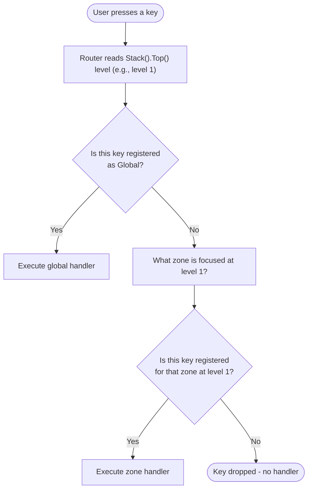

The key router dispatches every keypress to exactly one handler based on two factors: which zone currently holds focus, and which stack level is active. No `if-else` chains, no
mode flags. Register bindings declaratively — the framework guarantees they fire only when their conditions are met.

## Global Keys

Global bindings fire regardless of focus. Use them for truly application-wide actions:

```go [main.go]
app.Keys().Bind("ctrl+q", func() { app.Shutdown() }).Desc("Quit application")
app.Keys().Bind("ctrl+l", func() { app.State().Set("ui:clear", true) }).Desc("Clear UI state")
app.Keys().Bind([]string{"?", "f1"}, func() { app.UI().MountOverlay(&HelpPanel{}) }).Desc("Show help panel")
```

::tip
You can optionally chain multiple `Bind()` calls together (e.g., `app.Keys().Bind(...).Bind(...)`) if you prefer that style, but listing them individually is often cleaner.
::

**Rule:** If you find yourself adding conditionals inside a global handler to check which panel is open, convert it to a zone-scoped binding.

You can also completely remove a binding later using `Unbind`:

```go [main.go]
app.Keys().Unbind("ctrl+l")
```

## Zone-Scoped Keys

Zone bindings fire only when their named zone holds focus at the active stack level:

```go [providers/orders/provider.go]
func (p *OrderProvider) Boot(app *foundation.Application) error {
    ctx := app.Context()

    // These only fire when the "order-list" zone is focused at level 0
    listZone := ctx.Keys().Zone("order-list")
    listZone.Bind("j|down",    func() { p.moveDown() }).Desc("Move down")
    listZone.Bind("k|up",      func() { p.moveUp() }).Desc("Move up")
    listZone.Bind("enter",     func() { p.openSelected() }).Desc("Open order")
    listZone.Bind("x",         func() { p.cancelSelected() }).Desc("Cancel order")
    listZone.Bind([]string{"r", "f5"}, func() { p.refresh() }).Desc("Refresh list")

    // These only fire when the "order-detail" zone is at level 0
    detailZone := ctx.Keys().Zone("order-detail")
    detailZone.Bind("esc",  func() { p.closeDetail() })
    detailZone.Bind("e",    func() { p.editOrder() })
    detailZone.Bind("ctrl+d", func() { p.deleteOrder() })
		
    // Remove a binding from a zone
    // ctx.Keys().Zone("order-detail").Unbind("ctrl+d")
    return nil
}
```

**Zone + Level:** When you push an overlay to level 1, bind its keys at that level:

```go [provider.go]
func (p *SearchProvider) openSearch(ctx *tako.Context) {
    ctx.UI().Show("search", p.renderSearch)

    // Bindings at level 1 — dormant until this overlay is pushed
    searchZone := ctx.Keys().Zone("search", 1)
    searchZone.Bind("esc",   func() { ctx.UI().Unmount() }).Desc("Close search")
    searchZone.Bind("enter", func() { p.executeSearch() }).Desc("Execute search")
    searchZone.Bind("up",    func() { p.cursor-- }).Desc("Move up")
    searchZone.Bind("down",  func() { p.cursor++ }).Desc("Move down")
}
```

::tip
Use `MountOverlay` instead of manual `Show` + `Zone().Bind()`. Component overlay registration handles level targeting automatically via `RegisterKeys(keys contracts.KeyManager)`.
::

## Focus Management

The router needs to know which zone is focused to dispatch zoned keys. Use `Focus` to shift focus within a level:

```go [provider.go]
// Move focus to "order-detail" at level 0 when user opens an order
func (p *OrderProvider) openDetail(ctx *tako.Context) {
    p.selectedOrder = p.orders[p.cursor]
    ctx.Router().Focus(0, "order-detail")
}

// Return focus to "order-list" when detail is closed
func (p *OrderProvider) closeDetail(ctx *tako.Context) {
    ctx.Router().Focus(0, "order-list")
}
```

Or set a default focus zone at boot:

```go [main.go]
// Initial focus — determines which zone receives input on first render
app.Router().Focus(0, "order-list")
```

## Key String Format

| Key      | String                                                |
|----------|-------------------------------------------------------|
| Letter   | `a`, `z`, `r`                                         |
| Number   | `1`, `0`                                              |
| Special  | `space`, `enter`, `esc`, `tab`, `backspace`, `delete` |
| Arrow    | `up`, `down`, `left`, `right`                         |
| Control  | `ctrl+c`, `ctrl+f`, `ctrl+shift+s`                    |
| Alt      | `alt+enter`, `alt+p`                                  |
| Function | `f1`–`f12`                                            |
| Aliases  | `j\|down` — either key triggers the handler           |

## Key Conflict Detection

Registering the same key for the same zone+level combination logs an error at registration time. Conflicts are caught during boot, not at runtime:

```
[ERROR] Key "j" already bound for zone "order-list" at level 0. Ignoring duplicate.
```

To list all registered bindings:

```bash [terminal]
go run . route:list
```

## Dispatch Flow



Global handlers take precedence over zone handlers. If a global and a zone handler are both registered for the same key, the global wins.

::tip
For complex views with many keybindings, group them in a `registerKeys(ctx *tako.Context)` method called from `Boot`. This keeps your `Boot` readable and makes it easy to grep all
key registrations for a provider in one place. Name the method consistently across providers so new developers know exactly where to look.
::

