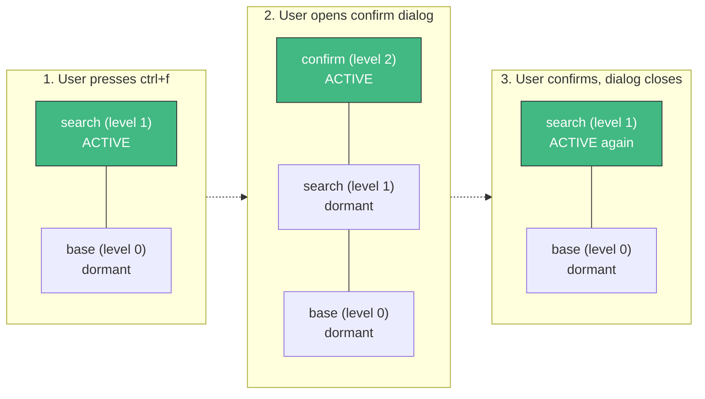

The focus stack is a named layer stack. The key router and mouse router only dispatch to bindings and hitboxes registered at the **topmost** level. Push a layer — that layer gains
control. Pop it — the layer below regains control, and all bindings at the popped level are purged automatically.

## Push and Pop

```go [provider.go]
// Push adds a layer to the top — all input goes here now
ctx.Stack().Push("search-overlay")
// Stack: [base, search-overlay]

// Pop removes the top layer — input returns to the one below
ctx.Stack().Pop()
// Stack: [base]

// Chain operations
ctx.Stack().Push("settings").Push("confirm-dialog")
// Stack: [base, settings, confirm-dialog]
```

Both `Push` and `Pop` return `*Stack` for chaining. They're thread-safe.

**What happens on Pop:**

1. Guards are evaluated against the current top layer
2. The stack re-validates that the top layer hasn't changed before mutating (TOCTOU-safe — if another goroutine pushed a new layer between guard evaluation and the actual pop, the
   pop is safely aborted)
3. All keybindings registered at the popped level are removed from the key registry
4. All mouse hitboxes at that level are removed
5. Focus reverts to the new top layer (auto-focus)

You never need to manually clean up bindings when closing an overlay — the stack handles it.

## Guards

Guards can prevent transitions before they happen — useful for unsaved-changes warnings or authorization:

```go [providers/editor/provider.go]
func (p *EditorProvider) Boot(app *foundation.Application) error {
    ctx := app.Context()

    // Prevent closing the editor with unsaved changes
    ctx.Stack().BeforePop(func(layer string) (bool, string) {
        if layer == "editor" && p.hasUnsavedChanges() {
            return false, "save or discard changes before closing"
        }
        return true, ""
    })

    // Prevent opening settings unless authenticated
    ctx.Stack().BeforePush(func(layer string) (bool, string) {
        if layer == "admin-panel" && !p.currentUser.IsAdmin() {
            return false, "admin access required"
        }
        return true, ""
    })

    // React to blocked transitions — show a toast or dialog
    ctx.Stack().
        OnPopBlocked(func(layer, reason string) {
            ctx.Emit("toast:show", reason)
        }).
        OnPushBlocked(func(layer, reason string) {
            ctx.Emit("notification:warn", reason)
        })
    return nil
}
```

Multiple guards can be registered — each one votes independently, returning `true` for layers it doesn't care about. The first `false` wins; subsequent guards are not called.

::tip
Guards are not persisted through `SaveState`/`RestoreState`. Re-register them on every boot — they represent application logic, not stack state.
::

## Inspecting the Stack

```go [layout.go]
func (l *Base) View(ctx *tako.Context) tea.View {
    top   := ctx.Stack().Top()    // "" if empty; current layer ID otherwise
    depth := ctx.Stack().Size()   // Number of active layers
    all   := ctx.Stack().Layers() // Snapshot copy, bottom to top

    // Render the overlay matching the top layer
    overlay := ctx.Hooks().Get("tako.overlay." + top)

    // Show a "close overlay" hint if overlays are active
    if depth > 1 {
        // Show "press esc to close" in the status bar
    }
    ...
}
```

`Layers()` returns a copy — safe to iterate without holding any lock.

## State Persistence

Session continuity: save the stack on shutdown, restore it on next launch.

```go [providers/app/provider.go]
func (p *AppProvider) Shutdown() error {
    p.app.Router().Stack().SaveState(p.app.Storage()) // Writes to KV key "router.stack"
    return nil
}
```

```go [bootstrap/app_bootstrapper.go]
func (b *AppBootstrapper) Bootstrap(app *foundation.Application) error {
    // On first run, RestoreState is a no-op (key not found)
    app.Router().Stack().RestoreState(app.Storage())
    return nil
}
```

::note
Restoring the stack only restores layer **names** — not keybindings or hitboxes. Your provider initialization must re-register bindings unconditionally so they're available
regardless of what layers are restored.
::

## Smart Quit

Tako's default `ctrl+c` handler checks the stack depth:

```
Stack size > 1  → ignore (user should close overlays first)
Stack size == 1 → quit the application
```

This prevents accidental shutdown when a user presses `ctrl+c` while a dialog is open.

::warning
**Base Layers vs. Overlays:** Do not use `app.UI().MountOverlay()` to render your main application screen (e.g., a dashboard or a simple CLI view). Doing so pushes the main view as
an overlay, inflating the stack size to 2, which causes the Smart Quit logic to ignore `ctrl+c`.

Instead, register your main component to the base layer (stack level 1) by calling `app.Stack().Push(id)` and `app.UI().Register(component)`. This ensures `ctrl+c` behaves
naturally without requiring custom bindings.
::

To completely disable this behavior from the start, use `WithoutDefaultQuit` during application setup:

```go [main.go]
app := tako.NewApp().WithoutDefaultQuit()
```

Or you can override it with your own global binding:

```go [main.go]
// Pop one overlay at a time; quit only from the base layer
app.Keys().Bind("ctrl+c", func() {
    if app.Router().Stack().Size() > 1 {
        app.UI().Unmount()
    } else {
        app.Shutdown()
    }
})
```

You can also completely remove the binding later using `app.Keys().Unbind("ctrl+c")`.

## Layer Stack Diagram



::tip
Prefer `app.UI().Show()` and `app.UI().MountOverlay()` over raw `Stack().Push()` for overlays. The overlay manager handles the push, registers the render hook, and pairs it with
`Close()` which handles the pop. Raw `Stack().Push()` is available for custom focus management scenarios where you need direct control — like a wizard-style multi-step form with
its own internal navigation.
::

