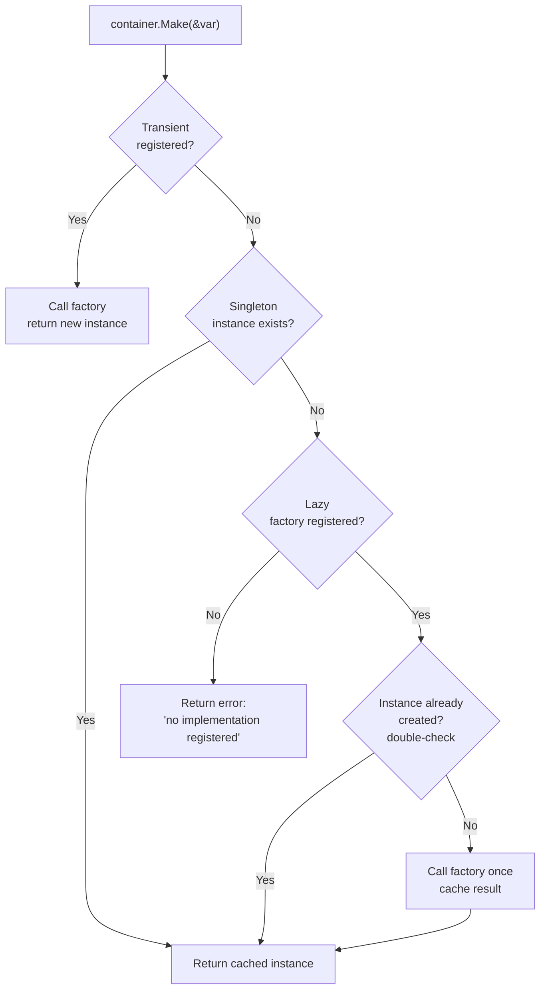

This pattern is called **Inversion of Control (IoC)**, and it's the reason plugins in Tako are naturally testable and replaceable.

## The Core Idea

Instead of this:

```go [global.go]
// ❌ global variable 
var myLogger *slog.Logger

func init() {
    myLogger = slog.Default()
}
```

You do this:

#### 1. Registering (Host App)

```go [container.go]
app.Container().Singleton(new(contracts.Logger), myLogger)
```

#### 2. Resolving (Plugin)

```go [lifecycle.go]
var logger contracts.Logger
ctx.Container().Make(&logger)
```

The plugin depends on `contracts.Logger` — an interface — not on any concrete implementation. This means you can swap the logger in tests without changing a single line of plugin code.

## The Three Registration Scopes

The container supports three binding modes. Choosing the right one matters.

### `Singleton` — register a pre-built instance

Use this when you already have the object and want everyone to share the same instance.

```go [container.go]
bus := event.NewBus()
container.Singleton(new(contracts.EventBus), bus)
```

The same `bus` is returned every time `Make` is called for `contracts.EventBus`. The factory is never called — you're registering the finished product.

**When to use:** Services that are cheap to create upfront and naturally shared (event bus, logger, config, key router).

### `Lazy` — defer construction until first use

Use this when construction is expensive or requires services that aren't registered yet.

```go [container.go]
container.Lazy(new(*MyService), func() (any, error) {
    var logger contracts.Logger
    if err := container.Make(&logger); err != nil {
        return nil, err
    }
    return NewMyService(logger), nil
})
```

The factory runs exactly once, on the first `Make` call. After that, the result is cached just like `Singleton`. Thread-safe — the double-check pattern ensures only one goroutine runs the factory even under concurrent access.

**When to use:** Services that need other services to be built, or services that are only needed conditionally.

### `Transient` — new instance on every call

Use this for objects that should not be shared — like request-scoped contexts or throw-away builders.

```go [container.go]
container.Transient(new(*QueryBuilder), func() (any, error) {
    return NewQueryBuilder(), nil
})
```

Every `Make` call creates a fresh instance.

**When to use:** Rare in framework code. More useful in application-level services where shared state would cause bugs.

## Resolving Services

```go [lifecycle.go]
// Recommended
logger := tako.MustResolve[contracts.Logger](ctx.Container())

// Manual (with error handling)
var manualLogger contracts.Logger
if err := ctx.Container().Make(&manualLogger); err != nil {
    return fmt.Errorf("plugin: failed to resolve logger: %w", err)
}
```

`Make` takes a **pointer to the interface variable** you want to fill. The container uses reflection to match the interface type to its registered implementation.

Always check the error. If a service isn't registered, `Make` returns an error — it doesn't panic. Handle it gracefully.

### Generic Resolve Shortcut

If you are using Go 1.18+ (which Tako requires), you can avoid the boilerplate error handling and type pointer passing by using the generic `tako.Resolve` helper:

```go [lifecycle.go]
bus := tako.Resolve[contracts.EventBus](ctx.Container())
if bus == nil {
    // handle missing service
}

// Or, if your plugin absolutely requires this service to boot:
logger := tako.MustResolve[contracts.Logger](ctx.Container()) // panics if not found
```

## The `ctx.Logger()` Shortcut

For core framework services, `tako.Context` provides cached shortcuts so you don't need to call `Make` every time:

```go [lifecycle.go]
ctx.Logger()    // contracts.Logger
ctx.Config()    // contracts.Config
ctx.Events()  // contracts.EventBus
ctx.Hooks()     // hook.Registry
ctx.Storage()   // contracts.KVStore
ctx.Theme()     // contracts.ThemeManager
ctx.Lang()      // contracts.LangManager
ctx.State()     // contracts.StateManager
ctx.Jobs()      // contracts.Scheduler
ctx.Router()    // *router.Router
ctx.Overlay()   // contracts.OverlayManager
ctx.Container() // contracts.Container (for everything else)
```

These cache on first access under a mutex. Safe to call from multiple goroutines.

## Dependency Injection via `Call`

When you need to resolve one or more services and immediately use them — without
declaring intermediate variables — use `Call`. The container inspects the
function's parameter types, resolves each one, and invokes the function:

```go [main.go]
app.Container().Call(func(registry *cli.Registry) {
    registry.Register(&MigrateCommand{})
})
```

Multiple parameters work exactly as you'd expect:

```go [main.go]
app.Container().Call(func(bus contracts.EventBus, logger contracts.Logger) {
    bus.Publish("app:custom-init", nil)
    logger.Info("custom init complete")
})
```

If any parameter cannot be resolved, `Call` returns an error immediately without invoking the function.

## Resolution Flow



## Registering Your Own Services

Plugins can register their own services into the container during `OnInit`. This is how you make a service available to other plugins:

```go [lifecycle.go]
func (p *Plugin) OnInit(ctx *tako.Context) error {
    // Build the service
    svc := NewMySearchService()

    // Register it so other plugins can resolve it
    ctx.Container().Singleton(new(*MySearchService), svc)

    return nil
}
```

Another plugin that depends on `MySearchService` declares the dependency in its manifest and resolves it in its own `OnInit`:

```go [lifecycle.go]
var Manifest = plugin.Manifest{
    ID:       "results-view",
    Requires: []string{"search"}, // boot order guaranteed
}

func (p *Plugin) OnInit(ctx *tako.Context) error {
    var svc *MySearchService
    if err := ctx.Container().Make(&svc); err != nil {
        return fmt.Errorf("results-view: search service not available: %w", err)
    }
    p.searchSvc = svc
    return nil
}
```

The `Requires` field in the manifest guarantees that `search` is booted before `results-view`. The DAG sort handles this automatically.
