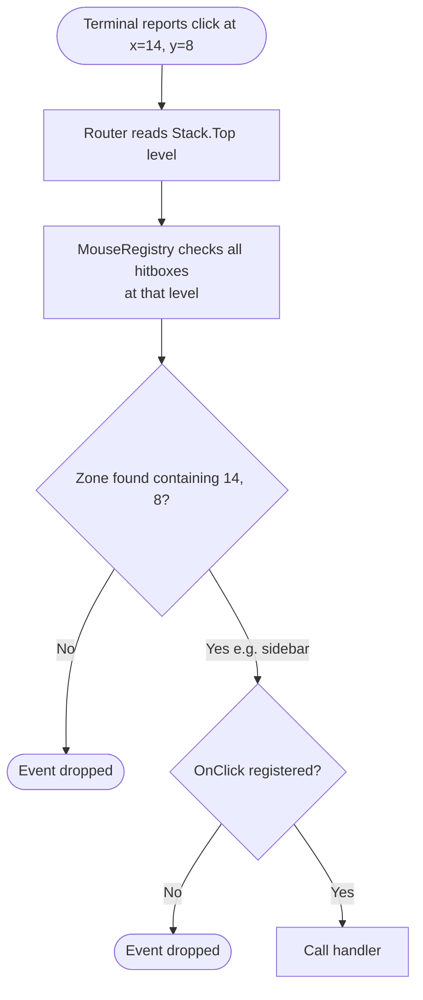

Mouse routing uses a hitbox-based model: you declare where your UI zones are on every render cycle, and the router handles hit-testing. When a click arrives, the router checks
which hitbox at the current stack level contains the coordinates and dispatches to the registered handler. No hit-testing logic in your code.

## Declaring Hitboxes

Hitboxes must be updated **every render cycle** — not once at init. Terminal layout is dynamic; zones shift when the window is resized, sidebars collapse, or content scrolls.

```go [layouts/base.go]
func (l *Base) View(ctx *tako.Context) tea.View {
    // Sidebar occupies the left 30 columns (minus toolbar row)
    sidebarX, sidebarY := 0, 1
    sidebarW, sidebarH := 30, l.termHeight-2

    l.mouse.UpdateHitbox("sidebar", sidebarX, sidebarY, sidebarW, sidebarH)

    // Main panel takes the rest of the width
    mainX := sidebarW + 1
    mainW := l.termWidth - mainX
    l.mouse.UpdateHitbox("main", mainX, sidebarY, mainW, sidebarH)

    // Build and return the view string...
}
```

For overlay components at non-zero stack levels:

```go
// Modal at stack level 1
l.mouse.UpdateHitboxAt(1, "modal-body",   modalX, modalY,   modalW, modalH)
l.mouse.UpdateHitboxAt(1, "modal-cancel", cancelX, cancelY, btnW,   btnH)
l.mouse.UpdateHitboxAt(1, "modal-ok",     okX, okY,         btnW,   btnH)
```

## Registering Handlers

Register handlers in `OnInit` or during component setup. The `Zone()` builder is fluent and chainable:

```go [providers/file_manager/provider.go]
func (p *FileProvider) Boot(app *foundation.Application) error {
    ctx := app.Context()
    ctx.Mouse().Zone("file-list").
        OnClick(func(x, y int) {
            // y is absolute terminal row — subtract the zone's top to get relative row
            p.selectFileAt(y - p.listStartRow)
        }).
        OnRightClick(func(x, y int) {
            p.showContextMenu(p.fileAt(y), x, y)
        }).
        OnScrollUp(func(x, y int) {
            p.scroll(-3)
        }).
        OnScrollDown(func(x, y int) {
            p.scroll(3)
        })

    ctx.Mouse().Zone("tab-bar").
        OnClick(func(x, y int) {
            p.switchToTab(x)
        }).
        OnMiddleClick(func(x, y int) {
            p.closeTab(x) // Middle-click to close
        })
    return nil
}
```

**Available handlers:**

| Handler         | Event                     | Typical Use                        |
|-----------------|---------------------------|------------------------------------|
| `OnClick`       | Left button               | Selection, navigation, activation  |
| `OnRightClick`  | Right button              | Context menus, alternative actions |
| `OnMiddleClick` | Middle button/wheel click | Close tab, paste                   |
| `OnScrollUp`    | Scroll wheel up           | List navigation                    |
| `OnScrollDown`  | Scroll wheel down         | List navigation                    |
| `OnDragStart`   | Begin drag                | Drag-and-drop source               |
| `OnDrop`        | Release drag              | Drag-and-drop target               |

## Stack-Level Isolation

Mouse handlers observe the same isolation as keyboard zones: **only the topmost stack level receives events.** If a modal is open at level 1, sidebar click handlers at level 0 are
dormant — even if the cursor coordinates fall within the sidebar's hitbox.

```go [provider.go]
// Level 0: sidebar click handler — dormant when any overlay is open
ctx.Mouse().Zone("sidebar").OnClick(p.selectItem)

// Level 1: modal button — only active when the modal overlay is shown
ctx.Mouse().Zone("modal-ok", 1).OnClick(p.confirmAction)
```

You don't check whether an overlay is open before handling a click — the router's level-aware dispatch handles it automatically.

## Drag and Drop

```go [provider.go]
func (p *FileProvider) Boot(app *foundation.Application) error {
    ctx := app.Context()

    // Source zone: initiate drag
    ctx.Mouse().Zone("file-list").OnDragStart(func(x, y int) {
        p.draggedFile = p.fileAt(y)
        ctx.State().Mutate("drag:active").Value(true).Broadcast()
    })

    // Target zone: receive drops
    ctx.Mouse().Zone("trash").OnDrop(func(fromZone string, x, y int) {
        if fromZone == "file-list" {
            p.moveToTrash(p.draggedFile)
            ctx.State().Mutate("drag:active").Value(false).Broadcast()
        }
    })

    // Another target: move between directories
    ctx.Mouse().Zone("folder-panel").OnDrop(func(fromZone string, x, y int) {
        if fromZone == "file-list" {
            targetDir := p.folderAt(y)
            p.moveFile(p.draggedFile, targetDir)
        }
    })
    return nil
}
```

Query drag state in your render function for visual feedback:

```go [layout.go]
if app.Router().Mouse().DragActive() {
    source := app.Router().Mouse().DragSource()
    // Highlight valid drop targets based on source zone
}
```

::note
Drags are level-scoped. A drag started at level 0 can only drop onto level-0 zones. Cross-level drags are not supported.
::

## Component Mouse Manager

When a component implements `MouseComponent`, the overlay system provides a pre-scoped `MouseManager` at the component's stack level. The component doesn't need to know what level
it'll occupy:

```go [components/order_table.go]
type OrderTable struct {
    orders   []*Order
    selected int
}

func (t *OrderTable) ID() string  { return "order-table" }
func (t *OrderTable) Render() any { return t.renderRows() }

func (t *OrderTable) RegisterKeys(keys contracts.KeyManager) {
    keys.Zone(t.ID()).
        Bind("j|down", func() { t.moveDown() }).
        Bind("k|up",   func() { t.moveUp() }).
        Bind("enter",  func() { t.openSelected() })
}

func (t *OrderTable) RegisterMouse(mouse contracts.MouseManager) {
    mouse.Zone(t.ID()).
        OnClick(func(x, y int) {
            t.selectAt(y)
        }).
        OnScrollDown(func(x, y int) {
            t.scrollDown()
        }).
        OnDragStart(func(x, y int) {
            t.beginDrag(y)
        })
}
```

When `app.UI().MountOverlay(&OrderTable{})` is called, the overlay manager binds the mouse manager to the correct level. The component remains portable — it can be shown at any
stack depth without changes.

## Hit-Test Flow



When multiple hitboxes overlap at the same level (avoid if possible), the first match wins. Iteration order over the zone map is non-deterministic. If z-ordering matters, use
different stack levels.

::tip
When scrolling feels sluggish, the cause is usually hitbox update overhead on every frame. If your layout has zones that never move (a fixed sidebar, a static toolbar), you can
skip `UpdateHitbox` calls for them when nothing has changed by caching the last dimensions and only updating on resize events. Use
`app.Events().Subscribe(app.Context(), "terminal:resized", ...)` to invalidate your cache when the terminal dimensions change.
::

