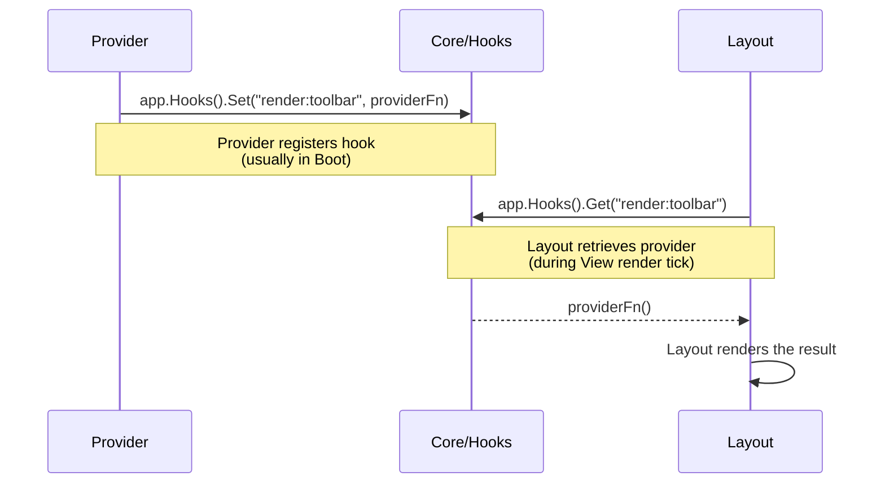

Hooks are named render slots that enable true plug-and-play UI composition. A provider registers a function for a named hook; the layout retrieves it by name at render time.
Neither side imports the other — they communicate entirely through the hook namespace.



## Single-Slot Hooks

One provider per slot. Models "there's one toolbar" or "there's one status bar":

```go [providers/search/provider.go]
func (p *SearchProvider) Boot(app *foundation.Application) error {
    // Register the provider — called every render tick
    p.unsubToolbar = app.Hooks().Set("render:toolbar", func() any {
        return renderToolbar(p.query, p.resultCount)
    })
    return nil
}

func (p *SearchProvider) Shutdown() error {
    // Remove the provider when this provider is shutdown
    if p.unsubToolbar != nil {
        p.unsubToolbar()
    }
    return nil
}
```

```go [layouts/base.go]
func (l *Base) View(ctx *tako.Context) tea.View {
    toolbar := ctx.Hooks().Get("render:toolbar")
    if toolbar == nil {
        toolbar = "Ready" // Fallback when no provider has claimed the slot
    }
    // ... compose the rest of the layout
}
```

**First-wins semantics:** If two providers try to `Set` the same hook, the second attempt is ignored and a warning is logged. To intentionally replace a provider, call the
unsubscribe function first:

```go
p.unsubToolbar()                                   // Remove previous provider
p.unsubToolbar = app.Hooks().Set("render:toolbar", themedToolbar) // Register new one
```

## Multi-Slot Hooks

Multiple providers per slot, returned in registration order. Models "there are many sidebar items":

```go [providers/orders/provider.go]
func (p *OrderProvider) Boot(app *foundation.Application) error {
    app.Hooks().Add("app.sidebar", func() any {
        return SidebarItem{
            Icon:   "📦",
            Label:  fmt.Sprintf("Orders (%d)", p.activeCount),
            Action: p.activate,
        }
    })
    return nil
}
```

```go [providers/notifications/provider.go]
func (p *NotificationProvider) Boot(app *foundation.Application) error {
    app.Hooks().Add("app.sidebar", func() any {
        return SidebarItem{
            Icon:   "🔔",
            Label:  fmt.Sprintf("Alerts (%d)", p.unreadCount),
            Action: p.activate,
        }
    })
    return nil
}
```

```go [layouts/base.go]
func (l *Base) renderSidebar(ctx *tako.Context) string {
    items := ctx.Hooks().All("app.sidebar") // Returns []any in registration order
    if len(items) == 0 {
        return "No items"
    }

    var lines []string
    for _, raw := range items {
        item := raw.(SidebarItem)
        lines = append(lines, fmt.Sprintf(" %s %s", item.Icon, item.Label))
    }
    return strings.Join(lines, "\n")
}
```

`Add` also returns an unsubscribe function — remove only your provider, leaving others intact:

```go
unsub := ctx.Hooks().Add("app.sidebar", p.sidebarItem)
// Later, on shutdown:
unsub()  // Only this provider's item is removed
```

## Provider Performance

Providers are called **on every render tick**. Keep them fast:

```go
// ✅ Return cached/pre-rendered state
app.Hooks().Set("render:statusbar", func() any {
    return p.cachedStatusBar // Updated only when data changes
})

// ❌ Compute expensive results on every tick
app.Hooks().Set("render:statusbar", func() any {
    return buildBar(scanDir(), queryMetrics()) // Called 60x/second!
})
```

Return type is `any` — Tako is UI-agnostic. Return a plain string, a styled lipgloss model, or any struct your layout knows how to render. The framework passes it through without
inspection.

## Naming Conventions

| Pattern                | Cardinality | Example                                                |
|------------------------|-------------|--------------------------------------------------------|
| `render:<slot>`        | Single      | `render:toolbar`, `render:statusbar`, `render:footer`  |
| `app.<collection>`     | Multi       | `app.sidebar`, `app.commands`, `app.status-indicators` |
| `tako.overlay.<id>`    | Single      | Reserved — auto-registered by the overlay manager      |
| `plugin.<name>.<slot>` | Either      | `plugin.git.status`, `plugin.diagnostics.items`        |

`render:` prefix signals single-slot; `app.` prefix signals multi-slot. Readable at a glance.

## Hooks and the Overlay System

The overlay manager uses hooks internally under the hood. `app.UI().Show("search", renderFn)` registers the render function as the provider for `"tako.overlay.search"`. Your layout
consumes this:

```go [layouts/base.go]
func (l *Base) View(ctx *tako.Context) tea.View {
    base := l.renderMain(ctx)

    if l.overlay.IsActive() {
        overlayID := l.overlay.Top()
        content := ctx.Hooks().Get("tako.overlay." + overlayID)
        if content != nil {
            return applyOverlay(base, content.(string))
        }
    }

    return base
}
```

When the overlay is closed, the stack pop triggers automatic cleanup of the hook provider. You never manually unregister overlay hooks.

## Introspection

```go
stats := ctx.Hooks().HookStats()
// {"render:toolbar": 1, "app.sidebar": 3, "tako.overlay.search": 1}

// List all registered hooks and provider counts
for hookID, count := range stats {
    ctx.Logger().Debug("hook", "id", hookID, "providers", count)
}
```

::tip
Design your hooks as value objects, not strings. Instead of returning a raw rendered string from your provider, return a struct (`SidebarItem`, `StatusEntry`, `ToolbarSection`) and
do the actual rendering in the layout. This keeps your layout's visual logic in one place — changing the visual design only requires editing the layout, not hunting through every
provider's hook function.
::

