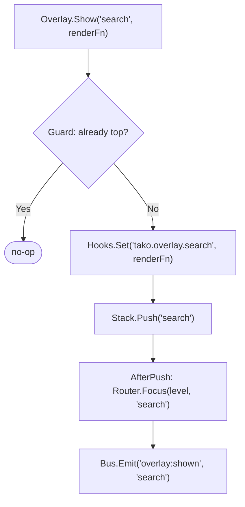
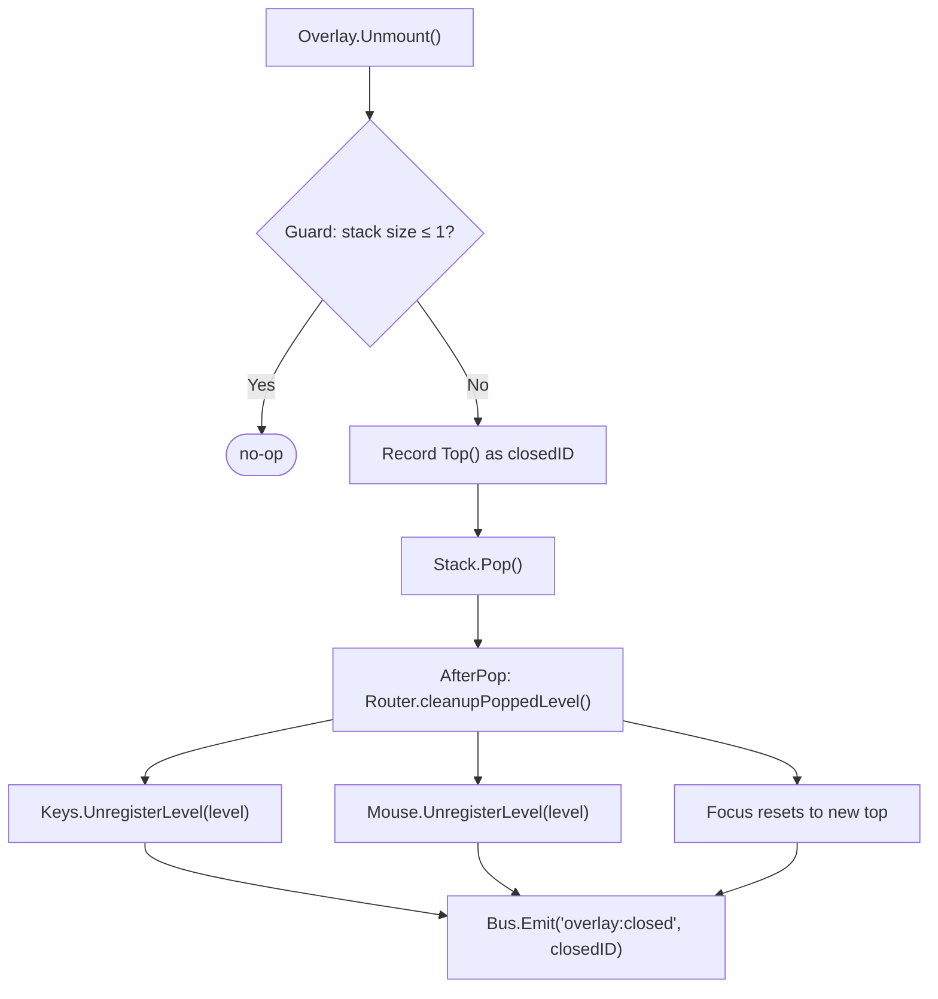

The `UIManager` is the high-level API for modal layers. A single `Show()` call pushes the focus stack, registers the render hook, and shifts focus. A single `Close()` call reverses
it — pops the layer and purges all keybindings, hitboxes, and hooks at that level automatically.

## Basic Overlays

Show a layer with a render function:

```go [provider.go]
// Show a search panel — all input goes to the "search" zone at level 1
app.UI().Show("search", func() any {
    return renderSearchPanel(p.query, p.results)
})

// Close the topmost overlay
app.UI().Unmount()

// Close ALL overlays, return to base layer
app.UI().UnmountAll()
```

`Show` is idempotent — calling it when `"search"` is already at the top is a no-op. Safe to call from rapid key handlers.

**Events emitted:**

| Event            | Payload         | When                     |
|------------------|-----------------|--------------------------|
| `overlay:shown`  | Layer ID string | After successful `Show`  |
| `overlay:closed` | Layer ID string | After successful `Close` |

Subscribe from another provider to pause animations, refresh data, or update badges when overlays open or close.

## Component Overlays

Components bundle render logic and keybindings in one struct. The overlay manager wires them at the correct stack level automatically:

```go [components/search_box.go]
type SearchBox struct {
    query   string
    results []SearchResult
    cursor  int
}

func (s *SearchBox) ID() string { return "search" }

func (s *SearchBox) Render() any {
    return renderSearch(s.query, s.results, s.cursor)
}

func (s *SearchBox) RegisterKeys(keys contracts.KeyManager) {
    keys.Zone(s.ID()).
        Bind("esc",    func() { app.UI().Unmount() }).
        Bind("enter",  func() { jumpToResult(s.results[s.cursor]); app.UI().Unmount() }).
        Bind("j|down", func() { s.cursor = min(s.cursor+1, len(s.results)-1) }).
        Bind("k|up",   func() { s.cursor = max(s.cursor-1, 0) })
}

// Optional: implement MouseComponent for click support
func (s *SearchBox) RegisterMouse(mouse contracts.MouseManager) {
    mouse.Zone(s.ID()).OnClick(func(x, y int) {
        s.cursor = y - s.headerOffset
    })
    mouse.Zone(s.ID()).OnScrollDown(func(x, y int) {
        s.cursor = min(s.cursor+1, len(s.results)-1)
    })
}
```

```go [provider.go]
// One call: push stack, register hooks, bind keys, shift focus
app.UI().MountOverlay(&SearchBox{})
```

For components that are shown repeatedly and need zero latency on the hot path, pre-register during `OnInit`:

```go [provider.go]
func (p *SearchProvider) Boot(app *foundation.Application) error {
    p.searchBox = &SearchBox{}
    app.UI().Register(p.searchBox) // Hooks and keys ready; layer not pushed yet
    return nil
}

// Later, when the user presses ctrl+f:
func (p *SearchProvider) open(ctx *tako.Context) {
    ctx.UI().Show("search", p.searchBox.Render) // No setup latency
}
```

## Dialog Primitives

```go [provider.go]
// Confirmation dialog
app.UI().Dialog().Confirm("Delete order #1042 permanently?", func(yes bool) {
    if yes {
        p.deleteOrder("ORD-1042")
        app.Context().Emit("toast:show", "Order deleted")
    }
})
```

When `Confirm` is called:

1. Keybindings at the next stack level: `y`/`enter` → accept, `n`/`esc` → cancel
2. Hook provider registered at `"tako.overlay.tako.dialog.confirm"` with the message text
3. Overlay shown via standard `Show` path

Your layout renders the dialog:

```go [layout.go]
func (l *Base) renderDialogIfActive(ctx *tako.Context) string {
    content := ctx.Hooks().Get("tako.overlay.tako.dialog.confirm")
    if content == nil {
        return ""
    }
    msg := content.(string)
    return centeredBox(msg + "\n\n[y] Confirm  [n] Cancel")
}
```

The callback fires exactly once (guarded with `sync.Once`). The keybindings become inert as soon as the layer is popped.

## Nested Overlays

Overlays stack naturally:

```go [provider.go]
// User opens search — stack: [base, search]
app.UI().MountOverlay(&SearchBox{})

// From within search, user triggers a destructive action
// Stack: [base, search, confirm-dialog]
app.UI().Dialog().Confirm("Clear all results?", func(yes bool) {
    if yes { p.clearResults() }
    // After callback runs, dialog is closed
    // Stack: [base, search] — search keybindings resume
})
```

Each level manages its own keybindings, hitboxes, and render hook. No level bleeds into another.

## Querying Overlay State

```go [layout.go]
func (l *Base) View(ctx *tako.Context) tea.View {
    base := l.renderBase(ctx)

    if !l.overlay.IsActive() {
        return tea.NewView(base)
    }

    // Dim the base content when an overlay is active
    dimmed := applyDim(base)

    overlayID := l.overlay.Top()
    content := ctx.Hooks().Get("tako.overlay." + overlayID)
    if content == nil {
        return tea.NewView(dimmed)
    }

    view := tea.NewView(composite(dimmed, content.(string)))
    view.AltScreen = true
    return view
}
```

| Method               | Returns  | Notes                      |
|----------------------|----------|----------------------------|
| `overlay.IsActive()` | `bool`   | `true` if stack size > 1   |
| `overlay.Top()`      | `string` | Top layer ID, `""` if none |

## Lifecycle Sequence

What happens when `Show("search", renderFn)` is called:



When `Close()` is called:



::tip
If you show the same overlay frequently (a search panel, a command palette), implement `MouseComponent` and use `Register` during `Boot` to pre-wire it. The first `Show` call on a
registered component skips the key registration step — noticeably faster for components that are opened repeatedly. Also set up your hitbox update in the component's `Render`
method, not in the layout, so the hitbox is always correct regardless of where the overlay appears in the stack.
::

