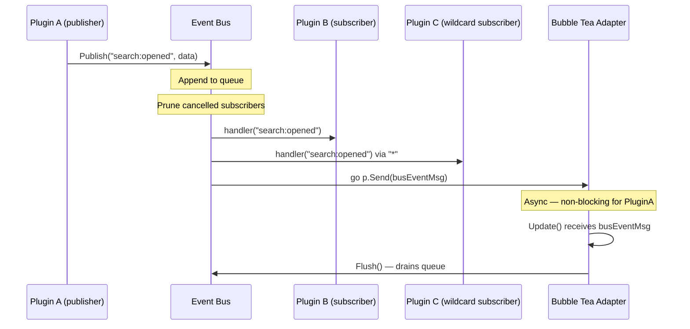

## The Golden Rule

> **Use the Event Bus when you don't need a return value.**
> Use the Service Container when you do.

If Plugin A fires `"fzf:opened"` and Plugin B (the status bar) needs to update its display, that's the Event Bus. If Plugin A needs to call a method on Plugin B and get a result back, that's a shared service through the container.

---

## Fluent Syntax: Typed Event Bus (Default)

Tako recommends using the **Typed Event Bus** for all events that carry a payload. The Typed Bus uses Go generics to give you compile-time safety, ensuring that publishers and subscribers agree on the payload structure.

### Setup

`TypedBus` is a thin, type-safe wrapper around the framework's core `EventBus`. Create one per payload type:

```go [plugin.go]
import "github.com/gettako/tako/internal/event"

type SearchResult struct { Query string; Hits int }

// Create a TypedBus scoped to SearchResult payloads
searchBus := event.NewTypedBus[SearchResult](ctx.Events())
```

### Publishing

```go [plugin.go]
searchBus.Publish("search:result", SearchResult{Query: "golang", Hits: 42})
```

Under the hood, this publishes the event to the core bus. Any subscriber listening to `"search:result"` (whether typed or untyped) will receive it.

### Subscribing

```go [plugin.go]
cancel := searchBus.Subscribe(ctx.Context, "search:result", func(e event.TypedEvent[SearchResult]) {
    // e.Name  — the event name string
    // e.Data  — SearchResult, fully typed, no assertion needed!
    log.Printf("Search '%s' returned %d hits", e.Data.Query, e.Data.Hits)
})
defer cancel() // unsubscribe when done (e.g., in OnDeactivate)
```

The returned `cancel` function lets you unsubscribe. Alternatively, because we passed `ctx.Context`, the bus automatically prunes this subscriber when the context is cancelled.

### Wildcard Subscription

`SubscribeAll` subscribes to `"*"` but only delivers events whose payload can be successfully decoded as your generic type `T`:

```go [plugin.go]
// Receives ALL events on the bus, but only fires when payload is a SearchResult
searchBus.SubscribeAll(ctx.Context, func(e event.TypedEvent[SearchResult]) {
    log.Printf("Search event: %+v", e.Data)
})
```

Events with non-matching payloads are silently skipped — no crash, no error.

### How Payload Decoding Works

`TypedBus` tries to resolve `T` from the raw `any` payload gracefully:

1. **Direct assertion (fast path):** If the publisher used the exact concrete type `T`, this succeeds in O(1) with no allocation.
2. **JSON round-trip (slow path):** Handles cross-package scenarios where the publisher sent a structurally-compatible map or struct. `DisallowUnknownFields` ensures strictly unrelated types fail to decode.
3. **Incompatible payload:** If both steps fail, the handler is not called. No panic, no error log. One malformed event won't crash your subscriber.

---

## Low-Level Syntax: Raw Event Bus (Untyped)

For simple events without payloads (e.g., `"app:ready"`, `"fzf:closed"`), or when building diagnostic tools that intercept everything, you can use the raw `EventBus`.

> [!WARNING]
> Avoid using the untyped bus for complex payloads. It requires runtime type assertions (`e.Data.(MyStruct)`) which will panic if the publisher changes the payload shape.

### Publishing

```go [plugin.go]
// Sugar — shorthand via ctx directly
ctx.Emit("fzf:opened", nil)

// Raw underlying method
ctx.Events().Publish("fzf:opened", nil)
```

### Subscribing

```go [plugin.go]
func (p *Plugin) OnActivate(ctx *tako.Context) error {
    // Option 1 — scoped to a context (auto-pruned when ctx is cancelled)
    cancelFn := ctx.Events().Subscribe(ctx, "fzf:opened", func(e contracts.Event) {
        p.currentState = "Searching"
    })
    p.cancelSub = cancelFn

    // Option 2 — sugar: Subscribe using ctx as the scoped context
    cancelFn = ctx.Subscribe(ctx, "fzf:opened", func(e contracts.Event) {
        p.currentState = "Searching"
    })

    // Option 3 — On: lives until cancel is called (context.Background internally)
    cancelFn = ctx.On("fzf:opened", func(e contracts.Event) {
        p.currentState = "Searching"
    })

    // Option 4 — Once: fires exactly once then auto-unsubscribes
    ctx.Once("app:ready", func(e contracts.Event) {
        p.initUI()
    })

    return nil
}
```

### The Wildcard Subscription

Subscribing to `"*"` receives every event published on the bus. The framework's Profiler uses this to record events for the live inspector.

```go [plugin.go]
ctx.Events().Subscribe(ctx, "*", func(e contracts.Event) {
    fmt.Printf("Event: %s\n", e.Name)
})
```

---

## Inter-Plugin RPC Bus

While the Event Bus is fire-and-forget, Tako also provides an **RPC Bus** for synchronized, two-way communication between decoupled plugins.

For full details on the RPC Router, Caller, Timeouts, and Retries, please see the dedicated [RPC Documentation](./13.rpc.md).

---

## General Architecture

### Event Flow



`Publish` is synchronous on the caller's goroutine, but the Bubble Tea adapter bridges this into async by sending an internal message. From a TUI perspective, events are non-blocking.

### Context-Based Auto-Cleanup

The bus passively prunes subscribers whose context has been cancelled. This happens inside `Publish` — no separate cleanup goroutine needed.

```go [plugin.go]
// This subscriber will be automatically removed when pluginCtx is cancelled
cancelFn := ctx.Events().Subscribe(pluginCtx, "some:event", handler)
```

### Naming Conventions

There's no enforced naming scheme, but the codebase follows this pattern:

| Pattern | Meaning |
|---|---|
| `"plugin-id:action"` | Something happened in plugin-id (e.g. `"fzf:opened"`) |
| `"plugin-id:closed"` | A layer/overlay was closed |
| `"plugin-id:tick"` | Periodic update (e.g. `"clock:tick"`) |

Use lowercase, colon-separated names. Be specific enough that wildcard subscribers can filter by prefix if needed.

### Events vs. Hooks vs. Direct Calls

It's worth being explicit about when to use what:

| Need | Use |
|---|---|
| Tell other plugins something happened (no return value) | Event Bus |
| Request data synchronously from another decoupled plugin | RPC Bus |
| Collect UI components from multiple plugins into a slot | Hook Registry |
| Call a method on a known service and get a result | Service Container |
| Schedule a background task | `ctx.Spawn` |
