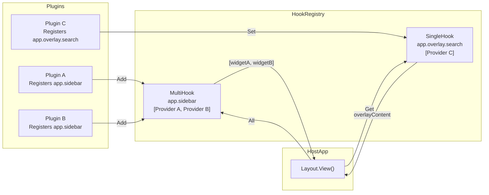

## The Two Cardinalities

### `SingleHook` — one owner per slot

Only one plugin should provide this. If multiple plugins register for the same `SingleHook`, the first one wins and a warning is logged.

#### Via Application (Recommended for Host App)

```go [main.go]
app.Hooks().Set("app.overlay.search", func() any {
    return p.renderSearchOverlay()
})
```

#### Via Context (Recommended for Plugins)

```go [lifecycle.go]
// In a plugin's OnInit:
unregister := ctx.Hooks().Set("app.overlay.search", func() any {
    return p.renderSearchOverlay()
})
// Later, or in OnDeactivate:
// unregister()
```

```go [layout.go]
// In the host app's Layout.View():
overlay := ctx.Hooks().Get("app.overlay.search")
if rendered, ok := overlay.(string); ok {
    // display it
}
```

Use `SingleHook` for things like: the active overlay content, the primary status widget, the title bar.

### `MultiHook` — many contributors

Multiple plugins can all register for the same slot. `All` returns all of them in registration order.

```go [lifecycle.go]
// Plugin 1 registers:
unreg1 := ctx.Hooks().Add("app.sidebar", func() any {
    return p.clockWidget()
})

// Plugin 2 registers:
unreg2 := ctx.Hooks().Add("app.sidebar", func() any {
    return p.statusWidget()
})
```

```go [layout.go]
// Host app collects all sidebar widgets:
raw := ctx.Hooks().All("app.sidebar")
widgets := make([]string, 0)
for _, w := range raw {
    if s, ok := w.(string); ok {
        widgets = append(widgets, s)
    }
}
sidebar := lipgloss.JoinVertical(lipgloss.Left, widgets...)
```

Use `MultiHook` for: sidebar panels, footer widgets, menu items, diagnostic displays.

## Hook Flow



## Hook Providers are Called on Every Render

Important: the `func() any` you register as a provider is called **every time** `Get` or `All` is invoked. In Bubble Tea, that's every render tick.

This means two things:

1. **Providers must be fast.** Don't do disk I/O or network calls inside a hook provider. Do that work in background goroutines and cache the result in the plugin struct.

2. **Providers read from plugin state.** The provider closure captures `p` (the plugin struct pointer), so it always reflects the latest state:

```go [lifecycle.go]
type Plugin struct {
    currentTemp string // updated by a background goroutine
}

func (p *Plugin) OnInit(ctx *tako.Context) error {
    ctx.Hooks().Add("app.sidebar", func() any {
        return "🌡 " + p.currentTemp  // reads fresh value on every render
    })
    return nil
}
```

## Defining Your Own Hook Slots

The host app decides what hook IDs exist. You define a slot by choosing a name and calling it in your layout. There's no registry of "declared slots" — the convention is enough.

Recommended naming: `"app.<area>"` for general slots, `"app.overlay.<id>"` for your own modal overlays.

```go [hooks.go]
// Define the contract in a shared constants file if needed:
const (
    HookSidebar        = "app.sidebar"
    HookFooter         = "app.footer"
    HookOverlayPrefix  = "app.overlay."
)
```

> **Framework-managed namespace:** The High-Level API (`OverlayManager`, `Component`, `DialogService`) registers hooks under the `"tako.overlay.*"` prefix, not `"app.overlay.*"`. If you use `app.Overlay().Show("search", fn)`, the hook key is `"tako.overlay.search"`. Both namespaces can coexist — your layout can read from either. See [04.01 — OverlayManager](../layer-management/overlays-components.md) for details.


## Hooks with Profiling

In development mode, the framework automatically instruments hook calls. When you open the inspector (`myapp inspect`), you can see per-hook average duration to spot providers that are taking too long.
