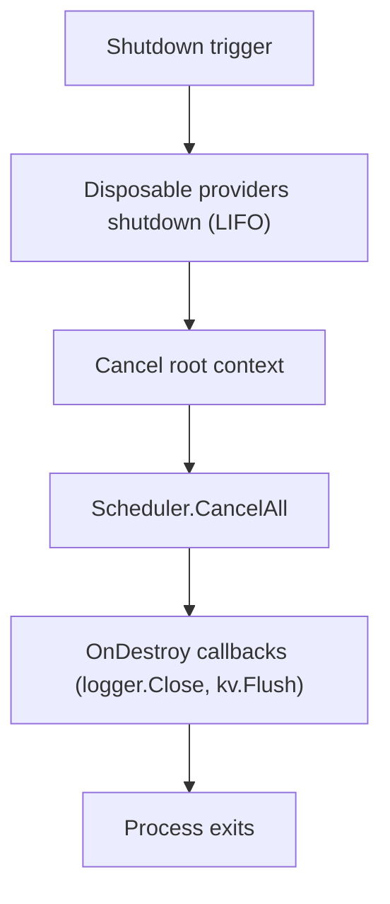
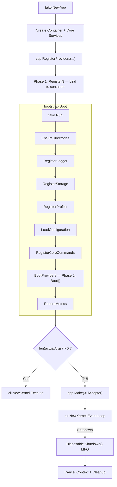

Understanding the lifecycle is not optional — it's the foundation of correct provider behavior. Services appear unresolved because you accessed them before bootstrap completed.
Providers fail because they depend on configuration that hadn't loaded. Shutdown hooks don't fire because you registered them after the context was already cancelled.

## Construction Phase

```go [main.go]
app := tako.NewApp()
```

Behind this single call, `foundation.NewApplication()`:

1. Resolves the working directory and application name
2. Creates a cancellable `context.Context` — the root context for the entire application lifetime
3. Instantiates a fresh IoC container
4. Registers core services as singletons:

| Service          | Registered As            | Why First                                      |
|------------------|--------------------------|------------------------------------------------|
| **EventBus**     | `contracts.EventBus`     | Required by StateManager, ThemeManager, others |
| **ThemeManager** | `contracts.ThemeManager` | Emits `theme:changed` events                   |
| **LangManager**  | `contracts.LangManager`  | Emits `lang:changed` events                    |
| **StateManager** | `contracts.StateManager` | Broadcasts `state:changed` via EventBus        |
| **Scheduler**    | `contracts.Scheduler`    | Providers may schedule work during boot        |
| **Hooks**        | `contracts.HookRegistry` | Render-phase slot registry                     |
| **Router**       | `contracts.Router`       | Input routing engine + focus stack             |
| **UIManager**    | `contracts.UIManager`    | Manages modal stack + Dialog service           |

Construction is synchronous, deterministic, and performs no I/O.

## Provider Registration

```go [main.go]
app.RegisterProviders(
    &providers.DatabaseProvider{},
    &providers.RouterProvider{},
    &providers.UIProvider{},
)
```

Each provider's `Register()` method is called immediately, in order. This is **Phase 1** of the Two-Phase Lifecycle. Providers bind services to the container but do not execute
logic.

## Bootstrap Phase

```go [tako.go]
bootstrap.Boot(app)
```

Seven bootstrappers run sequentially, followed by provider Boot:

| Order | Bootstrapper           | What It Does                                                     |
|-------|------------------------|------------------------------------------------------------------|
| 1     | `EnsureDirectories`    | Creates `.tako/run/`                                             |
| 2     | `RegisterLogger`       | Opens `tako.log`; registers `OnDestroy` to close it              |
| 3     | `RegisterStorage`      | Opens `kv.db`; registers `OnDestroy` to flush + close            |
| 4     | `RegisterProfiler`     | No-op in production; activates with `TAKO_PROFILER_ENABLED=true` |
| 5     | `LoadConfiguration`    | Merges all `config/*.yaml` and `config/*.json`                   |
| 6     | `RegisterCoreCommands` | Registers `help`, `version`, `status`, `plugin:list`, etc.       |
| 7     | **`BootProviders`**    | Validates dependencies → boots all providers sequentially        |
| 8     | `RecordMetrics`        | Records total boot duration to the profiler                      |

**`BootProviders`** does three things:

1. Validates `DependsOn` declarations — fails fast if a required provider is missing
2. Marks the app as booted
3. Calls `Boot()` on each provider in registration order
4. Boots any dynamically-registered pending providers

## Kernel Selection

After bootstrap, `tako.Run()` decides what to do:

```go [tako.go]
var actualArgs []string
if len(args) == 0 {
    if len(os.Args) > 1 {
        actualArgs = os.Args[1:]
    }
} else {
    actualArgs = args
}

// Boot the app using default bootstrappers
bootstrap.Boot(app)

// Choose the Driver (Kernel) based on arguments
if len(actualArgs) > 0 {
    cli.NewKernel(app).Handle(actualArgs)
    return nil
}

// Main Interactive TUI Mode: Resolve dynamic UIRenderer from IoC container
var uiAdapter contracts.UIRenderer
if err := app.Make(&uiAdapter); err != nil {
    return fmt.Errorf("no UIRenderer registered")
}
return tui.NewKernel(app, uiAdapter).Run()
```

The same binary serves both modes. `go run . status` invokes the CLI kernel. `go run .` invokes the TUI kernel.

## TUI Kernel

When no CLI arguments are present:

1. **Session hydration** — Restores the previous focus stack state from the KV store
2. **Debug server** — If profiling is enabled, starts the WebSocket debug server
3. **Event loop** — The renderer enters raw mode and begins the update/view cycle

## CLI Kernel

When `os.Args` has arguments:

1. Matches the first argument against the command registry
2. Executes the matching command's `Execute` method
3. Exits with the appropriate status code

## Shutdown Sequence

Triggered by: SIGINT, SIGTERM, `ctrl+c` (at base stack level), or `app.Shutdown()`.



**Why LIFO order?** If Provider B (registered after A) depends on A's database connection, B shuts down first while A's connection is still alive. A shuts down last, when no
dependents remain.

## Lifecycle Diagram



