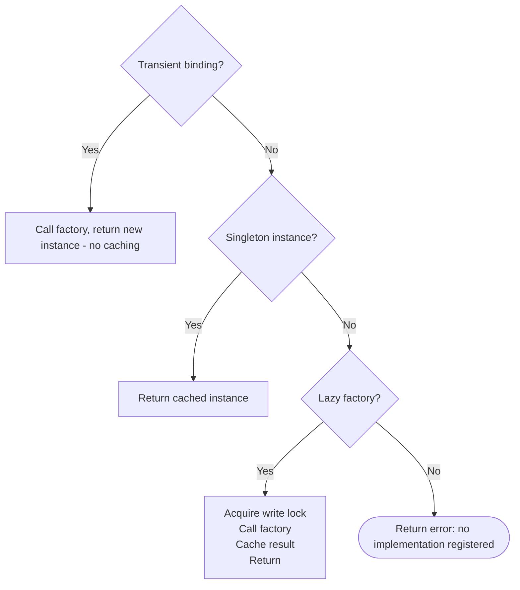

The service container manages service instantiation and dependency wiring. Services are registered by interface and resolved by type. The consumer never knows or cares about the
concrete implementation — which means you can swap a real API client for a mock in tests, replace the logger in CI, or share a single database connection across dozens of providers
without those providers knowing about each other.

## Binding Strategies

Three binding lifetimes, each with distinct semantics:

| Binding     | When Factory Runs | Instance Shared                        | Use When                                              |
|-------------|-------------------|----------------------------------------|-------------------------------------------------------|
| `Singleton` | At registration   | Always                                 | Shared infrastructure (EventBus, Logger)              |
| `Lazy`      | On first `Make`   | After first call (cached as singleton) | Expensive resources (DB connections, network clients) |
| `Transient` | On every `Make`   | Never                                  | Per-use state (validators, builders, buffers)         |

### Singleton

```go [provider.go]
func (p *Provider) Boot(app *foundation.Application) error {
    client := &APIClient{
        BaseURL: app.Config().String("api.base_url"),
        Timeout: 30 * time.Second,
    }

    // Reflect-based (classic)
    app.Container().Singleton((*contracts.APIClient)(nil), client)

    // Generic helper (preferred — no interface pointer ceremony)
    tako.Bind[contracts.APIClient](app.Container(), client)
    return nil
}
```

Use for services that maintain shared state (like an event bus or connection pool) or services that are trivial to construct and must be immediately available.

### Lazy

```go [provider.go]
func (p *Provider) Boot(app *foundation.Application) error {
    // Factory runs on first Make() call, then the result is cached forever
    tako.BindLazy[contracts.Database](app.Container(), func() (any, error) {
        dsn := app.Config().String("database.dsn")
        if dsn == "" {
            return nil, fmt.Errorf("database.dsn is required")
        }

        db, err := sql.Open("sqlite3", dsn)
        if err != nil {
            return nil, fmt.Errorf("failed to open database: %w", err)
        }

        app.OnDestroy(func() { db.Unmount() })
        return db, nil
    })
    return nil
}
```

Use for resources that are expensive to create or may not be needed in every execution path. Running `go run . version` doesn't need a database connection — lazy binding defers
that cost until something actually requests it.

If the factory returns an error, `Make` propagates it, and the factory is retried on the next resolution attempt. Once successful, the result is promoted to a singleton.

If a factory panics (e.g., nil pointer dereference), the container recovers and returns an error containing the full goroutine stack trace — making it straightforward to locate the
bug without a debugger.

### Transient

```go [provider.go]
func (p *Provider) Boot(app *foundation.Application) error {
    // New instance on every Make() call — never cached
    tako.BindTransient[contracts.OrderValidator](app.Container(), func() (any, error) {
        return &OrderValidator{
            errors: make([]string, 0),
            rules:  loadValidationRules(),
        }, nil
    })
    return nil
}
```

Use when the service carries per-use state that must not leak between callers — a request validator that accumulates errors, a builder that constructs a complex object
step-by-step, or a temporary buffer.

## Resolving Services

Three resolution patterns — choose what reads most clearly in context:

::code-group

```go [Pointer (explicit)]
// Resolve into a typed variable — error-aware
var db contracts.Database
if err := app.Container().Make(&db); err != nil {
    return fmt.Errorf("database not registered: %w", err)
}
db.Query("SELECT * FROM orders WHERE status = ?", "pending")
```

```go [Generics (concise)]
// Resolve with an error value
db, err := tako.Resolve[contracts.Database](app.Container())
if err != nil {
    return err
}
db.Query("SELECT * FROM orders WHERE status = ?", "pending")

// Panics if missing — use for architecturally-guaranteed bindings
bus := tako.MustResolve[contracts.EventBus](app.Container())
bus.Emit("order:created", order)
```

```go [Closure (auto-inject)]
// Framework resolves each parameter by type and calls the function
app.Container().Call(func(bus contracts.EventBus, logger contracts.Logger) {
    logger.Info("Setting up order handlers")
    bus.On("order:created", func(e contracts.Event) {
        logger.Info("New order", "id", e.Data.(*Order).ID)
    })
})
```

::

**Use `MustResolve` only in boot-time code** where a missing binding is a programming error, not a runtime condition. It panics immediately and clearly rather than producing a
confusing nil pointer later.

## Resolution Order

When `Make` is called, the container checks in this order:



**Why transient first?** Transient factories always produce fresh instances and must never be accidentally cached. Checking them before the singleton cache prevents a transient
from being resolved once and then treated as a singleton.

## Thread Safety

The container is fully safe for concurrent use:

- **Read operations** (resolving existing singletons) acquire only a read lock — unlimited parallel resolution.
- **Write operations** (lazy factory execution, first-time caching) use a lock-upgrade pattern that prevents deadlocks even when factories recursively resolve their own
  dependencies from the same container.

::warning
**Circular dependencies** will deadlock or stack-overflow. If service A's factory resolves service B, and service B's factory resolves service A, the container hangs. Design your
dependency graph as a DAG. If you find yourself creating a cycle, introduce an event-based decoupling layer instead.
::

## Container at the Application Level

The application-level container is identical to the container providers receive — same instance, same bindings. Register services before `tako.Run()` to make them available during
provider initialization:

```go [main.go]
app := tako.NewApp()

// These bindings are available to all providers during Boot
app.Container().Singleton((*contracts.FeatureFlags)(nil), &FeatureFlags{
    EnableDarkMode:  true,
    EnableBetaSearch: false,
})

app.UI().Layout(&layouts.Base{})
app.Mount(bubbletea.NewAdapter(app.Context(), nil))
tako.Run(app)
```

::tip
In tests, replace expensive services before bootstrap runs. Bind an in-memory fake for your database, a no-op logger, and a fixed config. Then use `app.BootstrapWith(subset)` to
boot only the bootstrappers your test actually needs. This keeps tests fast and isolates them from filesystem state.
::
