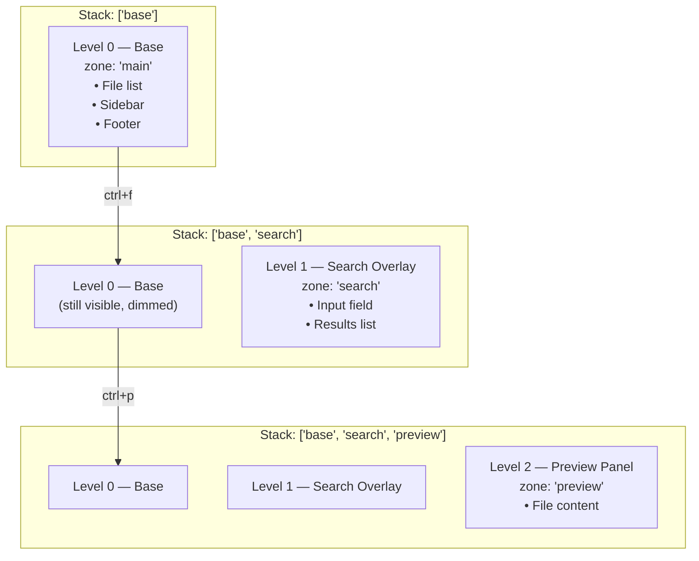

## Zones

A zone is a named, focusable region of your UI. The key router uses zones to scope keybindings — a key that means "scroll down" in your file list shouldn't fire when a text input is focused.

Zones have two identifiers:
- A **stack level** (which layer is active)
- A **zone ID** (which region within that layer is focused)

```go [main.go]
// Focus the "file-list" initially
app.Focus("file-list") 

// Later, user presses tab:
app.Focus("preview")
```

```go [main.go]
// Keybindings scoped to zone — via app (host app) or ctx (plugin):
app.Keys().Zone("file-list").Bind("j", func() { list.MoveDown() })
app.Keys().Zone("file-list").Bind("k", func() { list.MoveUp() })
app.Keys().Zone("preview").Bind("j", func() { preview.ScrollDown() })
app.Keys().Zone("preview").Bind("k", func() { preview.ScrollUp() })
```

Now `j` and `k` do the right thing in each zone, with no conditional logic in the key handler.

## Layers

A layer is a stack level above the base. Overlays, modals, panels — any time the user "enters" a sub-context, you push to the stack. When they leave, you pop.



## A Complete Layout Structure

Here's a layout that handles base state and two overlays:

```go [layout.go]
type AppLayout struct{}

func (l *AppLayout) View(ctx *tako.Context, r *router.Router) tea.View {
    stack := r.Stack()
    top := stack.Top()

    switch top {
    case "base":
        return l.renderBase(ctx, r)

    case "search":
        // Render base dimmed, then overlay on top
        base := l.renderBase(ctx, r)
        overlay := l.renderSearchOverlay(ctx)
        return l.compose(base, overlay)

    default:
        // OverlayManager provides hooks under "tako.overlay.<id>"
        hookName := "tako.overlay." + top
        if content := ctx.Hooks().Get(hookName); content != nil {
            if s, ok := content.(string); ok {
                base := l.renderBase(ctx, r)
                return l.compose(base, s)
            }
        }
        
        // Fallback for legacy manually-managed overlays
        legacyHook := "app.overlay." + top
        if content := ctx.Hooks().Get(legacyHook); content != nil {
            if s, ok := content.(string); ok {
                base := l.renderBase(ctx, r)
                return l.compose(base, s)
            }
        }
        return l.renderBase(ctx, r)
    }
}

func (l *AppLayout) renderBase(ctx *tako.Context, r *router.Router) tea.View {
    // Collect sidebar widgets from all plugins
    var sidebars []string
    for _, w := range ctx.Hooks().All("app.sidebar") {
        if s, ok := w.(string); ok {
            sidebars = append(sidebars, s)
        }
    }

    // Collect footer widgets
    var footers []string
    for _, w := range ctx.Hooks().All("app.footer") {
        if s, ok := w.(string); ok {
            footers = append(footers, s)
        }
    }

    sidebar := lipgloss.JoinVertical(lipgloss.Left, sidebars...)
    footer := lipgloss.JoinHorizontal(lipgloss.Bottom, footers...)
    main := lipgloss.NewStyle().Border(lipgloss.NormalBorder()).Render("main content")
    body := lipgloss.JoinHorizontal(lipgloss.Top, sidebar, main)

    view := tea.NewView(lipgloss.JoinVertical(lipgloss.Left, body, footer))
    view.AltScreen = true
    return view
}
```

## Plugin-Contributed Overlays

Plugins can display their own overlays using the `OverlayManager`. The host layout doesn't need to know about them upfront — it just reads from the `"tako.overlay." + top` hook.

```go [lifecycle.go]
// In a plugin's OnInit — clean and concise
ctx.Keys().Bind("?", func() {
    if ctx.Overlay().Top() == "help" {
        ctx.Overlay().Close()
    } else {
        ctx.Overlay().Show("help", func() any {
            return lipgloss.NewStyle().
                Border(lipgloss.DoubleBorder()).
                Width(60).
                Render(p.helpContent)
        })
        ctx.Emit("help:opened", nil)
    }
})
```

> **Under the Hood:** Calling `Show` automatically registers the render hook and pushes the stack. Before the High-Level API was introduced, plugins had to do this manually: register the hook first, then call `ctx.Stack().Push("help")`, and the layout would read from a custom `"app.overlay.help"` hook.

## Tab/Focus Management

When the user tabs between zones, update the focused zone and publish an event:

```go [main.go]
app.Keys().Bind("tab", func() {
    zones := []string{"file-list", "preview", "metadata"}
    current := app.Router().FocusedZone(0)
    
    // Find next zone index
    nextIdx := 0
    for i, z := range zones {
        if z == current {
            nextIdx = (i + 1) % len(zones)
            break
        }
    }
    next := zones[nextIdx]

    // Switch the zone and notify plugins
    app.Focus(next)
    app.Emit("focus:changed", next)
})
```

Plugins that render zone-specific visual focus indicators subscribe to `"focus:changed"` and update their border/highlight accordingly.
