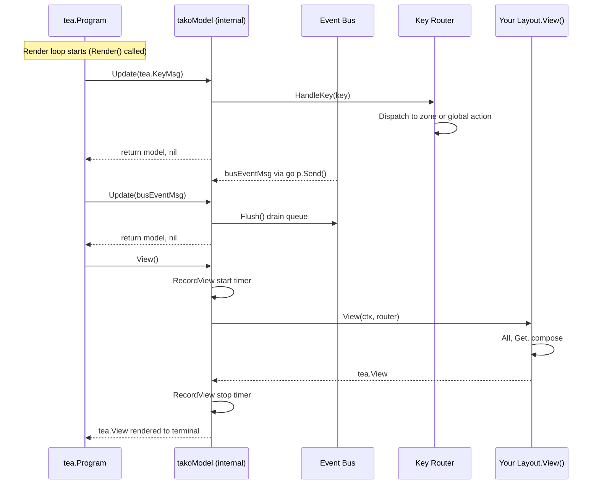

You can write an adapter for any terminal UI library (e.g., `tview`, `tcell`, `termbox`, or a custom engine).

Tako provides an official Bubble Tea adapter as a **separate Go submodule** at `github.com/gettako/tako/pkg/adapter/bubbletea`. The core framework has **zero UI library dependencies** — installing `github.com/gettako/tako` does not pull in Bubble Tea, Lipgloss, or Bubbles. The `pkg/adapter.BaseAdapter` helper is also available for building custom adapters. **Using them is optional**; you can implement `contracts.UIRenderer` directly for any other library.

> [!NOTE]
> **Internal Tooling:** Tako's built-in dev tools (inspector, log viewer, build output) use **raw ANSI terminal rendering** — they do not depend on Bubble Tea or any external UI library. Your application is completely unaffected by this choice.

## The UIRenderer Contract

The entire contract between Tako and your UI library is two methods:

```go [renderer.go]
// contracts/renderer.go
type UIRenderer interface {
    Render() error  // called once by the TUI Kernel — must block the main thread
    Stop() error    // called during shutdown — release the terminal, stop the loop
}
```

Register your implementation in the container before calling `tako.Run()`:

```go [main.go]
app.WithRenderer(myAdapter)
tako.Run(app)
```

The TUI Kernel resolves `contracts.UIRenderer` and calls `Render()`. When shutdown happens (from `ctrl+c`, OS signal, or programmatically), the Kernel calls `Stop()` after the context is cancelled.

If no `UIRenderer` is registered, the TUI Kernel just blocks until context cancellation — useful for headless/background-only apps.

---

## Option A: The Official Bubble Tea Adapter

Bubble Tea is officially supported. If you choose it, Tako gives you two building blocks:

- **`pkg/adapter/bubbletea`** — a full, ready-to-use `contracts.UIRenderer` implementation. You only implement the `Layout` interface to define what to draw.
- **`pkg/adapter.BaseAdapter`** — the helper struct embedded inside the BubbleTea adapter. It wires key routing, event bus flushing, and profiler instrumentation so you don't reimplement them.

> [!TIP]
> This is entirely opt-in. If you prefer `tview`, `tcell`, or anything else, skip to [Option B: Writing Your Own Adapter](#option-b-writing-your-own-adapter).

### Installation

The Bubble Tea adapter is a separate Go submodule. Install it explicitly:

```bash
go get github.com/gettako/tako/pkg/adapter/bubbletea
```

Then import it:

```go [main.go]
import (
    "github.com/gettako/tako/contracts"
    "github.com/gettako/tako/pkg/adapter/bubbletea"
)
```

### The Layout Interface

The Bubble Tea adapter splits your work from the framework's work. You implement one interface:

```go [layout.go]
// pkg/adapter/bubbletea
type Layout interface {
    View(ctx *tako.Context, r *router.Router) tea.View
}
```

The adapter handles the Bubble Tea model (`Init`, `Update`, `View`), the event bus bridge, the key routing, and the profiler instrumentation. You only implement what to *draw*.

```go [layout.go]
type AppLayout struct{}

func (l *AppLayout) View(ctx *tako.Context, r *router.Router) tea.View {
    // Collect widgets from plugins via hooks
    var sidebars []string
    for _, w := range ctx.Hooks().All("app.sidebar") {
        if s, ok := w.(string); ok {
            sidebars = append(sidebars, s)
        }
    }

    // Check for active overlay
    top := r.Stack().Top()
    var main string
    if top != "base" {
        if overlay := ctx.Hooks().Get("app.overlay." + top); overlay != nil {
            if s, ok := overlay.(string); ok {
                main = s
            }
        }
    } else {
        main = "Welcome. Press ctrl+f to search."
    }

    body := lipgloss.JoinHorizontal(lipgloss.Top,
        lipgloss.JoinVertical(lipgloss.Left, sidebars...),
        main,
    )

    view := tea.NewView(body)
    view.AltScreen = true
    return view
}
```

### Wiring It Up

```go [main.go]
app := tako.NewApp()

adapter := bubbletea.NewAdapter(
    app.Context(),
    nil, // root layout
)

app.WithRenderer(adapter)
tako.Run(app)
```

### How the Adapter Works Internally



The adapter bridges the event bus into Bubble Tea by subscribing to `"*"` with a wildcard and forwarding every event via `go p.Send(busEventMsg{e})`. This means your layout automatically re-renders whenever any plugin publishes an event — no manual wiring needed.

### Panic Safety

The Bubble Tea adapter wraps your `Layout.View()` in a `recover()`:

```go [adapter.go]
defer func() {
    if r := recover(); r != nil {
        view = tea.NewView("Error rendering view: panic occurred")
        view.AltScreen = true
    }
}()
```

> [!WARNING]
> If your layout panics (nil pointer, slice out of range), the terminal won't corrupt. You get an error screen instead. However, you should still fix the root cause — don't rely on this for production resilience.

---

## Option B: Writing Your Own Adapter

If you're using a library other than Bubble Tea, you implement `contracts.UIRenderer` directly — no `BaseAdapter` needed. The contract is just two methods, and you wire key routing and event polling yourself using the patterns shown below.

### The BaseAdapter Helper (Optional)

`pkg/adapter.BaseAdapter` is the helper struct that powers the official Bubble Tea adapter internally. You can also embed it in your own custom adapter if you find it useful — it wires key routing, event bus flushing, and profiler integration for you:

```go [adapter.go]
// pkg/adapter/adapter.go
type BaseAdapter struct {
    Ctx      *tako.Context
    Bus      contracts.EventBus
    Router   *router.Router
    Profiler *profiler.Profiler  // The internal profiler used for measuring framework performance. (nil until InitProfiler() is called).
}
```

You are not required to use it. For a minimal custom adapter, you can implement `contracts.UIRenderer` directly and call the underlying services (`Bus`, `Router`, etc.) yourself. `BaseAdapter` is just a convenience layer.

Available methods when you embed it:

| Method | What it does |
|---|---|
| `InitProfiler()` | Resolves the `*profiler.Profiler` from the container. Call this at the start of `Render()`. |
| `HandleKey(key string)` | Forwards a raw key string to the Key Router for dispatching. |
| `FlushEvents() []contracts.Event` | Drains the event bus queue and returns the flushed events. |
| `RecordUpdate(dur time.Duration)` | Tells the profiler an update cycle took this long. |
| `RecordView(dur time.Duration)` | Tells the profiler a render cycle took this long. Increments frame counter. |
| `StartEventLoop(ctx, interval, callback)` | Starts a goroutine that calls `FlushEvents()` on a ticker and invokes your callback. |

### Minimal Adapter Template

```go [myadapter.go]
package myadapter

import (
    "context"
    "time"

    "github.com/gettako/tako/contracts"
    "github.com/gettako/tako/internal/router"
    "github.com/gettako/tako/internal/tako"
    "github.com/gettako/tako/pkg/adapter"
)

type MyAdapter struct {
    *adapter.BaseAdapter
    // your UI library handle goes here
    // e.g. app *tview.Application
}

func NewMyAdapter(ctx *tako.Context) *MyAdapter {
    return &MyAdapter{
        BaseAdapter: adapter.NewBaseAdapter(ctx),
    }
}

// Render is called by the TUI Kernel once. It MUST block until the UI exits.
func (a *MyAdapter) Render() error {
    // Step 1: resolve the profiler (must happen here, not in constructor)
    a.InitProfiler()

    // Step 2: set up a key handler that forwards keys to Tako's router
    // (how you hook into key events depends on your UI library)
    // yourLib.OnKey(func(key string) {
    //     a.HandleKey(key)
    // })

    // Step 3: start the event loop — polls the bus and triggers redraws
    a.StartEventLoop(a.Ctx.Context, 16*time.Millisecond, func(events []contracts.Event) {
        // trigger a redraw in your UI library
        // yourLib.Draw()
    })

    // Step 4: hand over to your UI library (must block)
    return nil // return yourLib.Run()
}

// Stop is called during shutdown to release the terminal.
func (a *MyAdapter) Stop() error {
    // yourLib.Stop()
    return nil
}
```

### Handling Keys

The framework's Key Router expects to receive raw key strings. How you get those from your UI library is up to you:

```go [adapter.go]
// Bubble Tea style — key message in Update()
case tea.KeyMsg:
    a.HandleKey(msg.String())

// tview style — input capture
app.SetInputCapture(func(event *tcell.EventKey) *tcell.EventKey {
    a.HandleKey(tcellKeyToString(event))
    return nil
})

// tcell style — polling
switch ev := screen.PollEvent().(type) {
case *tcell.EventKey:
    a.HandleKey(tcellKeyToString(ev))
}
```

Key strings should match Tako's normalized format: lowercase, `+` as modifier separator (e.g. `"ctrl+f"`, `"esc"`, `"enter"`, `"j"`). The router normalizes them anyway, but consistency helps.

### The Event Loop Pattern

Different UI libraries tick differently:

| Library | Tick mechanism |
|---|---|
| **Bubble Tea** | Messages drive `Update()` — use `go p.Send(busEventMsg)` in bus subscriber |
| **tview** | Manual `app.Draw()` — use `StartEventLoop` with `app.Draw()` callback |
| **tcell** | Manual `screen.Show()` — use `StartEventLoop` with `screen.Show()` callback |
| **Custom** | Whatever drives your render loop — call your redraw function from the callback |

`StartEventLoop` polls the event bus on a configurable interval (16ms ≈ 60fps, 33ms ≈ 30fps) and fires your callback only when events are pending. If nothing is happening, the callback doesn't fire — no unnecessary redraws.

```go [adapter.go]
a.StartEventLoop(ctx, 16*time.Millisecond, func(events []contracts.Event) {
    for _, e := range events {
        // optionally inspect events before redrawing
        _ = e
    }
    screen.Show() // or app.Draw(), or your redraw
})
```

### A Complete tview Example

```go [tvadapter.go]
package tvadapter

import (
    "context"
    "strings"
    "time"
    "unicode"

    "github.com/gdamore/tcell/v2"
    "github.com/rivo/tview"
    "github.com/gettako/tako/contracts"
    "github.com/gettako/tako/internal/router"
    "github.com/gettako/tako/internal/tako"
    "github.com/gettako/tako/pkg/adapter"
)

type TviewAdapter struct {
    *adapter.BaseAdapter
    app     *tview.Application
    layout  func() tview.Primitive
}

func NewTviewAdapter(
    ctx *tako.Context,
    layout func() tview.Primitive,
) *TviewAdapter {
    return &TviewAdapter{
        BaseAdapter: adapter.NewBaseAdapter(ctx),
        app:         tview.NewApplication(),
        layout:      layout,
    }
}

func (a *TviewAdapter) Render() error {
    a.InitProfiler()

    root := a.layout()
    a.app.SetRoot(root, true)

    // Forward all key events to Tako's router
    a.app.SetInputCapture(func(event *tcell.EventKey) *tcell.EventKey {
        key := tcellEventToTakoKey(event)
        if key != "" {
            a.HandleKey(key)
        }
        return event // return event so tview also processes it
    })

    // Poll the event bus and redraw when events arrive
    a.StartEventLoop(a.Ctx.Context, 16*time.Millisecond, func(events []contracts.Event) {
        a.app.Draw()
    })

    return a.app.Run()
}

func (a *TviewAdapter) Stop() error {
    a.app.Stop()
    return nil
}

func tcellEventToTakoKey(ev *tcell.EventKey) string {
    // Map common tcell key codes to Tako normalized strings
    switch ev.Key() {
    case tcell.KeyCtrlC:       return "ctrl+c"
    case tcell.KeyCtrlF:       return "ctrl+f"
    case tcell.KeyEscape:      return "esc"
    case tcell.KeyEnter:       return "enter"
    case tcell.KeyTab:         return "tab"
    case tcell.KeyBackspace:   return "backspace"
    case tcell.KeyUp:          return "up"
    case tcell.KeyDown:        return "down"
    case tcell.KeyLeft:        return "left"
    case tcell.KeyRight:       return "right"
    case tcell.KeyRune:
        r := ev.Rune()
        if ev.Modifiers()&tcell.ModCtrl != 0 {
            return "ctrl+" + strings.ToLower(string(unicode.ToLower(r)))
        }
        return strings.ToLower(string(r))
    }
    return ""
}
```

Register it the same way as any other adapter:

```go [main.go]
app.WithRenderer(
    tvadapter.NewTviewAdapter(app.Context(), app.Events(), app.Router(), myLayout),
)
```

---

## About the Profiler and Custom Adapters

This deserves its own section because it's a common source of confusion.

### What the profiler records

The profiler tracks three render-related metrics:

| Metric | Recorded by | Method |
|---|---|---|
| **FPS** | Your adapter | `RecordView(dur)` increments frame counter |
| **Avg Update time** | Your adapter | `RecordUpdate(dur)` |
| **Avg View time** | Your adapter | `RecordView(dur)` |

These are **not automatic**. The profiler does not hook into your UI library. It can only measure what you tell it to measure, via `BaseAdapter.RecordUpdate` and `RecordView`.

### With the Bubble Tea adapter

The Bubble Tea adapter instruments these automatically:

```go [adapter.go]
func (m *takoModel) Update(msg tea.Msg) (tea.Model, tea.Cmd) {
    start := time.Now()
    defer func() { m.RecordUpdate(time.Since(start)) }()
    // ...
}

func (m *takoModel) View() tea.View {
    start := time.Now()
    defer func() { m.RecordView(time.Since(start)) }()
    // ...
}
```

If you're using the Bubble Tea adapter, FPS/Update/View metrics work out of the box.

### With a custom adapter

**You** are responsible for recording these metrics — the profiler has no way to do it automatically because it doesn't know when your UI library renders.

The rule is: call `RecordUpdate` wherever your app processes input/state changes, and call `RecordView` wherever it renders to the screen:

```go [adapter.go]
// tview example
a.app.SetBeforeDrawFunc(func(screen tcell.Screen) bool {
    // This runs before every draw — record View timing
    start := time.Now()
    return false  // false = continue drawing
})
// Note: tview doesn't provide post-draw hooks easily, so you may
// record approximations, or skip FPS tracking if your library doesn't support it
```

If your UI library doesn't provide a reliable draw hook, it's fine to skip `RecordUpdate`/`RecordView` entirely. The profiler will show zero FPS/timing in the inspector, which just means "not instrumented" — everything else (hook timings, events, memory, boot times) still works regardless.

### Hook timing always works

Hook profiling is separate and always active when the profiler is running. It's recorded inside the Hook Registry's `Get`/`All` methods, independent of which UI adapter you use. So even if you skip render timing, you'll still see per-hook durations in the inspector.
