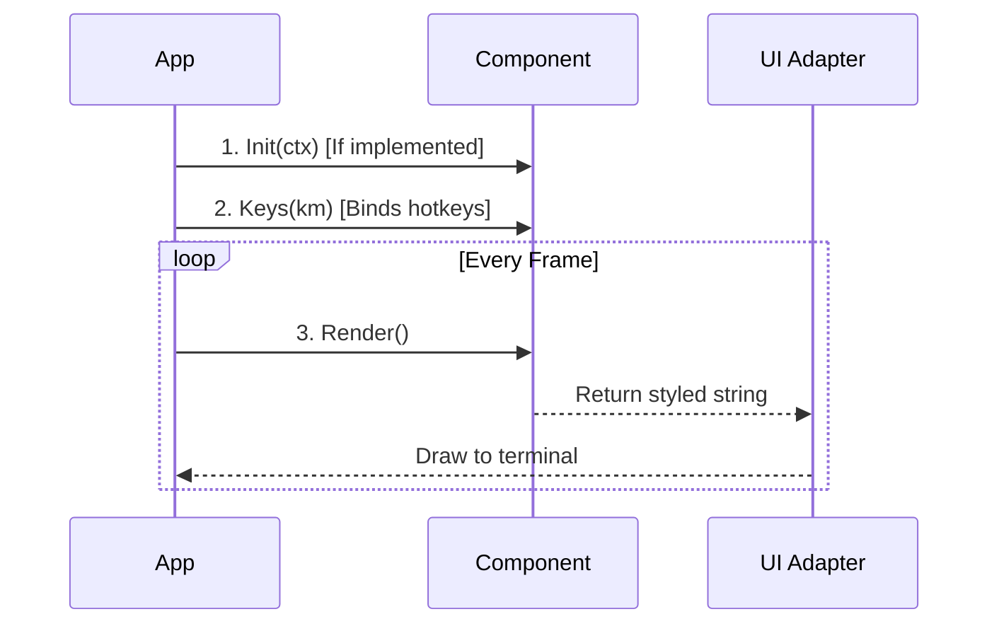

When building a terminal application, managing a massive `switch` statement for every keypress, mouse click, and state change can become difficult to maintain.

Tako brings component-based architecture (similar to Vue or React) to the terminal. Visual elements are organized into isolated, self-contained Components.

## The Component Interface

The base interface is minimal by design, ensuring flexibility and performance regardless of the underlying UI Adapter.

```go
type Component interface {
	// ID returns the unique identifier for this component.
	ID() string
	
	// Render returns the painted representation of this component.
	Render() string
	
	// Keys registers any necessary keyboard bindings.
	Keys(keys contracts.KeyManager)
}
```

### Optional Lifecycle Hooks

The component system is extensible. If a component needs to run logic when it is created or when the terminal is resized, you can implement optional lifecycle interfaces, and Tako will wire them up:

- `OnInit`: Provides an `Init(ctx Context)` method that runs once when the component mounts. This is an ideal place to set up event listeners or fetch initial data.
- `OnResize`: Notifies the component when the terminal window is resized.
- `NativeComponent`: Provides raw access to underlying adapter messages (such as a Bubble Tea `Msg`) if you need low-level control.

### The Render Cycle

Here is how Tako orchestrates the component lifecycle:



## Creating a Component

Let's build a `ServerMetricsCard` for our Server Dash application. This component displays current CPU usage and updates itself when new data arrives.

```go [internal/components/metrics_card.go]
import "fmt"

type ServerMetricsCard struct {
	cpuPct float64
}

func NewMetricsCard() *ServerMetricsCard {
	return &ServerMetricsCard{cpuPct: 0.0}
}

func (c *ServerMetricsCard) ID() string {
	return "metrics_card_cpu"
}

// Init runs once when mounted
func (c *ServerMetricsCard) Init(ctx contracts.Context) {
	// Listen for CPU metric updates from a background worker
	ctx.Events().On("metrics.cpu_updated", func(event contracts.Event) {
		if pct, ok := event.Data.(float64); ok {
			c.cpuPct = pct
			
			// Signal the UI adapter that a redraw is needed
			ctx.RenderNow()
		}
	})
}

func (c *ServerMetricsCard) Keys(km contracts.KeyManager) {
	// Bind 'r' to trigger a manual refresh
	km.Bind("r", func() {
		// Emit an event to tell the worker to fetch new data
	})
}

func (c *ServerMetricsCard) Render() string {
	// In a real application, you might use Lipgloss for styling
	return fmt.Sprintf("[ CPU Usage: %.2f%% ]", c.cpuPct)
}
```

::tip
Although Tako components return standard Go `string`s from the `Render()` method, you can use the [Charm Lipgloss](https://github.com/charmbracelet/lipgloss) library to add colors, margins, and layouts to those strings without handling raw ANSI escape codes manually.
::

## Reactivity and State

In traditional web frameworks, components automatically re-render when their internal state changes. In Tako, you achieve this reactivity by explicitly signaling the UI to redraw via `ctx.RenderNow()` (which is a shortcut for `ctx.UI().RequestRender()`).

Explicit rendering is used because rendering thousands of frames per second in a terminal when nothing has visually changed can impact CPU performance and cause screen tearing. Tako leaves this control to you.

## Best Practices

1. **Keep `Render()` Pure:** The `Render()` method executes frequently. **Never** perform blocking operations (like database queries or HTTP requests) inside `Render()`.
2. **Setup Listeners in `Init()`:** Attach event listeners or state watchers inside `Init(ctx)`. This ensures they are attached only once and prevents memory leaks.
3. **Use Styling Libraries:** Tako does not enforce a specific styling engine. You are free to use libraries like Lipgloss inside your `Render()` method to return formatted strings.
