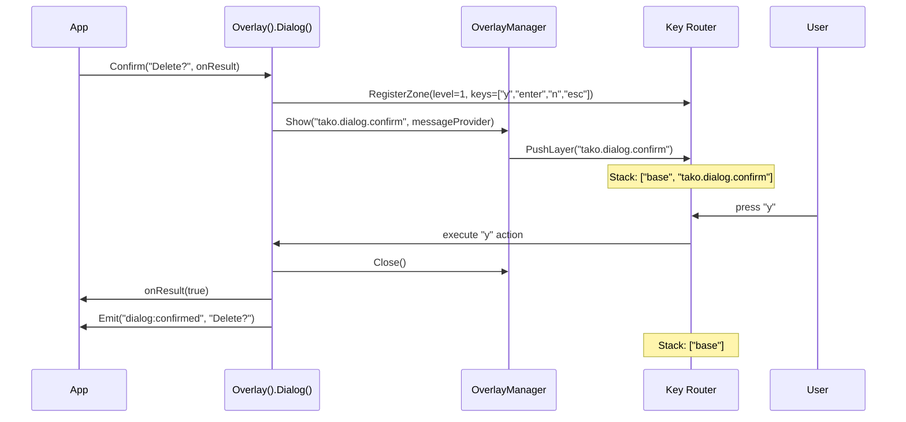

```go [lifecycle.go]
// Host app
app.Overlay().Dialog().Confirm("Delete?", func(yes bool) { ... })

// Plugin
ctx.Overlay().Dialog().Confirm("Sure?", func(yes bool) { ... })

// Cache for multiple calls
d := ctx.Overlay().Dialog()
d.Confirm("Step 1?", cb1)
```

## Why as a sub-namespace?

Dialogs *are* overlays. They push onto the same stack managed by `OverlayManager` and are dismissed the same way. Placing them under `.Dialog()` rather than flat on `OverlayManager` or as a separate `app.Dialog()` accessor:

1. **Makes the relationship explicit** — "I'm managing an overlay → specifically a dialog type."
2. **Keeps `OverlayManager` clean** — new dialog types (`Alert`, `Prompt`, `Select`) are added to `DialogService` without modifying the `OverlayManager` interface.
3. **Avoids a misleading top-level accessor** — `app.Dialog()` would imply Dialog is a primitive like `app.Hooks()`, when it's actually composed from Stack + Router + Keys + Hooks.

## Core Philosophy

The `DialogService` is UI-agnostic: Tako handles key routing and event emission; your layout handles the visual display via hooks.

1. Registers the message text as the render output of a hook.
2. Pushes the overlay via the `OverlayManager`.
3. Registers ephemeral key bindings at the dialog's stack level.
4. Calls `onResult` and emits events when the user responds.

## API Reference

### `Confirm(message string, onResult func(yes bool))`

Pushes a confirmation overlay that waits for one of two key groups:

| Keys | Result |
|---|---|
| `y` or `enter` | `onResult(true)` + emit `"dialog:confirmed"` |
| `n` or `esc` | `onResult(false)` + emit `"dialog:cancelled"` |

The overlay is automatically dismissed after the user responds.

```go [main.go]
app.Overlay().Dialog().Confirm("Delete this file?", func(yes bool) {
    if yes {
        app.Emit("file:delete", filename)
    }
})
```

Inside a plugin:

```go [lifecycle.go]
ctx.Overlay().Dialog().Confirm("Discard unsaved changes?", func(yes bool) {
    if yes {
        p.isDirty = false
        ctx.Stack().Pop()
    }
})
```

## Events Emitted

| Event | Data | When |
|---|---|---|
| `"dialog:confirmed"` | `message` (string) | User pressed `y` or `enter` |
| `"dialog:cancelled"` | `message` (string) | User pressed `n` or `esc` |

These events fire in addition to calling `onResult`. Other parts of the app can react without holding a reference to the callback:

```go [lifecycle.go]
ctx.On("dialog:confirmed", func(e contracts.Event) {
    logger.Info("User confirmed: " + e.Data.(string))
})
```

## Rendering the Dialog in Your Layout

The dialog overlay is registered under the hook key:

```
"tako.overlay.tako.dialog.confirm"
```

The value returned by the hook is the `message` string passed to `Confirm`. Your layout is responsible for styling it:

```go [layout.go]
// In Layout.View():
top := r.Stack().Top()
if top == "tako.dialog.confirm" {
    raw := ctx.Hooks().Get("tako.overlay.tako.dialog.confirm")
    if msg, ok := raw.(string); ok {
        prompt := lipgloss.NewStyle().
            Border(lipgloss.DoubleBorder()).
            Padding(1, 2).
            Render("⚠  " + msg + "\n\n  [y] Yes   [n] No")
        return l.compose(baseView, prompt)
    }
}
```

## Key Binding Scope

Dialog key bindings are registered at the **specific stack level** the dialog occupies:

- They fire only when the dialog is the topmost layer.
- They automatically go silent once the dialog is dismissed — no explicit cleanup needed.



## The `sync.Once` Safety Guard

Internally, `Confirm` wraps callbacks in `sync.Once`. Even if a bug causes multiple key events to fire for the same dialog, `onResult` is called at most once and the overlay is dismissed exactly once.

## Using DialogService with Stack Guards

A powerful pattern: combine `BeforePop` guards with `DialogService` for "unsaved changes" UX:

```go [lifecycle.go]
app.Stack().BeforePop(func(layer string) (bool, string) {
    if layer == "editor" && p.isDirty {
        return false, "unsaved changes"
    }
    return true, ""
})

app.Stack().OnPopBlocked(func(layer, reason string) {
    if layer == "editor" {
        ctx.Overlay().Dialog().Confirm("Discard changes?", func(yes bool) {
            if yes {
                p.isDirty = false
                ctx.Stack().Pop()  // guard now passes
            }
        })
    }
})
```

## Comparison: `Dialog().Confirm` vs `Component`

| | `Dialog().Confirm` | `Component` |
|---|---|---|
| **Use case** | Quick confirm/cancel | Rich, stateful UI unit |
| **Setup** | One method call | Define a struct + 3 methods |
| **Keys** | Hardcoded `y/n/enter/esc` | Fully custom via `RegisterKeys` |
| **Rendering** | Layout reads message hook | Layout reads component render hook |
| **Reusability** | One pattern (confirm) | Reusable with different state |
