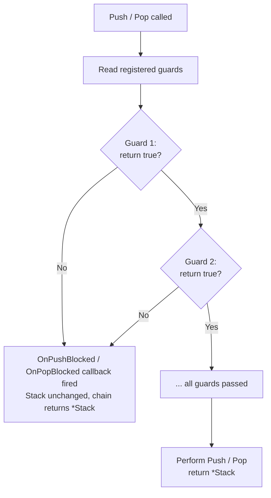

This is the right tool for things like:
- Blocking navigation to a restricted area unless certain conditions are met
- Showing an "unsaved changes" warning before letting the user close a panel
- Preventing the user from opening too many stacked layers

## The Basics

Guards are registered with `BeforePush` and `BeforePop`. Each guard receives the **layer name** that would be affected and returns two values: a `bool` (allow or block) and a `string` (human-readable reason, useful for showing feedback).

```go [main.go]
// Only allow opening "settings" if the user is an admin
app.Stack().BeforePush(func(layer string) (allow bool, reason string) {
    if layer == "settings" && !currentUser.IsAdmin() {
        return false, "admin access required to open settings"
    }
    return true, ""
})

// Warn before closing the editor if there are unsaved changes
app.Stack().BeforePop(func(layer string) (allow bool, reason string) {
    if layer == "editor" && editor.HasUnsavedChanges() {
        return false, "you have unsaved changes"
    }
    return true, ""
})
```

> **Alternative:** `app.Router().Stack().BeforePush(...)` is equivalent — `app.Stack()` is just sugar.

## Push and Pop — Fluent Chaining

`Push` and `Pop` return `*Stack`, so you can chain them:

```go [main.go]
// Initialize multiple layers at startup
app.Stack().Push("base").Push("sidebar")

// Pop multiple layers at once
app.Stack().Pop().Pop()
```

When a guard blocks the operation, the layer is simply not added/removed and
the chain continues. To react to a block, register a callback with
`OnPushBlocked` or `OnPopBlocked`:

```go [main.go]
app.Stack().
    OnPushBlocked(func(layer, reason string) {
        // Show feedback to the user
        ctx.Emit("ui:notification", reason)
    }).
    OnPopBlocked(func(layer, reason string) {
        ctx.Emit("ui:notification", reason)
    })

// Now Push/Pop flow cleanly — errors are handled in the callback
app.Stack().Push("settings")  // if blocked, OnPushBlocked fires
app.Stack().Pop()             // if blocked, OnPopBlocked fires
```

> `OnPushBlocked` and `OnPopBlocked` can be called multiple times; only the
> **last** registered callback is active. Register them once at startup.

## How Multiple Guards Work

Guards are evaluated **in registration order**. The first `false` stops evaluation — subsequent guards are not called. This means the most restrictive guards should be registered first.



## Guard Receives the Correct Layer

For `BeforePop`, the guard receives the **current top of the stack** — the layer that would be removed. This is the layer you want to check, not the layer below it.

```go [main.go]
// Stack: ["base", "editor", "preview"]
//
// Pop is about to remove "preview".
// The guard receives "preview", not "editor".

stack.BeforePop(func(layer string) (bool, string) {
    fmt.Println(layer) // "preview"
    return true, ""
})
stack.Pop()
```

## Guards Are Runtime-Only

Guards are **not persisted** to the KV store with `SaveState`. If your app restores a saved stack state on launch, the guards from the previous session are gone — they're registered fresh in `main.go` or `OnInit`. This is intentional: guards contain closures over live application state, which can't be serialized.

## Practical Pattern: Confirmation Before Close

If you use the High-Level Dialog Service (`ctx.Overlay().Dialog().Confirm()`), it handles all of this automatically under the hood. You don't need to write manual guards for simple dialogs. See [Dialogs](../layer-management/dialogs.md).

```go [lifecycle.go]
// In a plugin's OnInit:
app.Stack().BeforePop(func(layer string) (bool, string) {
    if layer == "editor" && p.isDirty {
        return false, "unsaved changes"
    }
    return true, ""
})

app.Stack().OnPopBlocked(func(layer, reason string) {
    if layer == "editor" {
        ctx.Overlay().Dialog().Confirm("Discard unsaved changes?", func(yes bool) {
            if yes {
                p.isDirty = false  // clear the flag so the guard passes
                ctx.Overlay().Close()
            }
        })
    }
})
```

Flow:
1. User presses `esc` while `editor` is active.
2. Guard blocks the pop → `OnPopBlocked` fires.
3. `DialogService.Confirm` pushes a confirmation overlay on top.
4. User presses `y` → `isDirty = false` → `ctx.Overlay().Close()` succeeds (guard now passes).


## Practical Pattern: Role-Based Layer Access

```go [main.go]
// Central access control in main.go, before any plugin boots
app.Stack().BeforePush(func(layer string) (bool, string) {
    restricted := map[string]string{
        "admin":    "admin",
        "settings": "user",
    }
    requiredRole, ok := restricted[layer]
    if !ok {
        return true, "" // unrestricted layer
    }
    if !authService.HasRole(requiredRole) {
        return false, "insufficient permissions for " + layer
    }
    return true, ""
})
```

## Concurrent Safety

Guard registration (`BeforePush`, `BeforePop`) and guard evaluation (`Push`, `Pop`) are both mutex-protected. Guards are read under a read lock; the actual stack mutation happens under a write lock after guards pass. Safe to call from multiple goroutines.
