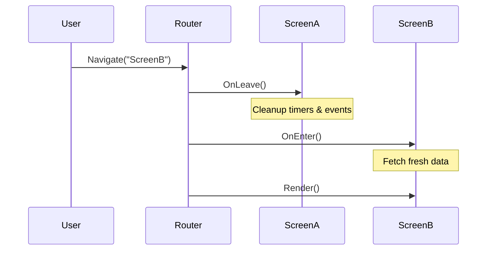

In a Single Page Application (SPA), navigating from one screen to another doesn't actually kill the process. This means if your first screen starts a background timer or listens to global events, those goroutines will continue running even after you navigate away!

If you don't clean up after yourself, your application will suffer from severe **Memory Leaks** and erratic behavior (like two screens trying to update the UI at the same time).

To solve this, Tako provides the **`contracts.RouterMiddleware`** interface, which grants your Views access to `OnEnter` and `OnLeave` lifecycle hooks.



## Implementing Lifecycle Hooks

If a View implements the `RouterMiddleware` interface, the Router will automatically detect it and call the hooks at the appropriate times.

```go
package components

import "gettako.dev/tako/contracts"

type LiveMetricsScreen struct {
	cancelListener func() // Function to unbind event listener
}

// OnEnter is called immediately before the View is rendered on the screen
func (s *LiveMetricsScreen) OnEnter() {
	app := contracts.Resolve[contracts.Application](ctx.Container(), "app")
	
	// Subscribe to a global event that fires 60 times a second.
	// The Listen() method returns a cancellation function.
	s.cancelListener = app.Events().Listen("metric.updated", func(payload any) {
		// update state...
	})
}

// OnLeave is called immediately before the Router navigates away from this View
func (s *LiveMetricsScreen) OnLeave() {
	if s.cancelListener != nil {
		// Clean up the listener so it doesn't fire when we are no longer looking at this screen!
		s.cancelListener()
		s.cancelListener = nil
	}
}

func (s *LiveMetricsScreen) Render(ctx contracts.Context) string {
	return "Live Metrics Dashboard"
}
```

## When to use Middlewares

You should implement `RouterMiddleware` whenever your View needs to:

1. **Subscribe to the Event Bus:** Always unsubscribe in `OnLeave`.
2. **Start Background Goroutines:** Pass a `context.Context` to your goroutines and call the `cancel()` function in `OnLeave`.
3. **Register Global Keybindings:** If your View registers a global hotkey (e.g. `Ctrl+S` to save) dynamically, unbind it in `OnLeave` so it doesn't conflict with other screens. *(Note: For scoped keybindings, prefer using the `contracts.KeyBinder` interface instead)*.
4. **Fetch Data:** Fetch API data or load files from the disk inside `OnEnter` so the data is fresh every time the user visits the page.
