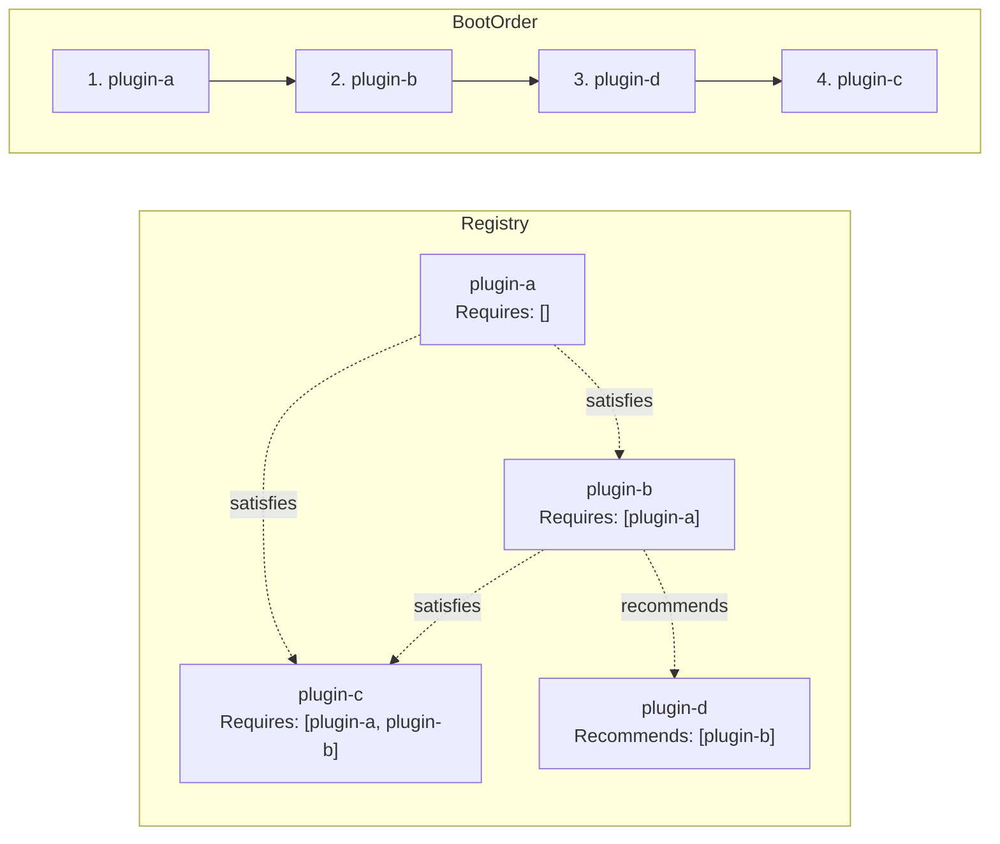

If you're building an app that doesn't need an extensible ecosystem, skip plugins entirely. Register your keybindings, hooks, and services directly in `main.go` — the framework doesn't care. The plugin system adds value when you want:

- Third parties to ship extensions that users install independently
- Your own codebase split into isolated, independently-versioned modules
- Clear dependency contracts between parts of your app
- The ability to enable/disable features by adding or removing an import

If none of those apply, plugins are overkill. But if they do — or if you just want clean structure — the plugin system is the best way to organize a growing Tako app.

## Without Plugins — Everything in main.go

For reference, here's a complete small app with no plugins at all, using the fluent helper methods:

```go [main.go]
func main() {
    app := tako.NewApp()

    // 1. Register a sidebar widget directly
    app.Hooks().Add("app.sidebar", func() any {
        return "📊 Status: Idle"
    })

    // 2. Register keybindings directly
    app.Keys().Bind("ctrl+f", func() {
        app.Overlay().ShowComponent(&SearchBox{})
    })

    app.Keys().Bind("esc", func() {
        if app.Overlay().IsActive() {
            app.Overlay().Close()
        }
    })
    // 3. Register renderer singleton
    app.WithRenderer(bubbletea.NewAdapter(app.Context(), &AppLayout{}))

    tako.Run(app)
}
```

Everything a plugin would do — registering hooks, keybindings, services — can be done directly on `app.Context()` and `app.Router()`. Plugins just give you a structured, lifecycle-managed way to do the same things.

---

## The Plugin as an Organizational Unit

A plugin is a **self-contained module** with:
- A declared identity (Manifest)
- A declared dependency list
- A lifecycle (four hooks: Init → Activate → Deactivate → Destroy)

The framework's Plugin Manager handles boot order, dependency validation, and teardown. You write the logic; the framework handles the orchestration.

## The Manifest

Every plugin starts with a `Manifest` struct. Think of it as the plugin's identity card:

```go [plugin.go]
var Manifest = plugin.Manifest{
    ID:          "search",           // required — unique, used as dependency identifier
    Name:        "Fuzzy Search",     // required — human-readable display name
    Version:     "1.0.0",           // required — semver
    Description: "Full-text search with fzf-style filtering.", // required — max 120 chars
    Author:      "Your Name",        // optional
    Type:        plugin.TypeHeadless, // default: TypeView
    Requires:    []string{"config-loader"},  // hard deps — must exist and succeed
    Recommends:  []string{"history"},        // soft deps — booted first if present
}
```

### ID Rules

The ID is used everywhere: dependency declarations, log messages, the `plugin:list` command, event names by convention. Make it:
- lowercase with hyphens (`"fuzzy-search"`, not `"FuzzySearch"`)
- unique within your app
- stable — changing it breaks dependencies

### Plugin Types

| Type | `OnInit` | `OnActivate` | Use for |
|---|---|---|---|
| `TypeView` (default) | ✅ | ❌ | UI components, keybinding registration, hook providers |
| `TypeHeadless` | ✅ | ✅ | Background workers, event processors, services |

The distinction matters: `OnActivate` is where you start goroutines and subscribe to events. `TypeView` plugins don't get `OnActivate` — they contribute to the UI reactively through hooks and events without owning background resources.

## The NoopLifecycle Embedding

`plugin.NoopLifecycle` provides empty implementations of all four lifecycle methods. Embed it to avoid writing boilerplate:

```go [lifecycle.go]
type Plugin struct {
    plugin.NoopLifecycle  // implements OnInit, OnActivate, OnDeactivate, OnDestroy with no-ops

    // your fields
    state string
}

// Only override what you need:
func (p *Plugin) OnInit(ctx *tako.Context) error {
    // ...
    return nil
}
```

Without `NoopLifecycle`, you'd need to implement all four methods even if most are empty.

## Dependency Declarations

### Hard Dependencies (`Requires`)

```go [plugin.go]
Requires: []string{"database", "auth"},
```

- Plugin won't boot if any required plugin is missing from the registry.
- Plugin won't boot if any required plugin failed to boot.
- The DAG sort guarantees required plugins are initialized before this one.

If a dependency is missing, the Plugin Manager marks your plugin as `failed` and logs an error. It doesn't crash the app — other plugins continue booting.

### Soft Dependencies (`Recommends`)

```go [plugin.go]
Recommends: []string{"analytics"},
```

- If the recommended plugin exists, it's booted first.
- If it doesn't exist, a warning is logged but your plugin boots normally.
- Use this for "nice to have" integrations that your plugin can work without.

## The DAG Sort

The Plugin Manager runs a topological sort (DFS with cycle detection) before booting. This ensures:
1. Dependencies are always booted before their dependants
2. Circular dependencies are detected and reported immediately with the cycle's entry point



Cycle detection returns an error that stops the entire boot:

```
DAG resolution failed: circular dependency detected involving plugin: search
```

## Auto-Registration Pattern

The idiomatic way to register a plugin uses Go's `init()` function:

```go [init.go]
// plugins/search/init.go
package search

import "github.com/gettako/tako/internal/plugin"

func init() {
    plugin.Register(Manifest, func() plugin.Lifecycle {
        return &Plugin{}  // factory creates a fresh instance
    })
}
```

The factory function (not the struct) is what's stored. The Plugin Manager calls it to instantiate the plugin at boot time. This means each plugin gets a clean instance — no shared mutable state between plugins sharing the same type.

Import the plugin in `main.go` with a blank import:

```go [main.go]
import _ "myapp/plugins/search"
```

The `init()` runs, the plugin is registered. Your `main.go` never needs to know about plugin internals.

## When `init()` Runs Before the Manager is Ready

If the Plugin Manager hasn't been created yet when `init()` runs (which can happen in certain test setups), registrations are buffered internally and flushed when `SetManager` is called. You don't need to worry about ordering — it's handled automatically by `plugin.Register`.
