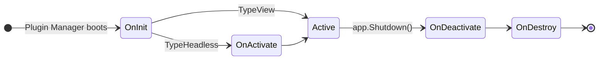
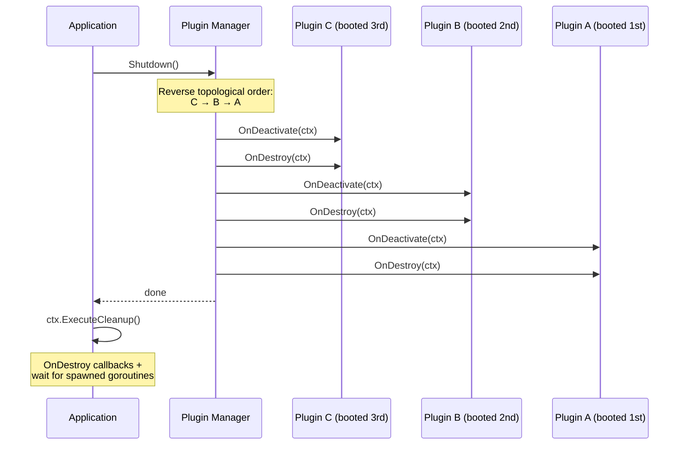

## The Four Hooks



All four methods receive `*tako.Context` and return `error`. A non-nil error from `OnInit` or `OnActivate` marks the plugin as failed and skips it for the rest of boot. Errors from `OnDeactivate` and `OnDestroy` are logged but don't stop other plugins from shutting down.

All four are wrapped in a `recover()` sandbox — a panic in your plugin won't crash the process.

All four are wrapped in a `recover()` sandbox — a panic in your plugin won't crash the process.

---

## Functional Plugins (Shortcut)

For simple plugins that only need to run setup code and don't require managing complex state, you can skip the struct boilerplate entirely using `plugin.Inline`:

```go [init.go]
func init() {
    plugin.Inline("my-plugin", "My Simple Plugin", func(ctx *tako.Context) {
        ctx.Logger().Info("Running functional plugin!")
        
        // Register simple bindings or components
        ctx.Keys().Bind("ctrl+p", showPicker)
    })
}
```

Under the hood, this creates a `TypeHeadless` plugin and executes your function during the `OnInit` phase.

---

## `OnInit` — Setup Phase

Called for every plugin, regardless of type. This is where you:

- Resolve services from the container
- Register keybindings
- Register hook providers
- Register cleanup callbacks with `ctx.OnDestroy`

```go [lifecycle.go]
func (p *Plugin) OnInit(ctx *tako.Context) error {
    // ✅ Resolve dependencies
    var logger contracts.Logger
    if err := ctx.Container().Make(&logger); err != nil {
        return fmt.Errorf("search: logger not available: %w", err)
    }
    p.logger = logger

    // ✅ Register keybindings — no router boilerplate needed
    ctx.Keys().Bind("ctrl+f", func() {
        ctx.Overlay().ShowComponent(&SearchBox{})
    })

    // ✅ Register hook providers
    ctx.Hooks().Add("app.sidebar", func() any {
        return p.renderSidebar()
    })

    // ✅ Register cleanup
    ctx.OnDestroy(func() {
        p.cleanup()
    })

    return nil
}
```

**Don't do in `OnInit`:**
- Start goroutines (use `OnActivate` for that)
- Subscribe to events (use `OnActivate` — it respects the activation order)
- Call services that haven't been registered yet

---

## `OnActivate` — Running Phase

Called only for `TypeHeadless` plugins, after all plugins have completed `OnInit`. This is where you:

- Start background goroutines with `ctx.Spawn`
- Subscribe to events on the event bus
- Begin any ongoing work

```go [lifecycle.go]
func (p *Plugin) OnActivate(ctx *tako.Context) error {
    // ✅ Start a background worker
    ctx.Spawn(func(c context.Context) {
        ticker := time.NewTicker(5 * time.Second)
        defer ticker.Stop()
        for {
            select {
            case <-ticker.C:
                p.refresh()
                ctx.Emit("search:index-updated", nil)
            case <-c.Done():
                return  // ← ALWAYS respect ctx.Done() to prevent goroutine leaks
            }
        }
    })

    // ✅ Subscribe to events
    cancel := ctx.On("config:reloaded", func(e contracts.Event) {
        p.reloadIndex()
    })
    p.cancelSub = cancel

    // Alternative — scoped to ctx so it's auto-pruned on context cancellation:
    // cancel = ctx.Subscribe(ctx, "config:reloaded", func(e contracts.Event) { ... })

    return nil
}
```

The key rule here: **always select on `ctx.Done()`** in your goroutines. When the app shuts down, the context is cancelled. If your goroutine doesn't check `ctx.Done()`, it will be leaked — `ctx.Spawn` tracks goroutines and waits for them during shutdown, so the app will hang until it times out.

---

## `OnDeactivate` — Winding Down

Called during shutdown, in **reverse boot order** — the last plugin to boot is the first to deactivate. This mirrors the dependency relationship: if plugin B depends on plugin A, B shuts down before A.

This is where you:

- Cancel event subscriptions
- Release any locks or connections your plugin owns
- Signal background goroutines to stop (though `ctx.Spawn` goroutines stop automatically via context cancellation)

```go [lifecycle.go]
func (p *Plugin) OnDeactivate(ctx *tako.Context) error {
    // ✅ Cancel event subscriptions
    if p.cancelSub != nil {
        p.cancelSub()
        p.cancelSub = nil
    }

    // ✅ Signal any channels
    if p.stopChan != nil {
        close(p.stopChan)
    }

    return nil
}
```

---

## `OnDestroy` — Final Cleanup

Called immediately after `OnDeactivate`, still in reverse order. This is your last chance to:

- Close file handles or network connections
- Flush any unsaved state to the KV store
- Release any OS resources

```go [lifecycle.go]
func (p *Plugin) OnDestroy(ctx *tako.Context) error {
    // ✅ Save state before the KV store closes
    if p.history != nil {
        _ = ctx.Storage().Set("search.history", p.history)
    }

    // ✅ Close any resources your plugin owns
    if p.index != nil {
        p.index.Close()
    }

    return nil
}
```

> **Tip:** The KV Store's `Close()` is called after plugin shutdown completes, so it's safe to write to storage in `OnDestroy`.

---

## Shutdown Sequence



Each `OnDeactivate` and `OnDestroy` call is sandboxed — a panic in one plugin's teardown doesn't prevent the others from running.
