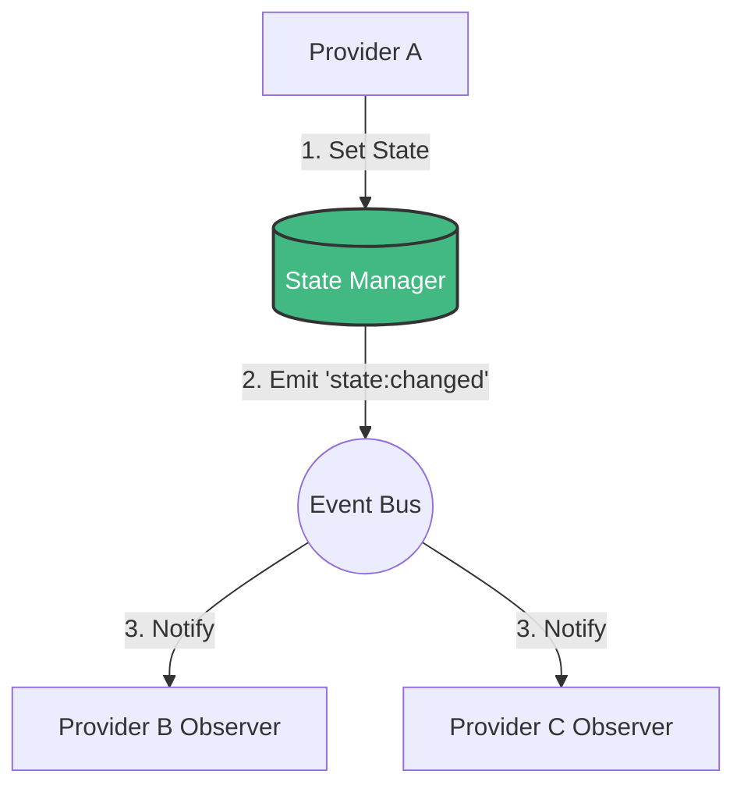

The state manager is a reactive in-memory key-value store that breathes life into your application. Every `Set` call automatically emits a `state:changed` event. Providers that
observe a key react instantly to changes without polling or manual propagation. It's not a database — use [KV Storage](/state-management/kv-storage) for persistence. The state
manager is for live session data: current user, cart contents, active filters, open notifications.



## Basic Operations

```go [providers/cart/provider.go]
func (p *CartProvider) Boot(app *foundation.Application) error {
    st := app.State()

    // Set — immediately available to all providers; emits "state:changed"
    st.Set("cart:items",  []*CartItem{})
    st.Set("cart:total",  0.0)

    // Get — returns any; type-assert or use observers for type safety
    items := st.Get("cart:items").([]*CartItem)

    // Has — check before Get to avoid nil assertions on missing keys
    if st.Has("cart:discount_code") {
        code := st.Get("cart:discount_code").(string)
        p.applyDiscount(code)
    }

    // Delete — removes the key and emits "state:changed" with NewValue=nil
    st.Delete("cart:discount_code")
    return nil
}
```

Every `Set` and `Delete` emits `"state:changed"`. Subscribe from anywhere:

```go
app.Events().Subscribe(app.Context(), "state:changed", func(e contracts.Event) {
    change := e.Data.(state.StateChange)
    // change.Key, change.OldValue, change.NewValue
    if change.Key == "cart:items" {
        p.updateCartBadge(len(change.NewValue.([]*CartItem)))
    }
})
```

## The Fluent Producer API

For mutations with advanced settings, use the `Produce()` chain:

```go [provider.go]
ctx.State().Mutate("search:results").
    Value(results).
    TTL(30 * time.Minute). // Auto-delete after 30 minutes
    Broadcast()            // Emits "state:changed" on set
```

// Pin — exempt from LRU eviction (use for critical, long-lived keys)
ctx.State().Mutate("user:session").
    Value(session).
    Pin().
    Broadcast()
```

| Method        | Effect                                   |
|---------------|------------------------------------------|
| `Mutate(k)`   | The state key to produce                 |
| `Value(v)`    | The value to store                       |
| `TTL(d)`      | Auto-delete after duration               |
| `Pin()`       | Exempt from LRU eviction                 |
| `Broadcast()` | Emit `state:changed` and commit mutation |

## TTL — Automatic Expiration

Use TTL for state that shouldn't live forever:

```go [providers/search/provider.go]
func (p *SearchProvider) cacheResults(ctx *tako.Context, query string, results []Result) {
    ctx.State().Mutate("search:cache:" + query).
        Value(results).
        TTL(10 * time.Minute). // Stale results auto-expire
        Broadcast()
}
```

On expiration, a `"state:changed"` event is emitted with `nil` value:

```go
ctx.On("state:changed:search:cache:"+query, func(e contracts.Event) {
    if e.Data == nil {
        ctx.Logger().Debug("cache expired", "key", "search:cache:"+query)
    }
})
```

::note
TTL timers are tracked internally. On application shutdown, pending TTL callbacks are cancelled — they will not fire against a closed event bus or recycled state.
::

## LRU Eviction — Memory Bounds

Configure maximum key count to prevent unbounded growth in long-running apps:

```go [main.go]
app := tako.NewApp()
app.Container().Singleton(new(contracts.StateManager), state.NewManager(
    state.WithMaxKeys(500), // LRU eviction kicks in at 500 keys
))
```

When the limit is reached, the least-recently-used unpinned key is evicted. Pinned keys are never evicted. The evicted key emits `"state:evicted"` so subscribers can react —
eviction events are published outside the internal lock, so observers can safely call back into the state manager (e.g., `Get` or `Set`) without deadlocking.

## Reactive Observers (Preferred Over Subscribe)

For type-safe, fine-grained reactions to specific keys, use observers:

```go [providers/cart/provider.go]
func (p *CartProvider) Boot(app *foundation.Application) error {
    ctx := app.Context()
    // Observer fires only when "cart:items" changes
    ctx.State().Watch("cart:items").
        Debounce(100 * time.Millisecond).  // Batch rapid updates
        OnUpdate(func(old, new any) {
            items := new.([]*CartItem)

            // Compute total — stored in state for other providers to consume
            var total float64
            for _, item := range items {
                total += item.Price * float64(item.Quantity)
            }
            ctx.State().Set("cart:total", total)
        }).
        Subscribe(ctx.Context())
    return nil
}
```

Debouncing is critical for keys that change at high frequency (e.g., keystrokes in a search box). Without it, every keystroke triggers the full observer callback chain.

## State vs KV Storage vs Events

|                    | State Manager                 | KV Storage                        | Event Bus                 |
|--------------------|-------------------------------|-----------------------------------|---------------------------|
| **Persistence**    | Session only (in-memory)      | Survives restarts                 | None                      |
| **Reactivity**     | Built-in via `state:changed`  | Manual                            | Pub/sub                   |
| **Use For**        | Active session data           | User preferences, session restore | Notifications, broadcasts |
| **Access Pattern** | Pull (Get) or Push (Observer) | Pull (Get)                        | Push (Subscribe)          |

A common pattern: load persisted data from KV into state at `Boot`, let providers observe state changes throughout the session, persist to KV in `Shutdown`:

```go [providers/preferences/provider.go]
func (p *PreferencesProvider) Boot(app *foundation.Application) error {
    ctx := app.Context()

    // Load from KV into state
    var prefs UserPreferences
    if ctx.Storage().Has("user:prefs") {
        ctx.Storage().Get("user:prefs", &prefs)
    } else {
        prefs = defaultPreferences()
    }
    ctx.State().Set("user:prefs", prefs)

    // Auto-persist when state changes
    ctx.State().Watch("user:prefs").
        Debounce(1 * time.Second).
        OnUpdate(func(old, new any) {
            ctx.Storage().Set("user:prefs", new.(UserPreferences))
        }).
        Subscribe(ctx.Context())
    return nil
}

func (p *PreferencesProvider) Shutdown() error {
    // Final sync on shutdown (in case observer hasn't fired yet)
    if prefs := p.app.State().Get("user:prefs"); prefs != nil {
        p.app.Storage().Set("user:prefs", prefs.(UserPreferences))
    }
    return nil
}
```

::tip
Use namespaced keys with a colon separator: `"cart:items"`, `"cart:total"`, `"user:session"`. This makes it trivial to scan the state dump (`go run . status`) and understand what
belongs to which domain. It also helps with wildcard subscriptions during debugging: `ctx.Subscribe("cart:*", debugHandler)`.
::

