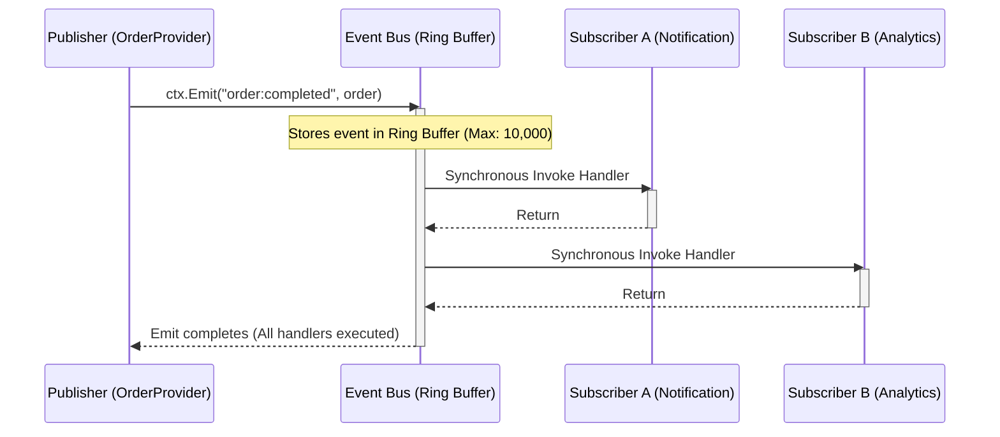

The event bus is how providers communicate without coupling. A provider emits a named event; any number of other providers can subscribe to it. Publisher and subscriber never
import each other.



## Emitting Events

```go [providers/orders/provider.go]
// ctx.Emit is shorthand for ctx.Events().Emit
func (p *OrderProvider) completeOrder(ctx *tako.Context, order *Order) {
    if err := p.db.Complete(order); err != nil {
        ctx.Logger().Error("order completion failed", "err", err)
        return
    }

    // Synchronous: all handlers execute before Emit returns
    ctx.Emit("order:completed", order)
}
```

Emitting is synchronous — every subscriber for `"order:completed"` runs before `Emit` returns. If a subscriber panics, the framework recovers and logs the error, but other
subscribers are not affected.

Internally, published events are stored in a fixed-size ring buffer (capacity 10,000) for replay and debugging via [Time Travel](/developer-tools/time-travel). When the buffer is
full, the oldest event is overwritten in O(1) — no allocations or copies on the hot path.

## Subscribing

Three subscription lifetimes:

```go [providers/notifications/provider.go]
func (p *NotificationProvider) Boot(app *foundation.Application) error {
    ctx := app.Context()

    // Subscribe — auto-cleaned up when the provider is shutdown
    app.Events().Subscribe(ctx, "order:completed", func(e contracts.Event) {
        order := e.Data.(*Order)
        p.showBadge("Order " + order.ID + " shipped!")
    })

    // Once — fires exactly once, then unsubscribes itself
    ctx.Once("app:ready", func(e contracts.Event) {
        p.loadUnreadNotifications()
    })

    // On — persists until the returned cancel function is called explicitly
    cancel := ctx.On("debug:dump_state", func(e contracts.Event) {
        ctx.Logger().Debug("notification queue", "count", len(p.queue))
    })
    p.cancelDebugSub = cancel // Store to cancel manually if needed
    return nil
}
```

**Choosing by scope:**

| Method                   | Lives Until                     | Use When                                                    |
|--------------------------|---------------------------------|-------------------------------------------------------------|
| `app.Events().Subscribe` | Provider context cancelled      | Standard provider event handlers (use this 95% of the time) |
| `ctx.Once`               | First fire or context cancelled | One-time initialization signals                             |
| `ctx.On`                 | Manually cancelled              | Application-lifetime handlers outside a provider lifecycle  |

## Built-In Framework Events

| Topic                  | Payload                                | When                                      |
|------------------------|----------------------------------------|-------------------------------------------|
| `app:ready`            | `nil`                                  | All bootstrappers + providers initialized |
| `app:shutdown`         | `nil`                                  | Graceful shutdown begins                  |
| `state:changed`        | `StateChange{Key, OldValue, NewValue}` | Any state key is set                      |
| `state:expired`        | `StateExpiry{Key, Reason}`             | A TTL or LRU eviction removes a key       |
| `provider:activated`   | `ProviderInfo{ID, Name}`               | A provider transitions to active          |
| `provider:deactivated` | `ProviderInfo{ID, Name}`               | A provider transitions to inactive        |
| `overlay:shown`        | `string` (layer ID)                    | An overlay is pushed                      |
| `overlay:closed`       | `string` (layer ID)                    | An overlay is popped                      |
| `rpc:completed`        | `*RPCCallResult`                       | An RPC call finishes (for monitoring)     |

## Event Naming Conventions

Use `domain:action` with lowercase snake_case:

```
order:created          order:completed         order:cancelled
user:logged_in         user:logged_out          user:profile_updated
inventory:stock_low    inventory:restocked
notification:received  notification:dismissed
```

Group related events under the same domain prefix so you can use wildcard subscriptions for debugging:

```go
// Subscribe to all order events (wildcard — development only)
ctx.On("order:*", func(e contracts.Event) {
    ctx.Logger().Debug("order event", "topic", e.Topic)
})
```

## Error Handling in Subscribers

Panics in subscribers are recovered by the framework. But returning an error to the caller isn't possible — pub/sub is fire-and-forget. Handle errors within the subscriber:

```go [provider.go]
ctx.On("order:completed", func(e contracts.Event) {
    order, ok := e.Data.(*Order)
    if !ok {
        ctx.Logger().Error("unexpected payload type",
            "topic", e.Topic,
            "got", fmt.Sprintf("%T", e.Data),
        )
        return
    }

    if err := p.notifyWarehouse(order); err != nil {
        ctx.Logger().Error("warehouse notification failed",
            "order_id", order.ID,
            "err", err,
        )
        // Emit a compensating event so other providers can react
        ctx.Emit("warehouse:notification_failed", &FailureEvent{
            OrderID: order.ID,
            Reason:  err.Error(),
        })
    }
})
```

::tip
Keep event payloads immutable. Once emitted, an event's payload travels to multiple subscribers potentially running in different goroutines. If you mutate the payload inside a
subscriber (e.g., adding a field to a shared struct), you create a data race. Pass copies or pointer-to-value types, and treat the payload as read-only inside subscriber functions.
::

