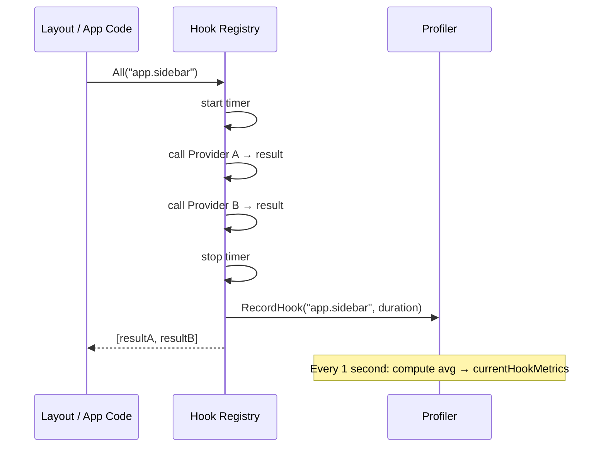

## Development Mode

Dev mode is detected automatically when you run via `go run`. The detection looks for `"go-build"` in the executable path — which is where Go puts temporary binaries when using `go run`.

```bash
go run main.go              # dev mode ON  → profiler + debug server start
go build -o app && ./app    # dev mode OFF → profiler + debug server absent
```

You can also force it explicitly:

```bash
TAKO_PROFILER_ENABLED=true ./app
```

In dev mode, two extra services start alongside your normal app:

1. **Profiler** — a ring-buffer telemetry collector for render timing, FPS, hook performance, and memory
2. **Debug Server** — a local WebSocket server that streams profiler data in real-time

Both are registered in the container during `Application.Boot()` and are only started by the TUI Kernel (not CLI commands, to avoid port conflicts).

---

## The Profiler

The profiler is the engine behind all runtime telemetry. It lives at `internal/profiler` and runs as a background goroutine subscribed to `"*"` on the event bus.

### What It Tracks

| Metric | Source | Notes |
|---|---|---|
| **FPS** | `RecordView()` calls | Frames counted per second, averaged over 1s window |
| **Avg Update time** | `RecordUpdate()` calls | Average duration of input/state processing cycles |
| **Avg View time** | `RecordView()` calls | Average duration of render cycles |
| **Hook timings** | `RecordHook()` via `MetricsCollector` | Per-hook average + call count, 1s rolling window |
| **Boot times** | `RecordBootTimes()` | Framework / app setup / plugin boot, measured separately |
| **Event log** | Bus `"*"` subscription | Ring buffer, configurable capacity (default 1000) |
| **Memory** | `runtime.ReadMemStats()` | AllocMB, SysMB, GC count, goroutine count, GC pause |
| **Uptime** | Internal | Time since profiler started |

### How FPS is Calculated

The profiler runs a `time.Ticker` every second. On each tick, it calculates:

```
FPS = framesThisSecond / elapsedSeconds
```

`framesThisSecond` is incremented by every `RecordView()` call. At the end of each tick window, the counter resets. This gives you a trailing 1-second FPS average.

### Idle Detection

If `RecordUpdate` and `RecordView` haven't been called for 3 consecutive seconds, the profiler considers the app idle and zeros out FPS/timing metrics. This prevents stale numbers from polluting the display when the TUI isn't actively rendering.

### The Dependency on Your Adapter

Here's the important part: **the profiler can only measure what your adapter reports.**

The profiler has no way to hook into your UI library automatically. It relies on your adapter calling `RecordUpdate` and `RecordView` at the right times.

```
Your Adapter
    │
    ├─ processes input ──→ RecordUpdate(duration)   ← profiler learns about update cycles
    └─ renders to screen → RecordView(duration)     ← profiler learns about render cycles, increments FPS
```

If your adapter never calls these methods, the profiler will show `FPS: 0`, `Avg Update: 0ms`, `Avg View: 0ms`. **This is not a bug** — it just means the adapter wasn't instrumented. All other profiler data (hook timings, events, memory, boot times) continues to work regardless.

The built-in Bubble Tea adapter handles this automatically. For custom adapters, see [05.01 — UI Adapters](../ui/adapters.md) for how to instrument your render loop.

### Ring Buffer for Events

Events are stored in a circular buffer of fixed capacity (1000 by default). When the buffer fills, the oldest entries are overwritten. This keeps memory bounded no matter how many events fire.

```
Buffer capacity: 1000
Events written: 1247
→ Buffer contains events 248 through 1247 (latest 1000)
```

Retrieving events returns them in chronological order, correctly reconstructed from the ring buffer's head pointer.

### Hook Profiling

Hook timing works regardless of UI adapter because it's recorded inside the Hook Registry itself, not in the adapter. When the profiler is active, it attaches itself as a `MetricsCollector` to the hook registry:

```go [profiler.go]
hookReg.SetMetricsCollector(profilerInstance)
```

After that, every `Get` and `All` call records its duration to the profiler. The 1-second rolling average is computed in `Tick()`.



---

## The Debug Server

The debug server is a local HTTP server with a single WebSocket endpoint. It only starts in dev mode, binds to `127.0.0.1:0` (OS-assigned port), and writes its address to a PID file.

### PID File

On start, the server writes:

```
.tako/run/<pid>.json
```

```json
{
  "pid": 12345,
  "addr": "127.0.0.1:54321"
}
```

The inspector discovers running apps by scanning all `.json` files in `.tako/run/` and connecting to the most recently modified one that matches `TAKO_APP_DIR`.

### WebSocket Message Types

The WebSocket handler pushes five message types every 500ms:

```json
{ "type": "events",      "data": [...] }
{ "type": "health",      "data": { "fps": 60, "avg_update_ms": 0.12, ... } }
{ "type": "stack",       "data": ["base", "search"] }
{ "type": "plugins",     "data": [...] }
{ "type": "keybindings", "data": [...] }
```

You can connect to this from your own tooling — it's plain WebSocket + JSON, but it requires an ephemeral token for security.

### Authentication

Even though the server is localhost-only, it uses an ephemeral token system to prevent unauthorized local processes from connecting.

1. **Locate the run file** at `~/.tako/run/<pid>.json` (the directory depends on your OS, e.g., `%LOCALAPPDATA%\tako\run\<pid>.json` on Windows).
2. **Read the JSON file**, which contains the server `port` and the `token`.
3. **Connect to the WebSocket**, passing the token either in the `Authorization` header (`Bearer <token>`) or as a query parameter (`?token=<token>`).

### Health Message Structure

```go [health.go]
type MemoryHealth struct {
    AllocMB      uint64        // heap allocated (MB)
    SysMB        uint64        // total memory from OS (MB)
    NumGC         uint32       // total GC runs since start
    NumGoroutine  int          // live goroutines
    PauseTotalNs  uint64       // total GC pause time (ns)
    Uptime        time.Duration

    Fps           float64      // current FPS (0 if adapter not instrumented)
    AvgUpdateMs   float64      // rolling 1s avg update time
    AvgViewMs     float64      // rolling 1s avg view time

    FrameworkBootMs float64    // time spent in Boot() framework setup
    AppBootMs       float64    // time spent in main.go + command registration
    PluginsBootMs   float64    // time spent running plugin OnInit/OnActivate
    TotalBootMs     float64    // sum of the above

    HasRecordedMetrics bool    // false if adapter hasn't called RecordUpdate/RecordView yet
    IsIdle             bool    // true if no render activity for 3+ seconds

    HookMetrics []HookMetric   // per-hook avg timing
}
```

---

## The Inspector (`myapp inspect`)

The inspector is a standalone TUI app that connects to a running Tako instance and displays all of the above in real-time.

```bash
# Terminal 1: run your app
go run main.go

# Terminal 2: open the inspector
go run main.go inspect
```

The inspector shows four panels, auto-refreshing from the WebSocket stream:

```
┌──────────────────────────────────┐  ┌─────────────────────────────────┐
│  Health & Memory                 │  │  Registered Keybindings          │
│  FPS: 60.0                       │  │  global  ctrl+c    shutdown      │
│  Avg Update: 0.12ms              │  │  global  ctrl+f    open-search   │
│  Avg View:   0.45ms              │  │  zone:0  main/j    scroll-down   │
│  Stack: [base, search]           │  │  zone:0  main/k    scroll-up     │
│  Goroutines: 12                  │  │  zone:1  search/enter  confirm   │
│  Heap: 12.4 MB / Sys: 28 MB      │  └─────────────────────────────────┘
│  GC runs: 3                      │
│  Uptime: 4m23s                   │  ┌─────────────────────────────────┐
│  Boot: framework 2.1ms           │  │  Plugins                         │
│        app      0.8ms            │  │  clock     ✓  headless  1.2ms   │
│        plugins  4.3ms            │  │  search    ✓  headless  4.8ms   │
│  Hook timings:                   │  │  status    ✓  view      0.9ms   │
│    app.sidebar  0.08ms (60/s)    │  │  analytics ✗  failed            │
│    app.footer   0.02ms (60/s)    │  └─────────────────────────────────┘
└──────────────────────────────────┘
┌──────────────────────────────────────────────────────────────────────┐
│  Live Event Stream                                                    │
│  10:42:01.123  fzf:opened                                            │
│  10:42:01.456  search:index-updated                                  │
│  10:42:02.001  clock:tick                                            │
│  10:42:03.512  fzf:closed                                            │
└──────────────────────────────────────────────────────────────────────┘
```

The inspector auto-reconnects if the target app restarts. The minimum terminal size requirement is 80×25 — if the terminal is too small, it shows a size warning instead of the panels.

## Next Steps

To learn more about how development mode handles file changes and auto-restarts, see the [Watcher & Hot Reload](./watcher.md) documentation.
