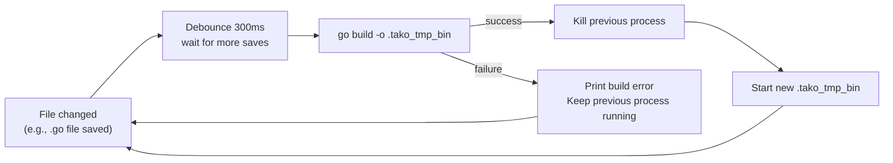

## How It Works

The watcher is implemented using `fsnotify` and runs as a background process during development.



### Directory Traversal

When the watcher starts, it walks the application directory recursively to add folders to the `fsnotify` watch list. It automatically ignores:
- Hidden directories starting with `.` (e.g., `.git`, `.tako`)
- The `vendor` directory
- Temporary or backup files ending in `~` or `.swp`

This ensures that the watcher doesn't get triggered by IDE background tasks or Git operations, keeping the hot-reload cycle fast and predictable.

### Debouncing

To prevent multiple rapid saves (such as "format on save" actions in editors) from triggering redundant builds, the watcher uses a **300ms debounce timer**. 

If a file event occurs, the timer resets. Only when the timer fires without any new events does the actual rebuild process begin.

## Configuration

The watcher accepts a `Config` struct that allows you to specify which file extensions should trigger a rebuild.

```go [watcher.go]
type Config struct {
	IncludeExts []string
	ExcludeExts []string
}
```

- **IncludeExts**: If specified, only files with these extensions will trigger a rebuild (e.g., `[]string{".go", ".yaml"}`).
- **ExcludeExts**: Files with these extensions will be explicitly ignored.

If `IncludeExts` is empty, the watcher will assume all files are relevant unless they match the exclusion rules.

## Using the Watcher Manually

While the `dev` command sets up the watcher for you automatically, you can also use the `internal/watcher` package programmatically if you're building custom development tools for Tako.

```go [watcher.go]
import "github.com/gettako/tako/internal/watcher"

// Configure and initialize the watcher
cfg := watcher.Config{
    IncludeExts: []string{".go"},
}
w, err := watcher.New("./", cfg)
if err != nil {
    log.Fatal(err)
}

// Start listening for file changes
w.Start()
defer w.Stop()

// React to changes
for {
    <-w.ChangeChan()
    log.Println("Relevant file changed, time to rebuild!")
}
```
