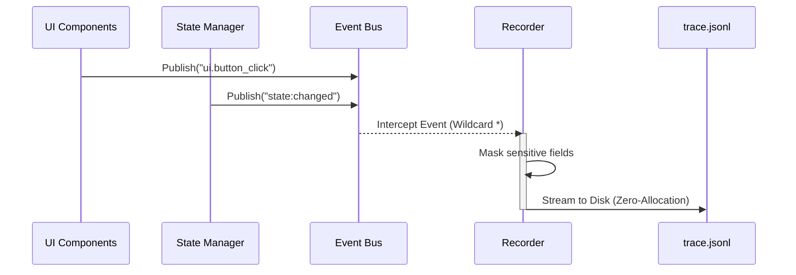

## What is Time-Travel Debugging?

When building complex Terminal UIs, figuring out why a layout broke or why the application crashed often requires reconstructing the sequence of keyboard inputs and background events.

Tako provides an **Event Recorder** that safely serializes every action in your application to a `JSONL` trace file on disk. You can then "Time-Travel" by replaying the exact sequence of events, in chronological order and with original timing delays, to watch the system fail right in front of you.

## Architecture

The Recorder acts as a "black-box flight recorder" for your application. It hooks directly into the central Event Bus using a wildcard subscription (`*`), intercepting every single event without requiring manual `log.Info()` statements scattered inside your business logic.



## Recording a Trace

The Recorder operates with zero-allocation streaming, ensuring your application doesn't run out of memory during a long debug session. It also supports **Field Masking** to securely redact passwords or secrets before writing them to disk.

### 1. Enable Recording

You can initialize the Recorder during the bootstrap process or globally inside your `main.go`:

```go [main.go]
import "github.com/gettako/tako/internal/recorder"

// 1. Initialize the Recorder and attach to Event Bus
rec := recorder.New(bus).
    MaskFields("password", "secret", "cvv") // Redacts sensitive data

// 2. Start recording magically in the background!
if err := rec.Start(context.Background()); err != nil {
    panic("Failed to start recorder")
}
defer rec.Stop() // Ensure file is flushed when app exits
```

By default, if the application is running in Development Mode (e.g., via `go run` or inside a git project), traces will be stored locally in `.tako/traces`. If it's running in Production (compiled binary), they will be stored in your User Home Directory (e.g., `~/.tako/traces`).

## Replaying a Trace

Once you have a trace file, you can feed it back into the framework using the built-in `replay` CLI command. Tako comes with a built-in TUI player that parses the trace file and reconstructs the Event Log and State Tree interactively.

```bash
tako replay .tako/traces/trace-1780000000.jsonl
```

Or, if using `go run`:

```bash
go run main.go replay .tako/traces/trace-1780000000.jsonl
```

### Inside the Player Interface

When you open a trace file, the TUI Player splits your terminal into two highly interactive panels:

#### 1. Event Log (Left Panel)
A chronological list of every intercepted event, complete with line numbers and exact timestamps. 
- The currently executing event is highlighted in **Green**.
- Past events are dimmed.
- You can jump instantly to any event line number using the `g` shortcut.

#### 2. Live State Tree (Right Panel)
A real-time, reconstructed JSON view of your application's `State`. As the player steps through `state:changed` events, this JSON object mutates before your eyes, giving you a perfect snapshot of your application's memory at any given millisecond!

### Player Controls

You can control the time-travel playback via these keyboard shortcuts:
- `[Space]` : Play or pause the playback
- `[Left/Right]` : Step backward or forward one event at a time manually
- `[1-4]` : Adjust playback speed (1x, 2x, 4x, or Fast-Forward)
- `[r]` : Restart the playback from the beginning
- `[g]` or `[/]` : Jump directly to a specific line/event number
- `[q]` : Quit the player

> [!TIP]
> The Event Recorder pairs wonderfully with the [Watcher](./02.watcher.md). While the Watcher gives you real-time insight, the Recorder acts as a "black box flight recorder" for post-mortem analysis.
