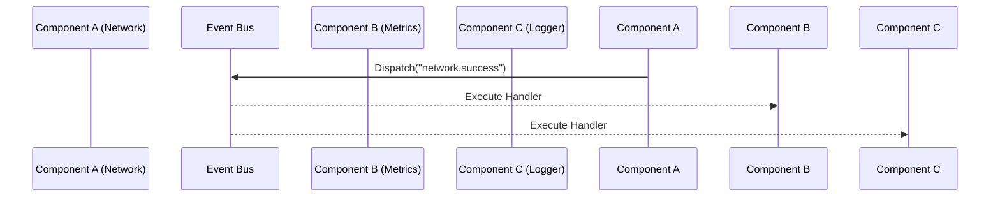

When building an application, you want your domains to be decoupled. Your `NetworkService` shouldn't need a direct reference to your `MetricsCard` UI component just to tell it that a ping succeeded.

Instead, they should communicate by broadcasting and listening to messages on a central **Event Bus**.



## Dispatching Events

Tako uses explicit methods to dispatch events, prioritizing clarity. You can access the Event Bus from any component via the Context API.

### Synchronous Dispatch (`Dispatch`)

By default, event listeners run synchronously. The application blocks until all handlers have processed the event.

```go
// A simple event with no data
ctx.Events().Dispatch("user.logged_in", nil)

// With a payload
user := User{ID: 1, Name: "Admin"}
ctx.Events().Dispatch("user.logged_in", user)
```

### Asynchronous Dispatch (`DispatchAsync`)

When you don't want to block the main thread (for example, triggering background metrics or long-running tasks), use `DispatchAsync`. Tako spawns a goroutine for each listener and tracks them to ensure they complete before the application shuts down.

```go
// Fire and forget
ctx.Events().DispatchAsync("analytics.track", eventData)
```

## Subscribing to Events

To listen for an event, use the `On` or `Subscribe` methods. The handler function will receive the `Event` payload.

```go
func (c *NotificationBanner) Init(ctx contracts.Context) {
    // Subscribe to the event
    ctx.Events().On("notification.show", func(event contracts.Event) {
        if message, ok := event.Data.(string); ok {
            c.ShowMessage(message)
            ctx.UI().RequestRender() // Request a redraw
        }
    })
}
```

### Wildcard Subscriptions

Tako's Event Bus supports trailing wildcard matches (`*`), allowing you to group related events under a namespace and listen to all of them at once.

```go
ctx.Events().On("router:*", func(event contracts.Event) {
    log.Println("Router action intercepted:", event.Name)
})

// Both of these will trigger the wildcard handler above
ctx.Events().Dispatch("router:navigated", "/home")
ctx.Events().Dispatch("router:back", nil)
```

## Typed Event Bus (Generics)

For safety and type strictness, Tako provides a `TypedBus[T]` generic wrapper. Instead of receiving an untyped `contracts.Event` and manually type-asserting it, you can declare a strongly-typed bus.

First, define your event payload struct:

```go
// Define a structured event payload
type ResizeEvent struct {
    Width  int
    Height int
}
```

Next, wrap your event bus using `contracts.Typed`. You can do this once and share the variable.

```go
import "gettako.dev/tako/contracts"

// Create a typed bus bound to a specific event name
var ResizeBus = contracts.Typed[ResizeEvent](ctx.Events(), "ui:resize")
```

Now you can emit and subscribe with compile-time safety:

```go
// Emit (must match the struct exactly)
ResizeBus.Dispatch(ResizeEvent{Width: 120, Height: 40})

// Subscribe (handler receives the struct directly)
unsub := ResizeBus.On(func(e ResizeEvent) {
    log.Printf("Resized to %dx%d", e.Width, e.Height)
})
```

If a payload with the wrong type is emitted to `"ui:resize"` elsewhere in your application, the `TypedBus` will ignore it, preventing runtime panics.

## Lifecycle and Cleanups

If you are listening to events inside a component that might be destroyed or unmounted, you must clean up your listeners to prevent memory leaks.

`Subscribe` returns an `unsubscribe` function.

```go
type TemporaryComponent struct {
    unsub func()
}

func (c *TemporaryComponent) Init(ctx contracts.Context) {
    // Save the unsubscribe function
    c.unsub = ctx.Events().Subscribe(ctx.StdCtx(), "tick", c.handleTick)
}

func (c *TemporaryComponent) Unmounted(ctx contracts.Context) {
    if c.unsub != nil {
        c.unsub() // Stop listening when component is removed
    }
}
```

::tip
If you use `Subscribe(ctx, event, handler)` and pass an active `context.Context` (like `ctx.StdCtx()`) that eventually gets cancelled, Tako will automatically unsubscribe the handler for you on the next emission cycle.
::

## Global Debugging

If you are building a developer tool (like the built-in Profiler) and want to listen to every event that fires in the application:

```go
ctx.Events().SubscribeAll(ctx.StdCtx(), func(event contracts.Event) {
    log.Println("Global Event Fired:", event.Name, event.Data)
})
```

::warning
Use `SubscribeAll` strictly for debugging or profiling purposes. Using it for standard application logic will negatively impact performance.
::
