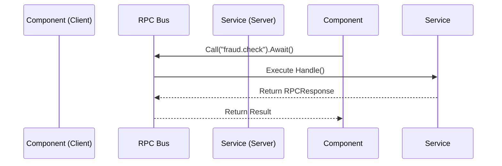

While the Event Bus handles "fire-and-forget" Pub/Sub messaging, there are times when a component needs to ask a question and wait for an answer. For instance, a transfer component might need to ask a fraud service if a transaction is safe.

Instead of injecting the `FraudService` directly into every component that needs it, Tako provides a decoupled **RPC Bus** (Remote Procedure Call) designed for in-process request-response communication.



## Registering an RPC Route (Server Side)

To expose an endpoint, you use the `Route()` method. This is typically done inside the `Boot` method of a Service Provider.

Tako's RPC Router uses a fluent builder syntax, allowing you to attach timeouts and guards (middlewares) before handling the request.

```go
func (p *FraudProvider) Boot(app contracts.Application) error {
	
	// Register the RPC endpoint
	app.RPC().Route("fraud.check").
		Timeout(2 * time.Second). // Cancel if it takes too long
		Handle(func(ctx context.Context, req contracts.RPCRequest) (contracts.RPCResponse, error) {
			
			// 1. Extract the payload
			amount, ok := req.Payload.(float64)
			if !ok {
				return contracts.RPCResponse{}, fmt.Errorf("invalid payload format")
			}
			
			// 2. Perform business logic
			isSafe := amount < 100000.0
			
			// 3. Return the response
			return contracts.RPCResponse{
				Data: map[string]any{"safe": isSafe},
			}, nil
		})

	return nil
}
```

## Calling an RPC Route (Client Side)

Any component can call this route using the `Call()` method. The fluent API allows you to attach context, payloads, and retry policies.

```go
func (c *TransferForm) processTransfer(amount float64) {
	
	// Initiate the RPC Call and Await the response
	resResp, err := c.app.RPC().Call("fraud.check").
		WithPayload(amount).
		WithContext(c.app.Context().StdCtx()).
		Retry(2). // Retry twice if it fails
		Await()

	if err != nil {
		c.app.Logger().Error("RPC Error", "err", err)
		return
	}

	// Process the response data
	resMap := resResp.Data.(map[string]any)
	if safe, ok := resMap["safe"].(bool); ok && !safe {
		c.app.Logger().Warn("Transfer Blocked by Fraud Service")
		return
	}

	// Proceed with transfer...
}
```

## Why use RPC instead of direct methods?

- **Decoupling**: The UI component doesn't need to know what or where the Fraud service is. It only knows the route name `"fraud.check"`.
- **Fault Tolerance**: The RPC Bus handles timeouts and retries via the fluent chain.
- **Interchangeability**: You can swap the internal `FraudService` with an external HTTP microservice inside the RPC handler, and the UI component's code won't need to change.

::note
Because `Await()` blocks the current goroutine, you should be mindful of where you call it. Do not use `Await()` directly inside the `Render()` loop, as it will freeze the terminal UI. Always use it inside a key handler or an asynchronous event hook.
::
