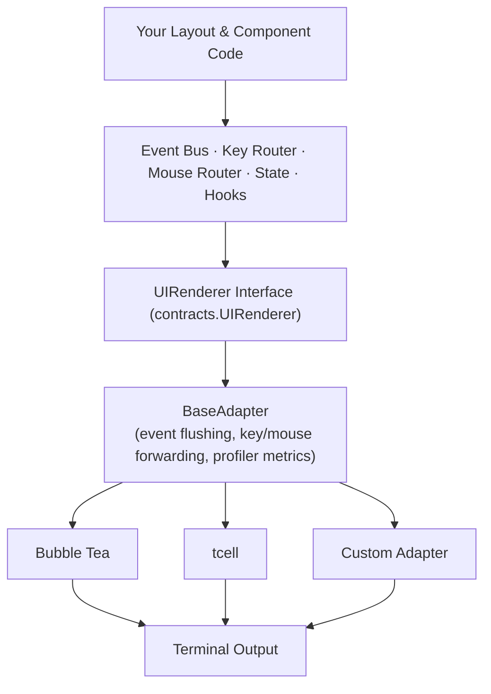

Tako renders nothing itself. It defines a two-method `UIRenderer` interface and delegates all terminal interaction to an adapter. Your application logic — events, state,
keybindings, plugins — lives entirely above this boundary and has no knowledge of which adapter is in use.

## The UIRenderer Interface

```go [contracts/renderer.go]
type UIRenderer interface {
    Render() error  // Enter alt screen, start event loop, BLOCK until exit
    Stop() error    // Release terminal, restore cursor, clean up resources
}
```

If `Render()` returns, Tako interprets it as application termination. Unhandled errors returned by `Render()` propagate to `tako.Run()` and then to `main()`.

## Registering an Adapter

```go [main.go]
app := tako.NewApp()

// Bubble Tea (official adapter)
adapter := bubbletea.NewAdapter(app.Context(), &layouts.Base{})
app.Mount(adapter)

if err := tako.Run(app); err != nil {
    log.Fatal(err)
}
```

Only one renderer can be active. The renderer is invoked after all bootstrappers and plugins have initialized.

## Architecture



## The BaseAdapter Helper

`BaseAdapter` handles the boilerplate that every adapter needs: event bus polling, key routing, mouse routing, and profiler integration.

```go [adapter/custom/adapter.go]
type CustomAdapter struct {
    adapter.BaseAdapter
    layout Layout
    ctx    *tako.Context
}

func NewAdapter(ctx *tako.Context, layout Layout) *CustomAdapter {
    a := &CustomAdapter{layout: layout, ctx: ctx}
    a.BaseAdapter = *adapter.NewBaseAdapter(ctx)
    return a
}
```

`NewBaseAdapter(ctx)` resolves the event bus, key router, and mouse router from the container. Construct adapters only **after** `tako.NewApp()` has completed — the container must
be populated.

## Handling Input

### Key Events

Convert your framework's key event to Tako's string format and call `HandleKey`:

```go [adapter.go]
func (a *CustomAdapter) onKeyPress(key FrameworkKey) {
    a.HandleKey(translateKeyToTako(key))
}
```

**Key string format:**

| Key          | String                                      |
|--------------|---------------------------------------------|
| Letter/digit | `a`, `z`, `1`                               |
| Modifier     | `ctrl+c`, `alt+enter`, `shift+tab`          |
| Special      | `space`, `enter`, `esc`, `tab`, `backspace` |
| Arrow        | `up`, `down`, `left`, `right`               |
| Function     | `f1`–`f12`                                  |

### Mouse Events

```go [adapter.go]
func (a *CustomAdapter) onMouseEvent(x, y int, btn FrameworkButton) {
    a.HandleMouseEvent(x, y, translateMouseBtn(btn))
}
```

Mouse event type strings: `left_click`, `right_click`, `middle_click`, `scroll_up`, `scroll_down`, `drag_start`, `drop`.

## Event Bus Processing

Two strategies for flushing the event bus into the render loop:

**If your framework has a tick loop:**

```go [adapter.go]
func (a *CustomAdapter) onTick() {
    if events := a.FlushEvents(); len(events) > 0 {
        a.triggerRedraw()
    }
}
```

**If it doesn't (adapter drives its own loop):**

```go [adapter.go]
func (a *CustomAdapter) Render() error {
    a.InitProfiler() // Idempotent and nil-safe

    a.StartEventLoop(a.ctx, 16*time.Millisecond, func(events []contracts.Event) {
        a.triggerRedraw()
    })

    return a.runMainLoop()
}
```

`StartEventLoop` polls the bus every 16ms (≈60fps). When events are pending, the callback fires so you can trigger a redraw.

## Profiler Integration

Call `RecordUpdate` and `RecordView` around your critical paths:

```go [adapter.go]
func (a *CustomAdapter) handleInput(msg Message) {
    start := time.Now()
    a.processKey(msg)
    a.RecordUpdate(time.Since(start)) // Reported to inspector
}

func (a *CustomAdapter) renderFrame() string {
    start := time.Now()
    output := a.layout.View(a.ctx)
    a.RecordView(time.Since(start)) // Reported to inspector
    return output
}
```

If no profiler is registered (production mode), all `Record*` calls are no-ops with zero overhead.

## Selecting an Adapter at Runtime

```go [main.go]
app := tako.NewApp()

var renderer contracts.UIRenderer
if os.Getenv("CI") != "" {
    // Headless adapter for CI — no terminal required
    renderer = &NoopAdapter{}
} else {
    renderer = bubbletea.NewAdapter(app.Context(), &layouts.Base{})
}

app.Mount(renderer)
if err := tako.Run(app); err != nil {
    log.Fatal(err)
}
```

::tip
For integration tests, create a `TestAdapter` that records emitted frames to a buffer instead of writing to a terminal. Combine this with a headless bootstrap (only the
bootstrappers you need) and a mock config. This lets you test full render + event + state cycles in milliseconds without allocating a PTY or spawning child processes.
::

