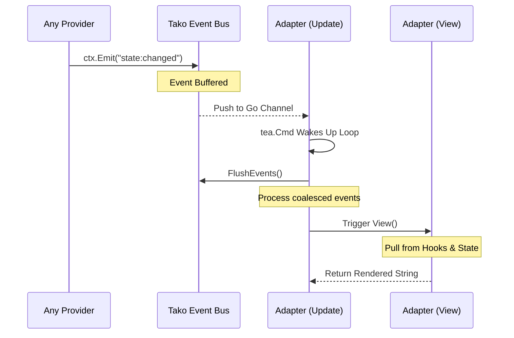

The Bubble Tea adapter is the recommended starting point. Built on [Charm's Bubble Tea v2](https://github.com/charmbracelet/bubbletea), it provides cross-platform terminal
handling, reliable input translation, and Elm-style update loop integration — all wired to Tako's event bus, key router, and mouse router.

## Setup

```go [main.go]
package main

import (
    "log"


"myapp/layouts"

"gettako.dev/tako"
"gettako.dev/tako/pkg/adapter/ui/bubbletea"
)

func main() {
    app := tako.NewApp()
    adapter := bubbletea.NewAdapter(app.Context(), &layouts.Base{})
    app.Mount(adapter)

    if err := tako.Run(app); err != nil {
        log.Fatal(err)
    }
}
```

## The Layout Interface

Your layout implements one method:

```go [layouts/base.go]
package layouts

import (
    tea "charm.land/bubbletea/v2"
    "gettako.dev/tako/internal/router"
    "gettako.dev/tako/internal/tako"
)

type Base struct{}

func (l *Base) View(ctx *tako.Context) tea.View {
    // Collect hook content from plugins
    toolbar := ctx.Hooks().Get("render:toolbar")
    sidebar := ctx.Hooks().All("app.sidebar")

    // Render active overlay by top stack layer ID
    var overlay any
    if l.overlay(ctx).IsActive() {
        overlay = ctx.Hooks().Get("tako.overlay." + l.overlay(ctx).Top())
    }

    // Build and return the view
    content := buildLayout(toolbar, sidebar, overlay)

    view := tea.NewView(content)
    view.AltScreen = true
    return view
}
```

`View` is called on every frame. Keep it fast — compute state in event handlers and read it in `View`.

## Alt Screen

Alt screen is enabled by default. Disable it for inline-rendered (non-full-screen) tools:

```go
adapter.AltScreen = false
```

## Input Translation Tables

**Keyboard:**

| Bubble Tea Value                  | Tako Key String            |
|-----------------------------------|----------------------------|
| `tea.KeyCtrlC`                    | `ctrl+c`                   |
| `tea.KeyCtrlP`                    | `ctrl+p`                   |
| `tea.KeyEnter`                    | `enter`                    |
| `tea.KeyTab`                      | `tab`                      |
| `tea.KeyShiftTab`                 | `shift+tab`                |
| `tea.KeyUp`/`Down`/`Left`/`Right` | `up`/`down`/`left`/`right` |
| `tea.KeyEsc`                      | `esc`                      |
| `tea.KeySpace`                    | `space`                    |
| `tea.KeyBackspace`                | `backspace`                |
| `tea.KeyF1`–`F12`                 | `f1`–`f12`                 |
| Rune `'j'`                        | `j`                        |

**Mouse:**

| Bubble Tea Message         | Tako Event     |
|----------------------------|----------------|
| `MouseClickMsg` + `Left`   | `left_click`   |
| `MouseClickMsg` + `Right`  | `right_click`  |
| `MouseClickMsg` + `Middle` | `middle_click` |
| `MouseWheelMsg` Delta > 0  | `scroll_down`  |
| `MouseWheelMsg` Delta < 0  | `scroll_up`    |
| `MouseReleaseMsg`          | `drop`         |
| Drag detection             | `drag_start`   |

## Bus Event → Render Cycle



Multiple events emitted in the same tick coalesce into one render call.

## Panic Recovery

`View()` is wrapped in a panic recovery. On panic, the adapter renders a fallback screen with the error and stack trace, offering `r` (retry) and `q` (quit) keys.

::warning
Recovery only covers `View()`. Panics in goroutines, event handlers, or provider initialization are not caught by the adapter. Handle those cases explicitly.
::

## Full Layout Example

```go [layouts/base.go]
package layouts

import (
	"fmt"
	"strings"

	tea "charm.land/bubbletea/v2"
	"gettako.dev/tako/internal/router"
	"gettako.dev/tako/internal/tako"
	"github.com/charmbracelet/lipgloss"
)

var (
	headerStyle = lipgloss.NewStyle().Bold(true).Foreground(lipgloss.Color("#88C0D0"))
	divider     = strings.Repeat("─", 60)
	footerStyle = lipgloss.NewStyle().Faint(true)
)

type Base struct{}

func (l *Base) View(ctx *tako.Context) tea.View {
	var sections []string

	if header := ctx.Hooks().Get("render:toolbar"); header != nil {
		sections = append(sections, headerStyle.Render(fmt.Sprintf("%v", header)))
	}
	sections = append(sections, divider)

	if content := ctx.Hooks().Get("render:content"); content != nil {
		sections = append(sections, fmt.Sprintf("%v", content))
	}

	if overlay := ctx.Hooks().Get("tako.overlay." + r.Stack().Top()); overlay != nil {
		sections = append(sections, fmt.Sprintf("\n%v", overlay))
	}

	sections = append(sections, divider)
	sections = append(sections, footerStyle.Render(contextHints(r.FocusedZone(0))))

	view := tea.NewView(strings.Join(sections, "\n"))
	view.AltScreen = true
	return view
}

func contextHints(zone string) string {
	switch zone {
	case "order-list":
		return "j/k: navigate │ enter: open │ ctrl+f: search │ ctrl+q: quit"
	case "order-detail":
		return "esc: back │ e: edit │ x: cancel order"
	default:
		return "ctrl+f: search │ ?: help │ ctrl+q: quit"
	}
}
```

::tip
The context-sensitive footer hint shown above (`contextHints(r.FocusedZone(0))`) is one of the best UX improvements you can add with minimal effort. Users at any point in your app
see exactly which keys are available. Expose this hint logic through a `render:keyhints` hook so different plugins can contribute zone-specific hints without modifying the layout
file.
::

