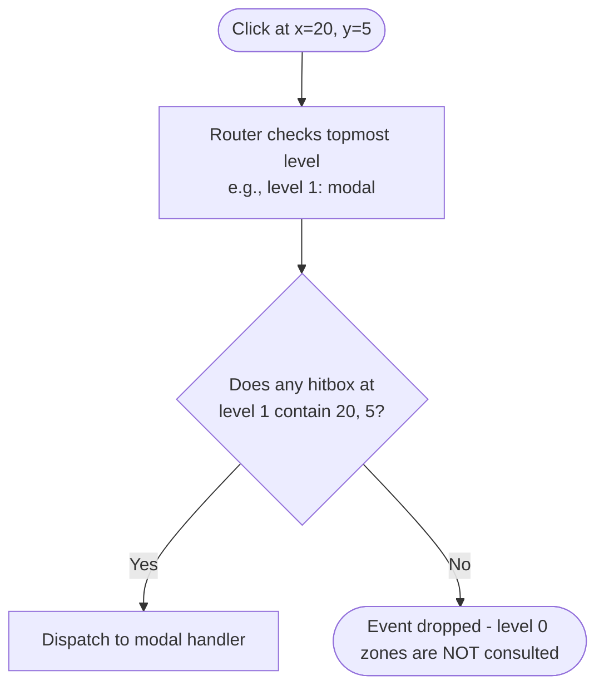

`MouseComponent` extends `Component` with a single method: `RegisterMouse(MouseManager)`. The overlay system auto-detects whether a component implements it and calls
`RegisterMouse` alongside `RegisterKeys`. No extra registration step.

```go [contracts/mouse_component.go]
type MouseComponent interface {
    Component
    RegisterMouse(MouseManager)
}
```

## MouseManager Interface

```go [contracts/mouse_manager.go]
type MouseManager interface {
    UpdateHitbox(zone string, x, y, width, height int)
    Zone(zone string, level ...int) ZoneMouseManager
}

type ZoneMouseManager interface {
    OnClick(func(x, y int))
    OnRightClick(func(x, y int))
    OnMiddleClick(func(x, y int))
    OnScrollUp(func(x, y int))
    OnScrollDown(func(x, y int))
    OnDragStart(func(x, y int))
    OnDrop(func(fromZone string, x, y int))
}
```

**Hitboxes must be updated on every render** — call `UpdateHitbox` in `RegisterMouse` or within the render cycle if dimensions change on resize.

## A Full Example: Order Table

```go [components/order_table.go]
package components

import "gettako.dev/tako/contracts"

type OrderTable struct {
    orders       []*Order
    selected     int
    scrollOffset int
    width, height int
    dragging     *Order
    onDelete     func(*Order)
    onOpen       func(*Order)
}

func (t *OrderTable) ID() string { return "order-table" }

func (t *OrderTable) Render() any {
    end := t.scrollOffset + t.height
    if end > len(t.orders) { end = len(t.orders) }
    return &OrderTableView{
        Rows:     t.orders[t.scrollOffset:end],
        Selected: t.selected - t.scrollOffset,
        Dragging: t.dragging,
    }
}

func (t *OrderTable) RegisterKeys(km contracts.KeyManager) {
    km.Zone(t.ID()).
        Bind("j|down",  func() { t.moveDown() }).
        Bind("k|up",    func() { t.moveUp() }).
        Bind("enter",   func() { t.onOpen(t.selected()) }).
        Bind("d",       func() { t.onDelete(t.selected()) })
}

func (t *OrderTable) RegisterMouse(mm contracts.MouseManager) {
    // Declare the clickable region (must be re-called if dimensions change)
    mm.UpdateHitbox(t.ID(), 0, 1, t.width, t.height) // y=1 to skip header row

    mm.Zone(t.ID()).
        OnClick(func(x, y int) {
            // y is the row offset within the hitbox; add scrollOffset for absolute index
            idx := t.scrollOffset + y
            if idx < len(t.orders) {
                t.selected = idx
                t.onOpen(t.orders[idx])
            }
        }).
        OnRightClick(func(x, y int) {
            idx := t.scrollOffset + y
            if idx < len(t.orders) {
                t.selected = idx
                // Show context menu... (emit event or open another overlay)
            }
        }).
        OnScrollDown(func(x, y int) { t.moveDown() }).
        OnScrollUp(func(x, y int) { t.moveUp() }).
        OnDragStart(func(x, y int) {
            idx := t.scrollOffset + y
            if idx < len(t.orders) {
                t.dragging = t.orders[idx]
            }
        }).
        OnDrop(func(fromZone string, x, y int) {
            if t.dragging != nil && fromZone == "order-table" {
                // Reorder logic...
                t.dragging = nil
            }
        })
}

func (t *OrderTable) moveDown() {
    if t.selected < len(t.orders)-1 {
        t.selected++
        t.ensureVisible()
    }
}
func (t *OrderTable) moveUp() {
    if t.selected > 0 {
        t.selected--
        t.ensureVisible()
    }
}
func (t *OrderTable) ensureVisible() {
    if t.selected < t.scrollOffset {
        t.scrollOffset = t.selected
    }
    if t.selected >= t.scrollOffset+t.height {
        t.scrollOffset = t.selected - t.height + 1
    }
}
```

## Stack-Level Isolation

Mouse events follow the same isolation as key events. Only the topmost stack level receives events. If a modal is open at level 1, the order table at level 0 receives no clicks —
even if the cursor physically overlaps the table's area.



To prevent clicks from reaching underlying content when a modal is open, give the modal a full-screen hitbox:

```go
mm.UpdateHitbox("modal-backdrop", 0, 0, termWidth, termHeight)
// This absorbs all clicks — nothing reaches level 0
```

::tip
For multi-panel layouts (split editor, file browser + preview pane), register a hitbox for each pane with the same zone name on both — but only activate the handlers when that pane
is focused. Alternatively, give each pane its own zone name and wire `OnClick` for each to shift focus: `ctx.Router().Focus(0, "preview-pane")`. This means clicking automatically
shifts both visual focus and keyboard focus to the pane the user clicked.
::

